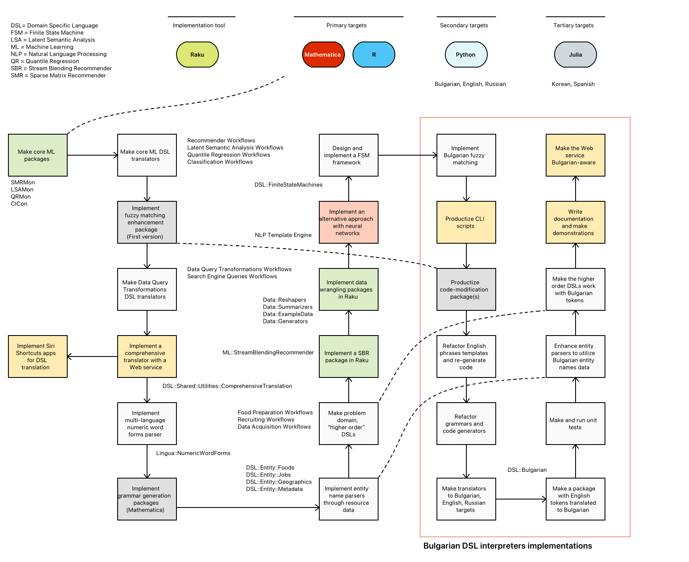

# DSL::Bulgarian

## Introduction

This document proclaims and exemplifies the Raku package 
["DSL::Bulgarian"](https://raku.land/zef:antononcube/DSL::Bulgarian) 
that facilitates the specification of computational workflows using
natural language commands in Bulgarian.

Using the Domain Specific Languages (DSLs) executable code is generated for different
programming languages: Julia, Python, R, Raku, Wolfram Language (WL).

Translation to other natural languages is also done: English, Korean, Russian, Spanish.

The workflow of creating the package "DSL::Bulgarian" is also utilized for making of the
packages 
["DSL::Portuguese"](https://github.com/antononcube/Raku-DSL-Portuguese)
and 
["DSL::Russian"](https://github.com/antononcube/Raku-DSL-Russian).

### Why and how it works?

The package "DSL::Bulgarian" reuses the English-based grammars of the packages "DSL::English::*", [AAp1 ÷ AAp8].
This produces good parsers of Bulgarian DSL commands because:

- Bulgarian and English are both [analytic languages](https://en.wikipedia.org/wiki/Analytic_language).

- The English grammar structures of short (imperative or prescriptive) sentences resemble those of Bulgarian.

It is relatively easy to "just" replace English tokens with Bulgarian tokens by direct translation. 
Further work is required, though, in order to handle Bulgarian word-suffixes related to gender and plurality. 

Additionally, in English often a word can function as a noun and verb, or adjective and noun, or adjective, noun, and verb.
Hence, the English grammars have to be (slightly) refactored to indicate what part of speech tokens are used,
and the corresponding English tokens files have to be enhanced.

### Document organization

The document organization is as follows:

- The next five sections show examples of code generation for computational workflows 
  of the most fundamental Machine Learning (ML) sub-cultures: Data Wrangling, 
  Classification, Latent Semantic Analysis (LSA), Quantile Regression (QR), Recommendations.

  - See [AAv1] for more detailed discussion see the presentation 
    ["Simplified Machine Learning Workflows Overview"](https://www.wolfram.com/broadcast/video.php?v=3743), [AAv3].

- The following section discusses the general software engineering strategy, and related design and implementation. 

- The last section gives implementation details that exemplify some of the steps in the software strategy section.

- Multiple references are given that provide further descriptions, explanations, and examples of the discussed features.  

------

## Data query (wrangling) workflows

Translate Bulgarian data wrangling specifications to different natural and programming languages:

```perl6
use DSL::English::DataQueryWorkflows;

my $command = '
зареди данните iris;
вземи елементите от 1 до 120;
филтрирай чрез Sepal.Width е по-голямо от 2.4 и Petal.Length е по-малко от 5.5; 
групирай с колоната Species;
покажи размерите
';
for <English Python::pandas Raku::Reshapers Spanish Russian> -> $t {
   say '=' x 60, "\n", $t, "\n", '-' x 60;
   say ToDataQueryWorkflowCode($command, $t, language => 'Bulgarian', format => 'code');
}
```

-------

## Classification workflows

Translate Bulgarian ML classification specifications to different natural languages and WL:

```perl6
use DSL::English::ClassificationWorkflows;

my $command = '
използвай dfTitanic;
раздели данните с цепещо съотношение 0.82;
направи gradient boosted trees класификатор;
покажи TruePositiveRate и FalsePositiveRate;
';

for <English Russian WL::ClCon> -> $t {
    say '=' x 60, "\n", $t, "\n", '-' x 60;
    say ToClassificationWorkflowCode($command, $t, language => 'Bulgarian', format => 'code');
}
```

**Remark:** Currently, code generation for ML classification workflows is implemented only for WL. 

-------

## Latent Semantic Analysis

Translate Bulgarian LSA specifications to different natural and programming languages:

```perl6
use DSL::English::LatentSemanticAnalysisWorkflows;

my $command = '
създай със textHamlet;
направи документ-термин матрица със автоматични стоп думи;
приложи LSI функциите IDF, TermFrequency, и Cosine;
извади 12 теми чрез NNMF и максимален брой стъпки 12;
покажи таблица  на темите с 12 термина;
покажи текущата лентова стойност
';

for <English Python::LSAMon R::LSAMon Russian> -> $t {
    say '=' x 60, "\n", $t, "\n", '-' x 60;
    say ToLatentSemanticAnalysisWorkflowCode($command, $t, language => 'Bulgarian', format => 'code');
}
```

**Remark:** The misspelling prompts show that the misspellings handler is "too aggressive." 
The module of handling DSL mis-formulations can be improved with several different approaches.
Currently, only token-level fuzzy matching is used. Other approaches are: (i) using an 
[NLP Template Engine](https://github.com/antononcube/NLP-Template-Engine), [AAr1],
(ii) phrase- or command-level fuzzy matching, (iii) conversational agents dialogs, [AAv1].

-------

## Quantile Regression Workflows

Translate Bulgarian QR specifications to different natural and programming languages:

```perl6
use DSL::English::QuantileRegressionWorkflows;

my $command = '
създай с dfTemperatureData;
премахни липсващите стойности;
покажи данново обобщение;
премащабирай двете оси;
изчисли квантилна регресия с 20 възела и вероятности от 0.1 до 0.9 със стъпка 0.1;
покажи диаграма с дати;
покажи чертеж на абсолютните грешки;
покажи текущата лентова стойност
';

for <English R::QRMon Russian WL::QRMon> -> $t {
    say '=' x 60, "\n", $t, "\n", '-' x 60;
    say ToQuantileRegressionWorkflowCode($command, $t, language => 'Bulgarian', format => 'code');
}
```

-------

## Recommender workflows

Translate Bulgarian ML recommendation specifications to different natural and programming languages:

```perl6
use DSL::English::RecommenderWorkflows;

my $command = '
създай чрез dfTitanic;
препоръчай със профила "male" и "died";
покажи текущата лентова стойност
';

for <English Python::SMRMon R::SMRMon Russian> -> $t {
    say '=' x 60, "\n", $t, "\n", '-' x 60;
    say ToRecommenderWorkflowCode($command, $t, language => 'Bulgarian', format => 'code');
}
```

-------

## Software development strategy

### General steps

In order to have Bulgarian commands parsed and interpreted into code the steps taken were
split into four phases:

1. Utilities preparation
2. Bulgarian words and phrases addition and preparation
3. Preliminary functionality experiments
4. Packages code refactoring

### The big picture

The following flowchart summarizes the *total* 
[**Raku for Prediction**](https://github.com/antononcube/RakuForPrediction-book) 
system development and its extension with Bulgarian DSL code generation.

]

The sub-sections below give a corresponding (coarsely grained) narration.

### Tool and targets

Here are the translations tool and targets:

- Implementation tool is Raku.

- Primary (translation) targets are Mathematica / WL and R.

- Secondary targets are Python, Bulgarian, English, Russian.

- Tertiary targets are Julia, Korean, Spanish.

### Ground work

Here are the ground work steps of he Raku for Prediction system:

1. First extract, define, and implement into software monads the computational workflows for 
   Data Wrangling, Classification, Latent Semantic Analysis, Quantile Regression, Recommendations.

   - For Data Wrangling leverage as much as possible existing implemented solutions.
     
     - E.g. [Python's "pandas"](https://pandas.pydata.org) or [R's "tidyverse"](https://www.tidyverse.org).
     
2. Implement code transformation packages that enhance Raku grammar and role files with additional
   specifications.
   
   - For example, tokens and rules are modified to do *fuzzy matching* (using Levenshtein distance.) 
   
3. Make a *"solid"* implementation of Data Wrangling DSL translations from English into Julia, Python, R, Raku, and WL; see [AAp5].

4. Make a comprehensive translator with a Web service. 
  
   - The Web service ["DSL Evaluations Interface"](https://antononcube.shinyapps.io/DSL-evaluations/) is based on [Cro](https://cro.services). See [AA1, AAv1].

5. Implement multi-language numeric word forms parsers. For example:

```perl6
use Lingua::NumericWordForms;
from-numeric-word-form(['twenty five', 'двадесет и пет', 'двадцать пять']):p
```

5. Implement Raku-grammar generation packages from Java's ANTLR and WL.
   
   - In order to leverage "prior art" of DSL translations.
   
6. Implement entity name parsers. For example:

```perl6
use DSL::Entity::MachineLearning;
ToMachineLearningEntityCode('true positive rate')
```

7. Implement "higher order" DSL translations for problem domains that might utilize ML workflows.

   - Like data acquisition, [AAp9], food preparation, [AAp10], or recruiting, [AAp11]. See [AAv1] for more detailed discussion.
   
8. Implement Raku packages for data wrangling; see [AAv2].

9. Implement alternative translation approach using neural networks -- instead of grammars; see [AAr1, AAv4]. 
   For example, here the neural-network-based NLP template engine is utilized:

```shell
dsl-web-translation "make some sort of recommender pipeline over the dataset dfGoods"
```

10. Design and implement Finite State Machine (FSM) framework in order to facilitate the implementation
    of conversational agents with "state remembering dialogs." See [AAv1].


### Bulgarian DSL interpreters implementation    

1. Implement Bulgarian fuzzy matching. See `is-bg-fuzzy-match` in "DSL::Shared", [AAp2].

2. Productize the Command Line Interface (CLI) scripts of "Grammar::TokenProcessing", [AAp3], to a full extent.  

3. Refactor English phrases template files to clearly indicate DSL tokens type (adjectives, nouns, verbs.) 

4. Refactor grammars and code generators.

   - Introduce the `Grammarish` roles into each of the focus DSL packages ("DSL::English::*".)
   
5. Make translator actions for Bulgarian, English, and Russian.
   
   - This means, for example, that "DSL::English::ClassificationWorkflows" has actions:
     
     - "DSL::English::ClassificationWorkflows::Actions::Bulgarian::Standard"
     - "DSL::English::ClassificationWorkflows::Actions::English::Standard"
     - "DSL::English::ClassificationWorkflows::Actions::Russian::Standard"
     
6. Make the English to Bulgarian "direct" translation of tokens. (As described in the introduction.)

7. Create and run unit tests.

8. Enhance entity packages to utilize Bulgarian names of entities.

9. Make the higher order DSLs work with Bulgarian. (*Not done yet.*)

10. Write documentation and make presentations. (*Started; see [AA2].*)

11. Hook up the Bulgarian parser-interpreters to the Web service mentioned above. For example:

```shell
dsl-web-translation -t=WL "DSL MODULE ClCon;
използвай dfTitanic; 
раздели данните с пропорция 0.8; 
направи класификатор с метода RandomForest; 
покажи мерките Accuracy and Recall"
```

---------

## Implementation details

### Utilities preparation

Since the beginning of the work on translation of the computational DSLs into programming code
it was clear that some the required code transformations have to be automated.

While doing the preparation work -- and in general, while the DSL-translation work matured --
it became clear that there are several directives to follow:

1. Make and use Command Line Interface (CLI) scripts that do code transformation or generation.

2. Adhere to of the [Eric Raymond's 17 Unix Rules](https://en.wikipedia.org/wiki/Unix_philosophy), [Wk1]:
    - *Make data complicated when required, not the program*
    - *Write abstract programs that generate code instead of writing code by hand*

In order to facilitate the  "from Bulgarian" project the package "Grammar::TokenProcessing", [AAp3],
was "finalized." The initial versions of that package were used from the very beginning of the
DSLs grammar development in order to facilitate handling of misspellings.

### Current recipe

This sub-section lists the steps for endowing a certain already developed workflows DSL package
with Bulgarian translations.

Denote the DSL workflows we focus on as DOMAIN (workflows.)
For example, DOMAIN can stand for `DataQueryWorkflows`, or `RecommenderWorkflows`.

*Remark:* In the recipe steps below DOMAIN would be
[`DataQueryWorkflows`]()

It is assumed that:

- DOMAIN in English are already developed.

- Since both English and Bulgarian are analytical, non-agglutinative languages "just" replacing
  English words with Bulgarian words in DOMAIN would produce good enough parsers of Bulgarian.

Here are the steps:

1. Add global Bulgarian words (*optional*)

    1. Add Bulgarian words and phrases in the
       [DSL::Shared](https://github.com/antononcube/Raku-DSL-Shared) file
       ["Roles/Bulgarian/CommonSpeechParts-template"](https://github.com/antononcube/Raku-DSL-Shared/blob/master/lib/DSL/Shared/Roles/Bulgarian/CommonSpeechParts-template).

    2. Generate the file
       [Roles/Bulgarian/CommonSpeechParts.rakumod](https://github.com/antononcube/Raku-DSL-Shared/blob/master/lib/DSL/Shared/Roles/Bulgarian/CommonSpeechParts.rakumod)
       using the CLI script
       [`AddFuzzyMatching`](https://github.com/antononcube/Raku-Grammar-TokenProcessing/blob/main/bin/AddFuzzyMatching)

    3. Consider translating, changing, or refactoring global files, like,
       [Roles/English/TimeIntervalSpec.rakumod](https://github.com/antononcube/Raku-DSL-Shared/blob/master/lib/DSL/Shared/Roles/English/TimeIntervalSpec.rakumod)

2. Translate DOMAIN English words and phrases into Bulgarian

    1. Take the file
       [DOMAIN/Grammar/DOMAIN-template](https://github.com/antononcube/Raku-DSL-English-DataQueryWorkflows/blob/master/lib/DSL/English/DataQueryWorkflows/Grammar/DataQueryPhrases-template)
       and translate its words into Bulgarian

3. Add the corresponding files into [DSL::Bulgarian](https://github.com/antononcube/Raku-DSL-Bulgarian), [AAp1].

    1. Use the `DOMAIN/Grammarish.rakumod` role.
        - The English DOMAIN package should have such rule. If do not do the corresponding code refactoring.

    2. Test with implemented DOMAIN languages.

    3. See the example grammar and role in
       [DataQueryWorkflows in DSL::Bulgarian](https://github.com/antononcube/Raku-DSL-Bulgarian/tree/main/lib/DSL/Bulgarian/DataQueryWorkflows).

### Code modification examples

The rules in the file
["DataQueryPhrases.rakumod"](https://github.com/antononcube/Raku-DSL-Bulgarian/blob/main/lib/DSL/Bulgarian/DataQueryWorkflows/Grammar/DataQueryPhrases.rakumod)
are derived from file
["DataQueryPhrases-template"](https://github.com/antononcube/Raku-DSL-Bulgarian/blob/main/lib/DSL/Bulgarian/DataQueryWorkflows/Grammar/DataQueryPhrases-template)
using the package
["Grammar::TokenProcessing"](https://github.com/antononcube/Raku-Grammar-TokenProcessing)
, [AAp3].

-------

## References

### Articles

[AA1] Anton Antonov,
["Introduction to data wrangling with Raku"](https://rakuforprediction.wordpress.com/2021/12/31/introduction-to-data-wrangling-with-raku),
(2021),
[RakuForPrediction at WordPress](https://rakuforprediction.wordpress.com).

[AA2] Anton Antonov,
["Увод в обработката на данни с Raku"](https://rakuforprediction.wordpress.com/2022/05/24/увод-в-обработката-на-данни-с-raku/),
(2022),
[RakuForPrediction at WordPress](https://rakuforprediction.wordpress.com).

[Wk1] Wikipedia entry,
[UNIX-philosophy rules](https://en.wikipedia.org/wiki/Unix_philosophy).

### Packages

[AAp1] Anton Antonov,
[DSL::Bulgarian, Raku package](https://github.com/antononcube/Raku-DSL-Bulgarian),
(2022),
[GitHub/antononcube](https://github.com/antononcube).

[AAp2] Anton Antonov,
[DSL::Shared, Raku package](https://github.com/antononcube/Raku-DSL-Shared),
(2018-2022),
[GitHub/antononcube](https://github.com/antononcube).

[AAp3] Anton Antonov,
[Grammar::TokenProcessing, Raku project](https://github.com/antononcube/Raku-Grammar-TokenProcessing)
(2022),
[GitHub/antononcube](https://github.com/antononcube).

[AAp4] Anton Antonov,
[DSL::English::ClassificationWorkflows, Raku package](https://github.com/antononcube/Raku-DSL-General-ClassificationWorkflows),
(2018-2022),
[GitHub/antononcube](https://github.com/antononcube).

[AAp5] Anton Antonov,
[DSL::English::DataQueryWorkflows, Raku package](https://github.com/antononcube/Raku-DSL-English-DataQueryWorkflows),
(2020-2022),
[GitHub/antononcube](https://github.com/antononcube).

[AAp6] Anton Antonov,
[DSL::English::LatentSemanticAnalysisWorkflows, Raku package](https://github.com/antononcube/Raku-DSL-General-LatentSemanticAnalysisWorkflows),
(2018-2022),
[GitHub/antononcube](https://github.com/antononcube).

[AAp7] Anton Antonov,
[DSL::English::QuantileRegressionWorkflows, Raku package](https://github.com/antononcube/Raku-DSL-General-QuantileRegressionWorkflows),
(2018-2022),
[GitHub/antononcube](https://github.com/antononcube).

[AAp8] Anton Antonov,
[DSL::English::RecommenderWorkflows, Raku package](https://github.com/antononcube/Raku-DSL-General-RecommenderWorkflows),
(2018-2022),
[GitHub/antononcube](https://github.com/antononcube).

[AAp9] Anton Antonov,
[DSL::English::DataAcquisitionWorkflows, Raku package](https://github.com/antononcube/Raku-DSL-English-DataAcquisitionWorkflows),
(2021-2022),
[GitHub/antononcube](https://github.com/antononcube).

[AAp10] Anton Antonov,
[DSL::English::FoodPreparationWorkflows, Raku package](https://github.com/antononcube/Raku-DSL-English-FoodPreparationWorkflows),
(2021-2022),
[GitHub/antononcube](https://github.com/antononcube).

[AAp11] Anton Antonov,
[DSL::English::RecruitingWorkflows, Raku package](https://github.com/antononcube/Raku-DSL-English-RecruitingWorkflows),
(2021-2022),
[GitHub/antononcube](https://github.com/antononcube).

### Repositories

[AAr1] Anton Antonov,
["NLP Template Engine"](https://github.com/antononcube/NLP-Template-Engine),
(2021-2022),
[GitHub/antononcube](https://github.com/antononcube).

### Videos

[AAv1] Anton Antonov,
["Multi-language Data Wrangling and Acquisition Conversational Agents"](https://archive.fosdem.org/2022/schedule/event/dataaquisition/),
(2022),
[FOSDEM 2022](https://archive.fosdem.org/2022/).

[AAv2] Anton Antonov,
["Implementing Machine Learning algorithms in Raku"](https://conf.raku.org/talk/170),
(2022),
[The Raku Conference 2022](https://conf.raku.org/).

[AAv3] Anton Antonov,
["Simplified Machine Learning Workflows Overview"](https://www.wolfram.com/broadcast/video.php?v=3743),
(2022),
[Wolfram Technology Conference 2022](https://www.wolfram.com/events/technology-conference/2022/presentations/).

[AAv4] Anton Antonov,
["Natural Language Processing Template Engine"](https://www.wolfram.com/broadcast/video.php?v=3807),
(2022),
[Wolfram Technology Conference 2022](https://www.wolfram.com/events/technology-conference/2022/presentations/).