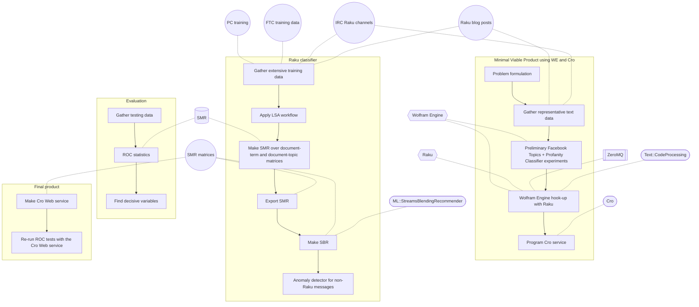

```mermaid
graph TB
a[[ZeroMQ]]
a1{{Wolfram Engine}}
a2{{Raku}}
subgraph ide1 [Minimal Viable Product using WE and Cro]
 b[Wolfram Engine hook-up with Raku]
 c[Program Cro service]
 d[Problem formulation]
 e[Gather representative text data]
 f[Preliminary Facebook Topics + Profanity Classifier experiments]
end
g([Text::CodeProcessing])
h([Cro])
i[(SMR)]
subgraph ide2 [Raku classifier]
j[Gather extensive training data]
k[Apply LSA workflow]
l[Make SMR over document-term and document-topic matrices]
m[Export SMR]
n[Make SBR]
o[Anomaly detector for non-Raku messages]
end
o1((PC training))
o2((FTC training data))
o3((IRC Raku channels))
o4((Raku blog posts))
p((SMR matrices))
subgraph ide3 [Evaluation]
q[Gather testing data]
r[ROC statistics]
s[Find decisive variables]
end
p1([ML::StreamsBlendingRecommender])
subgraph ide4 [Final product]
t[Make Cro Web service]
u[Re-run ROC tests with the Cro Web service]
end
a1-.-b & f
a2-.-b
a-.-b
b-->c
d-->e-->f-->b
g-.-b
h-.-c
i-.-l
j-->k-->l-->m-->n-->o
o1 & o2 & o3 & o4-.-j
o4-..-e
o3-..-e
p-.-t & n & m
q-->r-->s
p1-.-n
t-->u
i-.-r
```