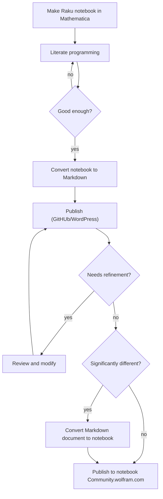
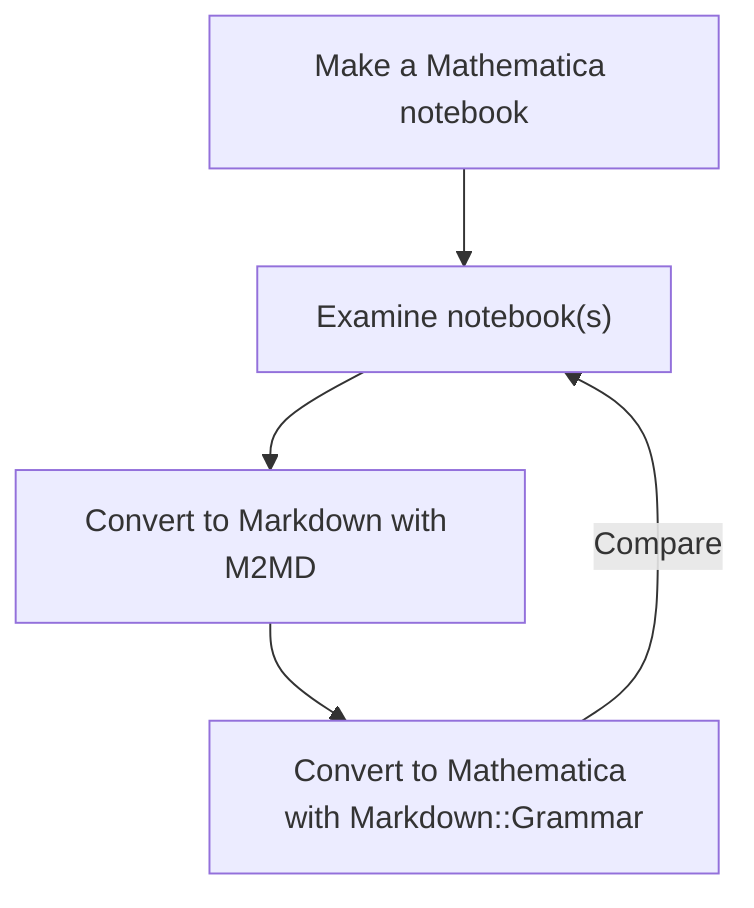
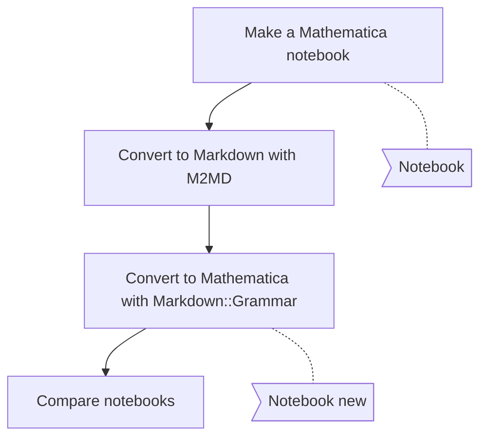

## Motivation 

```mermaid
graph TD
    Rnb[Make Raku notebook in Mathematica]-->LT
    LT[Literate programming]-->GE
    GE{Good enough?}-->|yes|CN
    CN[Convert notebook to Markdown]-->P
    P["Publish (GitHUb/WordPress)"]-->SP
    SP-->|yes|R
    R[Review and modify]-->P
    GE-->|no|LT
    SP{Needs refinement?}-->|no|SD
    SD{Significantly different?}-->|yes|CM
    SD-->|no|PC
    CM[Convert Markdown document to notebook]-->PC
    PC["Publish to notebook Community.wolfram.com"]   
```

## Round trip translation

```mermaid
graph TD
    WL[Make a Mathematica notebook] --> E
    E["Examine notebook(s)"] --> M2MD
    M2MD["Convert to Markdown with M2MD"] --> MG
    MG["Convert to Mathematica with Markdown::Grammar"] --> |Compare|E
```

```mermaid
graph TD
    WL[Make a Mathematica notebook] --> M2MD
    WL-.-NB1>Notebook]
    M2MD["Convert to Markdown with M2MD"] --> MG
    MG["Convert to Mathematica with Markdown::Grammar"] --> C["Compare notebooks"]
    MG-.-NB2>Notebook new]
```