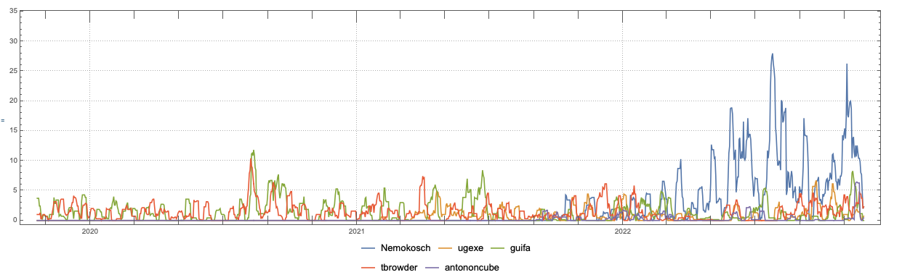

# Further work on the Raku-D3.js translation

## Introduction

This document gives motivation and design details for the Raku package 
["JavaScript::D3"](https://raku.land/zef:antononcube/JavaScript::D3) 
and discusses the usefulness of implementing:

- The package itself
- The corresponding Python package ["JavaScript::D3"](), [AAp3]
- Functions for drawing random mandalas and scribbles

Some familiarity with "JavaScript::D3" is assumed. See the article
["JavaScript::D3"](https://rakuforprediction.wordpress.com/2022/12/15/javascriptd3/),
or the video
["The Raku-ju hijack hack of D3.js"](https://youtu.be/YIhx3FBWayo), [AAv1].

-------

## Why I implement this package?

Using [D3.js](https://d3js.org) via Raku is a good answer of the question:

> How to do data-driven visualizations with Raku? 

I used to (or tried to use) the alternatives outlined in the following sub-sections.

### SVG::Plot

The package [“SVG::Plot”](https://raku.land/github:moritz/SVG::Plot) is a good illustration 
that a Raku visualization system can be build “from scratch”, 
but it is way too much work to develop “SVG::Plot” to have all features needed for informative plots. 
(Various plot labels, grid lines, etc.)

One of the best features of "SVG::Plot" is that it is 
[supported "out of the box"](https://github.com/bduggan/raku-jupyter-kernel/blob/master/eg/svg.ipynb) 
by the Jupyter Raku kernel [BD1].

### Chart::Gnuplot

I have attempted to install the package 
["Chart::Gnuplot"](https://raku.land/cpan:TITSUKI/Chart::Gnuplot)
a few times on my computer without success. Some people from the Raku community claim it is useful.

### Text::Plot

I wrote earlier this year the package 
["Text::Plot"](https://raku.land/zef:antononcube/Text::Plot), 
because I needed some plotting for 
[my presentation at TRC-2022](https://conf.raku.org/talk/170).

Its main advantage is that "it can be used anywhere." Occasionally, I find it very useful,
but it is just a crutch, not a real plotting solution.

For example, it is hard to have informative time series plotted with "Text::Plot".
In support of that statement see this time series plot done with Mathematica for 
the number of IRC Raku channel posts per week in the last three years (by certain known posters):

### That is why!

When I do data analysis I want to be able to:

1. Make nice *and* informative plots

2. Use concise plot specifications

3. Quickly do the required setup

4. Claim *easy* reproducibility and portability of the related documents 

Using [D3.js](https://d3js.org) definitely provides 1. The package "JavaScript::D3" aims to provide 2.
Setting up Jupyter (notebooks) with the Raku kernel implemented by Brian Duggan, [BD1], is not that hard.
(But be warned that YMMV.) The Jupyter notebooks are widely shareable at this point, so, 4 is also satisfied.

Here is an example bubble plot made in Jupyter:

-------

## Why I did not implement this a year ago?

I do not like Jupyter much, and I mostly stay away from it. 
That is why, 1.5 years ago when I read the code of “Jupyter::Kernel” I did not try to comprehend the magics. 
(I was interested in [sand-boxing Raku](https://rakuforprediction.wordpress.com/2021/07/13/raku-textcodeprocessing/).) 

Brian Duggan has put examples how the magics can be used to embed HTML and SVG code in Jupyter, [BD1]. 
Those prompted me to utilize that framework to use JavaScript.

-------

## Refactoring via re-implementation in Python 

Re-implementing the package (from Raku) 
[to Python](https://github.com/antononcube/Python-packages/tree/main/JavaScriptD3) 
was great way to brainstorm the necessary refactoring of the JavaScript code snippets and related package architecture. 
See the examples in [AAp3].

--------

## Multi-dataset visualizations

The initial version of "JavaScript::D3" did not have multi-dataset support for bar charts and histograms.
I figured out how to do that for bar charts; still working on histograms.

Here is a bar chart example:

--------

## Random mandalas and scribbles

Another way to "challenge" the package design and implementation is to (try to) implement functions that draw 
[random mandalas](https://nbviewer.org/github/antononcube/Raku-JavaScript-D3/blob/main/resources/RandomMandalas.ipynb), [AAv2],
and
[random scribbles](https://nbviewer.org/github/antononcube/Raku-JavaScript-D3/blob/main/resources/RandomScribbles.ipynb).

Implementing the corresponding functions required to:

1. Have optional axes specification

2. Be able to produce D3.js without placement wrappers (like HTML declaration, of JavaScript brackets for Jupyter.)

The refactoring for 2. was required in order to have multiple plots in one Jupyter cell. 
Also, it was fairly involved, although, it is "just" for gluing the main, core plotting parts.

I wanted to do as much as possible on the Raku side:

- The random points generation and "arrangement" is done in Raku

- The plotting is done with D3.js

**Remark:** The algorithms for drawing, say, Bezier curves through the random points are far from trivial 
and D3.js does this very nicely.  

Here is an example of random mandala generation:

Here is an example of random scribbles generation:

For interactive examples, see the video 
["Random mandalas generation (with D3.js via Raku)"](https://www.youtube.com/watch?v=THNnofZEAn4).

--------

## Some "leftover" remarks

- My Jupyter setup is “local” on my laptop. I have tried to use Raku in cloud setups a few times without much success.

- I think there are some issues with the ZMQ connections between Raku’s “Jupyter::Kernel” and “the big” Jupyter framework.
  Observing those difficulties and making reproducible bug reports is not easy.

- If more people use Raku with Jupyter that would help or induce reliability improvements.
  (I hope my demos with "JavaScript::D3" would make some Rakunistas interrupt their
   VI addiction and try the Raku-Jupyter synergy.)

--------

## References

### Articles

[AA1] Anton Antonov,
["JavaScript::D3"](https://rakuforprediction.wordpress.com/2022/12/15/javascriptd3/),
(2022),
[RakuForPrediction at WordPress](https://rakuforprediction.wordpress.com).

[OV1] Olivia Vane,
["D3 JavaScript visualisation in a Python Jupyter notebook"](https://livingwithmachines.ac.uk/d3-javascript-visualisation-in-a-python-jupyter-notebook),
(2020),
[livingwithmachines.ac.uk](https://livingwithmachines.ac.uk).

[SF1] Stefaan Lippens,
[Custom D3.js Visualization in a Jupyter Notebook](https://www.stefaanlippens.net/jupyter-custom-d3-visualization.html),
(2018),
[stefaanlippens.net](https://www.stefaanlippens.net).

### Packages

[AAp1] Anton Antonov,
[Data::Reshapers Raku package](https://raku.land/zef:antononcube/Data::Reshapers),
(2021-2022),
[GitHub/antononcube](https://github.com/antononcube/Raku-Data-Reshapers).

[AAp2] Anton Antonov,
[Text::Plot Raku package](https://raku.land/zef:antononcube/Text::Plot),
(2022),
[GitHub/antononcube](https://github.com/antononcube/Raku-Text-Plot).

[AAp3] Anton Antonov,
[JavaScriptD3 Python package](https://github.com/antononcube/Python-packages/tree/main/JavaScriptD3),
(2022),
[Python-packages at GitHub/antononcube](https://github.com/antononcube/Python-packages).

[BD1] Brian Duggan,
[Jupyter::Kernel Raku package](https://raku.land/cpan:BDUGGAN/Jupyter::Kernel),
(2017-2022),
[GitHub/bduggan](https://github.com/bduggan/raku-jupyter-kernel).

[MLp1] Moritz Lenz,
[SVG::Plot Raku package](https://github.com/moritz/svg-plot)
(2009-2018),
[GitHub/moritz](https://github.com/moritz/svg-plot).

### Videos

[AAv1] Anton Antonov,
["The Raku-ju hijack hack of D3.js"](https://www.youtube.com/watch?v=YIhx3FBWayo),
(2022),
[Anton Antonov's channel at YouTube](https://www.youtube.com/@AAA4prediction).

[AAv2] Anton Antonov,
["Random mandalas generation (with D3.js via Raku)"](https://www.youtube.com/watch?v=THNnofZEAn4),
(2022),
[Anton Antonov's channel at YouTube](https://www.youtube.com/@AAA4prediction).