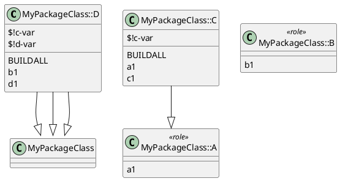

# Generating UML diagrams for Raku namespaces

**Version 0.7**

Anton Antonov   
[RakuForPrediction-book at GitHub](https://github.com/antononcube/RakuForPrediction-book)   
[RakuForPrediction at WordPress](https://rakuforprediction.wordpress.com)   
June 2022

## Introduction

In this notebook we discuss the use of Java, Python, Raku, and Wolfram Language (WL) packages for the generation of [Unified Modeling Language (UML)](https://en.wikipedia.org/wiki/Unified_Modeling_Language) diagrams, [Wk1], from Raku code.

In principle, given Raku's introspection abilities, we should be able to "just" traverse package namespaces, classes, class attributes and methods, and generate UML diagram specifications. This is done with the Raku package ["UML::Translators"](https://raku.land/zef:antononcube/UML::Translators), [AAp1].

We use two Domain Specific Languages (DSLs) for the UML specifications:

1.  [PlantUML](https://plantuml.com)'s DSL, [Wk2]

1.  [WL's graph construction and representation DSL](https://reference.wolfram.com/language/guide/GraphConstructionAndRepresentation.html), [WRI1]

The making of the actual UML diagrams is done through two "engines": PlantUML and WL.

**Remark:** This notebook uses the Mathematica-and-Raku connection described in [AA3]. "Mathematica" and "WL" are more or less used as synonyms.

**Remark:** Mathematica notebooks can have initialization cells, that are (optionally) run before executing any code of the notebook. See the initialization cells in the section "Setup" below.

**Remark:** The WL option setting `SetOptions[RakuInputExecute,Epilog->UMLGraphEpilog]` allows for automatic conversion of the Raku cell results that are UML specs into UML diagrams.

### Usage examples

Here are the classes and roles found in the Raku package ["ML::StreamsBlendingRecommender"](https://github.com/antononcube/Raku-ML-StreamsBlendingRecommender), [AAp3]: 

```perl6
namespace-types('ML::StreamsBlendingRecommender')

# ((UtilityFunctions) (LSAEndowedSBR) (AbstractSBR) (CoreSBR) (CompositeSBR) (LSATopicSBR))
```

Here is an example we generate the corresponding UML diagram (by using the Java JAR file provided by the site PlantUML, [PUML1]):

```perl6
use UML::Translators;
to-uml-spec('ML::StreamsBlendingRecommender'):!methods:!attributes;
```


Here is an example using WL's graph visualization capabilities through the WL package, ["UMLDiagramGeneration.m"](https://github.com/antononcube/MathematicaForPrediction/blob/master/Misc/UMLDiagramGeneration.m), [AAp2, AA2]:

```perl6
to-uml-spec('ML::StreamsBlendingRecommender', format=>'wl', image-size=>1000, graph-layout=>'CircularEmbedding'):!methods:!attributes;
```


### Command line examples

The package "UML::Translators" provides a Command Line Interface (CLI) function. Here is an example of WL-UML spec generation via CLI:

```shell
> to-uml-spec --/methods --/attributes --format=WL "ML::StreamsBlendingRecommender"

# UMLClassGraph[
# "Parents" -> Flatten[{"ML::StreamsBlendingRecommender::CompositeSBR" \[DirectedEdge] "ML::StreamsBlendingRecommender::AbstractSBR", "ML::StreamsBlendingRecommender::CompositeSBR" \[DirectedEdge] "ML::StreamsBlendingRecommender::UtilityFunctions", "ML::StreamsBlendingRecommender::CoreSBR" \[DirectedEdge] "ML::StreamsBlendingRecommender::AbstractSBR", "ML::StreamsBlendingRecommender::CoreSBR" \[DirectedEdge] "ML::StreamsBlendingRecommender::UtilityFunctions", "ML::StreamsBlendingRecommender::LSATopicSBR" \[DirectedEdge] "ML::StreamsBlendingRecommender::CoreSBR", "ML::StreamsBlendingRecommender::LSATopicSBR" \[DirectedEdge] "ML::StreamsBlendingRecommender::AbstractSBR", "ML::StreamsBlendingRecommender::LSATopicSBR" \[DirectedEdge] "ML::StreamsBlendingRecommender::UtilityFunctions", "ML::StreamsBlendingRecommender::LSAEndowedSBR" \[DirectedEdge] "ML::StreamsBlendingRecommender::AbstractSBR", "ML::StreamsBlendingRecommender::LSAEndowedSBR" \[DirectedEdge] "ML::StreamsBlendingRecommender::UtilityFunctions"}],
# "RegularMethods" -> Flatten[{}],
# "Abstract" -> Flatten[{"ML::StreamsBlendingRecommender::UtilityFunctions"}],
# "EntityColumn" -> False, VertexLabelStyle -> "Text", ImageSize -> Large, GraphLayout -> Automatic]
```


Here is a shell command that generates an UML diagram PNG image (and places in a temporary folder):

```shell
to-uml-spec --/methods --/attributes "ML::StreamsBlendingRecommender" | java -jar ~/Downloads/plantuml-1.2022.5.jar -pipe -tpng > /tmp/myuml.png 
```


See the [PlantUML site](https://plantuml.com) in order to obtain the [PlantUML JAR file](https://plantuml.com/download) and get [details on command line running](https://plantuml.com/command-line). (Available output types, etc.)

### Outline

The rest of the notebook has the following parts:

- Problem formulations

- Big picture overview

- Introductory examples of UML specs and diagrams generation

    - Includes discovery of all classes and roles in a name space.

- Comparison of UML diagram graphics objects and UML diagram images

    - Technical (i.e. optional) section that show different ways to obtain UML diagrams. 

- Examples gallery

    - Various use cases with different namespaces, UML specs, and diagram making packages.

- Glitches 

    - Lists various glitches and inconsistencies of the orchestration pipelines components.

**Remark:** Just reading this introduction is sufficient to start using the Raku package ["UML::Translators"](https://raku.land/zef:antononcube/UML::Translators), [AAp1]. (Meaning the rest of the notebook can be skipped.)

------

## Problem formulations

This sub-section has more precise problem formulations.

#### To UML

**To-UML-problem**: From the code of a Raku package or namespace programmatically:

- Find all classes, grammars, and roles

- Generate corresponding UML diagrams

The main motivations for the *To-UML-problem* are:

- The ability to quickly inform ourselves for the structure of a Raku package or namespace.

- Easy generation of good (first iterations) of documentation diagrams for Raku code.

    - Hence, those diagrams can be easily updated to reflect subsequent versions of the code.

#### From UML

It is natural to also consider the "inverse" problem of *To-UML-problem*.

**From-UML-problem**: From an UML class-diagram specification generate hierarchy of classes that has corresponding:

- Inheritance or composition of classes and roles

- Attributes and methods per class

**Remark**: In this notebook we deal only with the first problem, *To-UML-problem*.

------

## Big picture

In this subsection we discuss the main workflow and features breakdown.

### Orchestration pipelines

#### WL-Raku-PlantUML

Consider the example:

```perl6
to-uml-spec('Cro'):!methods:!attributes:remove-unlinked;
```


The example above uses the "orchestration pipeline":  WLZMQRakuZMQWLOS-shellPlantUML-jarOS-shellWL. Here is the corresponding graph:

```mathematica
PipelineGraph[{"WL", "ZeroMQ", "Raku", "ZeroMQ", "WL", "OS-shell", "PlantUML.jar", "OS-shell", "WL"}, ImageSize -> 1000]
```


We call this first pipeline "***WL-Raku-PlantUML***".

#### WL-Raku-WLUML

Consider the example:

```perl6
to-wl-uml-spec('Cro', graph-layout=>'RadialEmbedding', image-size=>1000):!methods:!attributes;
```


The example above uses the much simpler pipeline:  WLZMQRakuZMQWL. Here is the corresponding graph:

```mathematica
PipelineGraph[{"WL", "ZeroMQ", "Raku", "ZeroMQ", "WL"}, ImageSize -> Large]
```


We call this second pipeline "***WL-Raku-WLUML***".

A more detailed flowchart is given in the section "Big picture."

### Flowchart

The following flow-chart summarize the general workflow that applies to Raku script executions, CLI executions, and interactive sessions (like in-notebook invocation):

```mathematica
Import["https://github.com/antononcube/RakuForPrediction-book/raw/main/Articles/Diagrams/Generating-UML-diagrams-for-Raku-name-spaces/UML-diagrams-generation.pdf", "PageGraphics"][[1]]
```

[](https://github.com/antononcube/RakuForPrediction-book/raw/main/Articles/Diagrams/Generating-UML-diagrams-for-Raku-namespaces/UML-diagrams-generation.pdf)

#### Scenario walk-through

Consider the following steps using a Mathematica notebook:

1. Make and evaluate a Raku cell in the notebook.

    1. [ZeroMQ](https://zeromq.org) is used to connect Raku and Mathematica.

1. Generate UML specification for a Raku namespace using "UML::Translators".

    1. And send by back the result via ZeroMQ socket.

1. From Mathematica trigger an OS-shell process:

    1. Using a PlantUML Java JAR file generate a JPEG image for the UML specification

    1. Write that JPEG image into a temporary directory

1. Import the image generated in the previous step into the notebook.

1. Alternatively, or in addition, open the image with an appropriate OS image viewer.

#### Additional clarifications

Here is a list of additional details and clarifications:

- Using SVG and PDF formats allows Mathematica to import the UML diagrams as "native", scalable graphics. Other formats are imported as images.

- Instead of using a Java JAR file to generate the UML images, we can use:

    - A web service

    - The built-in WL graph functions, [WRI1-3]

- PlantUML provides a web service -- in this notebook we use the Python package [DNp1] via the external evaluation capabilities of WL.

- Having a CLI implementation makes the workflows more convenient. The packages we use in this notebook that have CLI are:

    - PlantUML's Java JAR file

    - Python's "plantuml"

    - Raku "UML::Translators"

- We do not need the Raku package "UML::Translators" to generate PlantUML DSL specs -- we can write them ad hoc. 

    - Then we can use the functions JavaPlantUML or PythonWebPlantUML from [AAp2] to generate UML diagrams.

- The WL package ["UMLDiagramGeneration.m"](https://github.com/antononcube/MathematicaForPrediction/blob/master/Misc/UMLDiagramGeneration.m), [AAp2], has a function, PlantUMLSpec, that generates PlantUML specs from UML-graph specs.

### Feature breakdown

There multiple "small" decisions that has to be made in order to have a useful system that satisfies -- at least to a point -- the motivation wants listed above. The following mind-map shows the breakdown of the envisioned features and their implementation status:

```mathematica
Import["https://github.com/antononcube/RakuForPrediction-book/raw/main/Articles/Diagrams/Generating-UML-diagrams-for-Raku-name-spaces/UML-diagrams-mind-map.pdf", "PageGraphics"][[1]]
```

[](https://github.com/antononcube/RakuForPrediction-book/raw/main/Articles/Diagrams/Generating-UML-diagrams-for-Raku-namespaces/UML-diagrams-mind-map.pdf)

**Remark:** [The linked PDF file of the mind-map](https://github.com/antononcube/RakuForPrediction-book/raw/main/Articles/Diagrams/Generating-UML-diagrams-for-Raku-name-spaces/UML-diagrams-mind-map.pdf) has "live" hyperlinks.

------

## UML for ad hoc module

In this section we introduce the generation of UML specs and diagrams using a user-defined namespace.

Let us define a simple module with two roles and two classes:

```perl6
module MyPackageClass {
    role A { method a1 {} }
    role B { method b1 {} }
    class C does A { has $!c-var; method c1 {} }
    class D does B is C { has $!d-var; method d1 {} }
}

# (MyPackageClass)
```

### Classes and roles

Here are the classes and roles in that namespace:

```perl6
.say for namespace-types( 'MyPackageClass' )

# ((D) (A) (B) (C))
```

Here we show the meta-object types of the module types (classes and roles):

```perl6
.say for namespace-types( 'MyPackageClass' ):how-pairs

# MyPackageClass::D => Perl6::Metamodel::ClassHOW
# MyPackageClass::A => Perl6::Metamodel::ParametricRoleGroupHOW
# MyPackageClass::B => Perl6::Metamodel::ParametricRoleGroupHOW
# MyPackageClass::C => Perl6::Metamodel::ClassHOW
```

### UML diagrams

Here is the corresponding UML diagram generated through SVG export/import of the WL-Raku-PlantUML pipeline:

```perl6
to-plant-uml-spec('MyPackageClass')
```


Here is the corresponding UML diagram generated with the Raku-WL pipeline:

```perl6
to-wl-uml-spec('MyPackageClass', image-size=>500)
```


### UML specs

In order to get the UML spec in the notebook we have reset the option of the WL function `RakuInputExecute`:

```mathematica
SetOptions[RakuInputExecute, Epilog -> FromRakuCode];
```

Here is the UML spec corresponding to the Raku class `MyPackageClass`:

```perl6
to-plant-uml-spec('MyPackageClass')
```



Here we get the corresponding WL-graph spec:

```perl6
to-wl-uml-spec('MyPackageClass')

# UMLClassGraph[\"Parents\" -> Flatten[{\"MyPackageClass::D\" \\[DirectedEdge] \"MyPackageClass::C\", \"MyPackageClass::D\" \\[DirectedEdge] \"MyPackageClass::A\", \"MyPackageClass::D\" \\[DirectedEdge] \"MyPackageClass::B\", \"MyPackageClass::C\" \\[DirectedEdge] \"MyPackageClass::A\"}],
# \"RegularMethods\" -> Flatten[{\"MyPackageClass::D\" -> {\"BUILDALL\", \"b1\", \"d1\"}, \"MyPackageClass::A\" -> {\"a1\"}, \"MyPackageClass::B\" -> {\"b1\"}, \"MyPackageClass::C\" -> {\"BUILDALL\", \"a1\", \"c1\"}}],
# \"Abstract\" -> Flatten[{\"MyPackageClass::A\", \"MyPackageClass::B\", \"MyPackageClass::A\"}],
# \"EntityColumn\" -> False, VertexLabelStyle -> \"Text\", ImageSize -> Large, GraphLayout -> Automatic]"*)
```

Here we make the WL function RakuInputExecute to return UML diagrams when UML specs are generated from the Raku code:

```mathematica
SetOptions[RakuInputExecute, Epilog -> UMLGraphEpilog];
```

**Remark:** For this notebook the setting above is first done in the setup section; see below. 
In that way UML diagrams generation becomes more immediate and interactive. 
The implementation of `UMLGraphEpilog` is also given the setup section.

## Images vs graphics objects

This section provides details how UML diagrams are obtained and post-processed. 

First we reset the Raku evaluation epilog function:

```mathematica
SetOptions[RakuInputExecute, Epilog -> FromRakuCode];
```

Here generate an UML spec:

```mathematica
spec = RakuInputExecute["to-uml-spec('MyPackageClass'):methods:!attributes"];
```

Here we generate an SVG image and import as a graphics object:

```mathematica
grJava = JavaPlantUML[spec, "Type" -> "svg"];
```

In order to demonstrate that we have obtained a graphics object let us change it by inserting graphics style commands:

```mathematica
grJava2 = grJava /. {Thickness[x_?NumberQ] :> Sequence[{Thick}], {JoinedCurve[x__]} :> {Red, JoinedCurve[x]}};
ResourceFunction["GridTableForm"][{{Head[grJava], grJava, grJava2}}, TableHeadings -> {"Expression head", "Imported", "Transformed"}, Background -> None, Alignment -> Top]
```


Here we generate a PNG image for the UML spec:

```mathematica
imgJava = JavaPlantUML[spec, "Type" -> "png"];
```

In order to demonstrate that we have obtained an image let us change it by applying image restyling (de-colorization and jittering):

```mathematica
imgJava2 = Fold[ImageEffect, imgJava, {"Decolorization", {"Jitter", 0.8}}];
ResourceFunction["GridTableForm"][{Prepend[Magnify[#, 2.5] & /@ {imgJava, imgJava2}, Head[imgJava]]}, TableHeadings -> {"Expression head", "Imported", "Transformed"}, Background -> None, Alignment -> Top]
```


**Remark:** We can make the Java PlantUML program to use PNG images (instead of the default SVG) with the command:

```
SetOptions[JavaPlantUML,"Type"->"PNG"]
```

Here we reset the epilog function again :

```mathematica
SetOptions[RakuInputExecute, Epilog -> UMLGraphEpilog];
```

------

## Examples gallery

This section has examples of using the different functions of the Raku package ["UML::Translators"](https://github.com/antononcube/Raku-UML-Translators), [AAp1], and the WL package ["UMLDiagramGeneration.m"](https://github.com/antononcube/MathematicaForPrediction/blob/master/Misc/UMLDiagramGeneration.m), [AAp2], over different Raku packages.

### Classes and roles of packages

Here are the classes, roles, and constants found in the package ["ML::TriesWithFrequencies"](https://raku.land/cpan:ANTONOV/ML::TriesWithFrequencies), [AAp4]:

```perl6
.say for namespace-types( 'ML::TriesWithFrequencies' ):how-pairs

# ML::TriesWithFrequencies::TrieTraverse => Perl6::Metamodel::ParametricRoleGroupHOW
# ML::TriesWithFrequencies::LeafProbabilitiesGatherer => Perl6::Metamodel::ClassHOW
# ML::TriesWithFrequencies::RegexBasedRemover => Perl6::Metamodel::ClassHOW
# ML::TriesWithFrequencies::ThresholdBasedRemover => Perl6::Metamodel::ClassHOW
# ML::TriesWithFrequencies::Trie => Perl6::Metamodel::ClassHOW
# ML::TriesWithFrequencies::Trieish => Perl6::Metamodel::ParametricRoleGroupHOW
# TRIEROOT => Str
# ML::TriesWithFrequencies::ParetoBasedRemover => Perl6::Metamodel::ClassHOW
# TRIEVALUE => Str
# ML::TriesWithFrequencies::PathsGatherer => Perl6::Metamodel::ClassHOW"
```

Here are the classes, grammars, and roles found in the package ["Chemistry::Stoichiometry"](https://raku.land/cpan:ANTONOV/Chemistry::Stoichiometry),  [AAp5]:

```perl6
.say for namespace-types( 'Chemistry::Stoichiometry' ):how-pairs

(*"Chemistry::Stoichiometry::Grammar => Perl6::Metamodel::GrammarHOWChemistry::Stoichiometry::ResourceAccess => Perl6::Metamodel::ClassHOWChemistry::Stoichiometry::Actions::EquationMatrix => Perl6::Metamodel::ClassHOWChemistry::Stoichiometry::Actions::MolecularMass => Perl6::Metamodel::ClassHOWChemistry::Stoichiometry::Actions::EquationBalance => Perl6::Metamodel::ClassHOWChemistry::Stoichiometry::Actions::WL::System => Perl6::Metamodel::ClassHOWChemistry::Stoichiometry::Grammar::ChemicalEquation => Perl6::Metamodel::ParametricRoleGroupHOWChemistry::Stoichiometry::Grammar::ChemicalElement => Perl6::Metamodel::ParametricRoleGroupHOW"*)
```

Here is a table of the grammars and roles of ["DSL::English::DataQueryWorkflows"](https://github.com/antononcube/Raku-DSL-English-DataQueryWorkflows):

```perl6
use Text::Table::Simple;
.say for lol2table(<class type>, namespace-types( 'DSL::English::DataQueryWorkflows' ):how-pairs.sort(*.key).map(*.kv.Array))

# O---------------------------------------------------------------------------------O------------------------------------------O
# | class                                                                           | type                                     |
# O=================================================================================O==========================================O
# | DSL::English::DataQueryWorkflows::Actions::Bulgarian::Predicate                 | Perl6::Metamodel::ClassHOW               |
# | DSL::English::DataQueryWorkflows::Actions::Bulgarian::Standard                  | Perl6::Metamodel::ClassHOW               |
# | DSL::English::DataQueryWorkflows::Actions::English::Predicate                   | Perl6::Metamodel::ClassHOW               |
# | DSL::English::DataQueryWorkflows::Actions::English::Standard                    | Perl6::Metamodel::ClassHOW               |
# | DSL::English::DataQueryWorkflows::Actions::Julia::DataFrames                    | Perl6::Metamodel::ClassHOW               |
# | DSL::English::DataQueryWorkflows::Actions::Korean::Predicate                    | Perl6::Metamodel::ClassHOW               |
# | DSL::English::DataQueryWorkflows::Actions::Korean::Standard                     | Perl6::Metamodel::ClassHOW               |
# | DSL::English::DataQueryWorkflows::Actions::Python::ListManagementCommand-pandas | Perl6::Metamodel::ClassHOW               |
# | DSL::English::DataQueryWorkflows::Actions::Python::pandas                       | Perl6::Metamodel::ClassHOW               |
# | DSL::English::DataQueryWorkflows::Actions::R::ListManagementCommand-tidyverse   | Perl6::Metamodel::ClassHOW               |
# | DSL::English::DataQueryWorkflows::Actions::R::base                              | Perl6::Metamodel::ClassHOW               |
# | DSL::English::DataQueryWorkflows::Actions::R::tidyverse                         | Perl6::Metamodel::ClassHOW               |
# | DSL::English::DataQueryWorkflows::Actions::Raku::Reshapers                      | Perl6::Metamodel::ClassHOW               |
# | DSL::English::DataQueryWorkflows::Actions::Russian::Predicate                   | Perl6::Metamodel::ClassHOW               |
# | DSL::English::DataQueryWorkflows::Actions::Russian::Standard                    | Perl6::Metamodel::ClassHOW               |
# | DSL::English::DataQueryWorkflows::Actions::SQL::Standard                        | Perl6::Metamodel::ClassHOW               |
# | DSL::English::DataQueryWorkflows::Actions::Spanish::Predicate                   | Perl6::Metamodel::ClassHOW               |
# | DSL::English::DataQueryWorkflows::Actions::Spanish::Standard                    | Perl6::Metamodel::ClassHOW               |
# | DSL::English::DataQueryWorkflows::Actions::WL::System                           | Perl6::Metamodel::ClassHOW               |
# | DSL::English::DataQueryWorkflows::Grammar                                       | Perl6::Metamodel::GrammarHOW             |
# | DSL::English::DataQueryWorkflows::Grammar::DataQueryPhrases                     | Perl6::Metamodel::ParametricRoleGroupHOW |
# | DSL::English::DataQueryWorkflows::Grammarish                                    | Perl6::Metamodel::ParametricRoleGroupHOW |
# ------------------------------------------------------------------------------------------------------------------------------
```

### Subs and callables of a package

Here are the functions in the package ["Data::Reshapers"](https://raku.land/cpan:ANTONOV/Data::Reshapers), [AAp5], (extensively discussed in ["Introduction to data wrangling with Raku"](https://rakuforprediction.wordpress.com/2021/12/31/introduction-to-data-wrangling-with-raku/), [AA4]):

```perl6
.say for namespace-types( 'Data::Reshapers' ):how-pairs

# delete-columns => Sub
# cross-tabulate => Sub
# get-lake-mead-levels-dataset => Sub+{Callable[Positional]}
# summarize-at => Subto-wide-format => Sub
# get-titanic-dataset => Sub+{Callable[Positional]}
# to-long-format => Sub
# to-pretty-table => Sub
# group-by => Subdimensions => Sub
# transpose => Sub
# rename-columns => Sub
# join-across => Sub
# data-reshape => Sub
# select-columns => Sub
```

### Full UML diagrams

Here is an UML diagram of "ML::StreamsBlendingRecommender" that includes the methods and attributes of the classes:

```perl6
to-uml-spec('ML::StreamsBlendingRecommender')
```


### UML diagrams through WL graphs

The function to-wl-uml-spec can take the options image-size and graph-layout ( see [WRI1-3]): 

```perl6
to-wl-uml-spec('Data::Reshapers', image-size=>700, graph-layout=>'CircularEmbedding')
```


Here we produce the UML diagram for the package ["Cro"](https://cro.services):

```perl6
to-wl-uml-spec('Cro', graph-layout=>'{"PackingLayout"->"Layered"}', image-size=>800):methods:!attributes
```


**Remark:** Currently WL-UML function does not visualize classes that are parents or children.

### Using PlantUML Java JAR file

We do need the Raku package "UML::Translators" to generate PlantUML DSL specs -- we can write them ad hoc. Then we can use the function JavaPlantUML from [AAp2] to generate UML diagrams.

Consider the [spec](https://plantuml.com/smetana02):

```mathematica
smetanaSpec = "@startuml!pragma layout smetanaclass Foo1Foo1 --> Foo2Foo1 --> Foo3Foo1 ---> Foo4 : test 4Foo1 ----> Foo5 : test 5@enduml";
```

Here we generate the corresponding UML diagram invoking the function JavaPlantUML:

```mathematica
JavaPlantUML[smetanaSpec]
```


### Using PlantUML Web service

Consider the following [use case spec](https://plantuml.com/use-case-diagram):

```mathematica
useCaseSpec = "
@startuml
skinparam actorStyle awesome
:User: --> (Use)
\"Main Admin\" as Admin
\"Use the application\" as (Use)
Admin --> (Admin the application)
@enduml";
```

Here we call the PlantUML Web service with that spec via the Python library "plantuml", [DNp1]:

```mathematica
PythonWebPlantUML[useCaseSpec]
```


### PlantUML specs generation in WL

Here we generate PlantUML DSL spec using the function PlantUMLSpec of 
["UMLDiagramGeneration.m"](https://github.com/antononcube/MathematicaForPrediction/blob/master/Misc/UMLDiagramGeneration.m), [AAp2]:

```mathematica
umlSpec = PlantUMLSpec["Parents" -> {"MyPackageClass::D" \[DirectedEdge] "MyPackageClass::C", "MyPackageClass::D" \[DirectedEdge] "MyPackageClass::A", "MyPackageClass::D" \[DirectedEdge] "MyPackageClass::B", "MyPackageClass::C" \[DirectedEdge] "MyPackageClass::A"}, "AbstractMethods" -> {"MyPackageClass::A" -> {"a1"}, "MyPackageClass::B" -> {"b1"}}, "RegularMethods" -> {"MyPackageClass::D" -> {"BUILDALL", "b1", "d1"}, "MyPackageClass::C" -> {"BUILDALL", "a1", "c1"}}, "Abstract" -> {"MyPackageClass::A", "MyPackageClass::B", "MyPackageClass::A"}]

(*
"@startuml
abstract MyPackageClass::A{
 {abstract} a1
}

abstract MyPackageClass::B{
 {abstract} b1
}

class MyPackageClass::C{
 BUILDALL
 a1
 c1
}
MyPackageClass::C --> MyPackageClass::A

class MyPackageClass::D{
 BUILDALL
 b1
 d1
}
MyPackageClass::D --> MyPackageClass::C
MyPackageClass::D --> MyPackageClass::A
MyPackageClass::D --> MyPackageClass::B
@enduml"
*)
```

Here we is the corresponding UML diagram using the JavaPlantUML of [AAp2]:

```mathematica
JavaPlantUML[umlSpec]
```


------

## Glitches

The Raku package "UML::Translators" and the *combinations* of related functionalities with other systems (Java, Python, WL, ZeroMQ) discussed in this notebook have numerous "small" glitches. Nevertheless, I find the package and related orchestration pipelines useful -- they are able to provide quick insights and good enough documentation diagrams. At least for the Raku packages I develop or have the inclination to deal with. 

Here is a list of (most of) those glitches:

- If using the pipeline WL-Raku-PlantUML then the specs like "$!var" get represented in the PlantUML-made diagrams as "0var".

- PlantUML does not generate correct inheritance diagrams for Raku namespaces that are too deep.

    - For example, "Chemistry::Stoichiometry::Grammar" "Chemistry::Stoichiometry::Grammar::ChemicalElement" from "Chemistry::Stoichiometry".

- "UML::Translators" currently produces class diagrams in which constants, packages, roles, and subs are represented as classes.

    - [PlantUML's DSL](https://plantuml.com/class-diagram) allows for specification of packages and namespaces.

    - I do not think representing roles as UML interfaces or abstract classes is a good idea. 

    - Currently roles are marked with "*<<role>>*".

- The PlantUML Java file does not generate PDF files that can be imported in Mathematica.

    - At least with the most recent versions MacOS, Mathematica, and PlantUML versions in mid-June, 2022.

    - Here is the PlantUML Java file name (from May, 2022) : "plantuml-1.2022.5.jar".

- The PlantUML service does not work with specs that are two big. (Or at least the Python package I have used the web interface with does not.)

- The WL-UML specs generated by "UML::Translators" do not include unlinked classes.

------

## Setup

### Load RakuMode, and Raku encoder and decoder

```mathematica
Import["https://raw.githubusercontent.com/antononcube/ConversationalAgents/master/Packages/WL/RakuMode.m"];
Import["https://raw.githubusercontent.com/antononcube/ConversationalAgents/master/Packages/WL/RakuDecoder.m"];
Import["https://raw.githubusercontent.com/antononcube/ConversationalAgents/master/Packages/WL/RakuEncoder.m"];
SetOptions[RakuInputExecute, Epilog -> FromRakuCode];
SetOptions[Dataset, MaxItems -> {Automatic, 40}];
```

### UML diagrams package

```mathematica
Import["https://raw.githubusercontent.com/antononcube/MathematicaForPrediction/master/Misc/UMLDiagramGeneration.m"]
```

```mathematica
SetOptions[JavaPlantUML, "ExportDirectory" -> "/tmp"];
```

### Raku process

```mathematica
RakuMode[]
KillRakuProcess[]
StartRakuProcess["Raku" -> $HomeDirectory <> "/.rakubrew/shims/raku"]
```

### Raku cells output interpretation

```mathematica
Clear[UMLGraphEpilog];
UMLGraphEpilog[s_String] := 
   Which[
    StringQ[s] && StringMatchQ[s, "UMLClassGraph[" ~~ __], 
    ToExpression[s], 
    
    StringQ[s] && StringMatchQ[s, "@startuml" ~~ ___ ~~ "@enduml" ~~ (WhitespaceCharacter ..)], 
    JavaPlantUML[s], 
    
    True, 
    FromRakuCode[s] 
   ];
UMLGraphEpilog[s_] := s;
SetOptions[RakuInputExecute, Epilog -> UMLGraphEpilog];
```

### Additional WL functions

```mathematica
ClearAll[PipelineGraph];
Options[PipelineGraph] := Join[{EdgeLabelStyle -> Directive[Blue, Italic, 16]}, Options[HighlightGraph]];
PipelineGraph[seq_List, opts : OptionsPattern[]] := PipelineGraph[seq, First[seq], opts];
PipelineGraph[seq_List, startNode_, opts : OptionsPattern[]] := 
   Block[{edgeLabelStyle = OptionValue[PipelineGraph, EdgeLabelStyle]}, 
    HighlightGraph[
     Graph[
      MapIndexed[DirectedEdge[#1[[1]], #1[[2]], #2[[1]]] &, Partition[seq, 2, 1]], 
      VertexLabels -> "Name", EdgeLabels -> "EdgeTag", EdgeLabelStyle -> edgeLabelStyle], 
     startNode, 
     FilterRules[{opts}, Options[HighlightGraph]], ImageSize -> 1000] 
   ];
```

### Load Raku packages

```perl6
# use Data::Generators;
# use Data::Reshapers;
# use ML::StreamsBlendingRecommender;

use UML::Translators;
use Mathematica::Serializer;
```

### Shell process

```shell
source ~/.zshrc
```

## References

### Articles

[AA1] Anton Antonov, et al., ["Find programmatically all classes, grammars, and roles in a Raku package"](https://stackoverflow.com/q/68622047/14163984), (2021), StackOverflow.

[AA2] Anton Antonov, ["UML diagrams creation and generation"](https://mathematicaforprediction.wordpress.com/2016/03/14/uml-diagrams-creation-and-generation-2/), (2016), [MathematicaForPrediction at WordPress](https://mathematicaforprediction.wordpress.com).

[AA3] Anton Antonov. ["Connecting Mathematica and Raku"](https://rakuforprediction.wordpress.com/2021/12/30/connecting-mathematica-and-raku/), (2021), [RakuForPrediction at WordPress](https://rakuforprediction.wordpress.com).

[AA4] Anton Antonov, ["Introduction to data wrangling with Raku"](https://rakuforprediction.wordpress.com/2021/12/31/introduction-to-data-wrangling-with-raku/), (2021), [RakuForPrediction at WordPress](https://rakuforprediction.wordpress.com).

[WK1] Wikipedia entry, ["Unified Modeling Language"](https://en.wikipedia.org/wiki/Unified_Modeling_Language).

[WK2] Wikipedia entry, ["PlantUML"](https://en.wikipedia.org/wiki/PlantUML).

[WK3] Wikipedia entry, ["Graphviz"](https://en.wikipedia.org/wiki/Graphviz).

### Functions, packages, plug-ins, repositories

[AAp1] Anton Antonov, [UML::Translators  Raku package](https://github.com/antononcube/Raku-UML-Translators), (2021), [GitHub/antononcube](https://github.com/antononcube).

[AAp2] Anton Antonov, [UML Diagram Generation Mathematica package](https://github.com/antononcube/MathematicaForPrediction/blob/master/Misc/UMLDiagramGeneration.m), (2016), [MathematicaForPrediction at GitHub/antononcube](https://github.com/antononcube/MathematicaForPrediction). (Last updated June 2022.)

[AAp3] Anton Antonov, [ML::StreamsBlendingRecommender Raku package](https://github.com/antononcube/Raku-ML-StreamsBlendingRecommender), (2021), [GitHub/antononcube](https://github.com/antononcube).

[AAp4] Anton Antonov, [ML::TriesWithFrequencies Raku package](https://github.com/antononcube/Raku-ML-TriesWithFrequencies), (2021), [GitHub/antononcube](https://github.com/antononcube).

[AAp5] Anton Antonov, [Chemistry::Stoichiometry Raku package](https://github.com/antononcube/Raku-Chemistry-Stoichiometry), (2021), [GitHub/antononcube](https://github.com/antononcube).

[AAp6] Anton Antonov, [Data::Reshapers Raku package](https://github.com/antononcube/Raku-Data-Reshapers), (2021), [GitHub/antononcube](https://github.com/antononcube).

[DNp1] Doug Napoleone, Samuel Marks, Eric Frederich, [plantuml Python package](https://pypi.org/project/plantuml/), (2013-2019), [PyPI.org/dogn](https://pypi.org/user/dougn/).

[ES1] Eugene Steinberg and Vojtech Krasa, [PlantUML integration IntelliJ IDEA plugin](https://plugins.jetbrains.com/plugin/7017-plantuml-integration), [JetBrains Plugins Marketplace](https://plugins.jetbrains.com/).

[WRI1] Wolfram Research (2010), Graph, Wolfram Language function, https://reference.wolfram.com/language/ref/Graph.html (updated 13).

[WRI2] Wolfram Research (2007), GraphPlot, Wolfram Language function, https://reference.wolfram.com/language/ref/GraphPlot.html (updated 2019).

[WRI3] Wolfram Research (2010), GraphLayout, Wolfram Language function, https://reference.wolfram.com/language/ref/GraphLayout.html (updated 2021).

### Sites

[GV1] [graphviz.org](https://graphviz.org).

[PUML1] [plantuml.com](https://plantuml.com).

[PUML2] [PlantUML online demo server](http://www.plantuml.com/plantuml).

[UMLD1] [uml-diagrams.org](https://www.uml-diagrams.org).
```