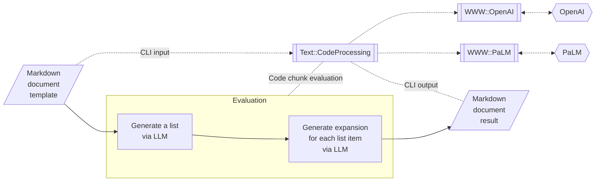

# Generating documents via templates and LLMs

Anton Antonov   
[RakuForPrediction at WordPress](https://rakuforprediction.wordpress.com)   
[RakuForPrediction-book at GitHub](https://github.com/antononcube/RakuForPrediction-book)   
July 2023


## Introduction

This article proclaims the simple secret of making "fully fledged" documents via 
Large Language Models (LLMs), [AA2, Wk1], using computational Markdown, Org-mode, or Pod6 template files, [AA1, AAv1],
and a few Raku packages, [AAp1÷AAp3].

**Definition:** A computational Markdown, Org-mode, or Pod6 file has *code chunks* the content of which
is evaluated within one, document-wide context, [AA1, AAv1, AAp1].

**Definition:** We call the processing of a computational document via the package
["Text::CodeProcessing"](https://raku.land/zef:antononcube/Text::CodeProcessing), [AAp1],
***document execution***.

Of course, instead of using templates we can "just" write Raku scripts that generate such documents, but using
scripts does not allow:
- Convenient interleaving of human-written content with LLM hallucinations
- (Semi-)interactive, refining, editing, and tweaking of both content types.
  - With suitable editors, integrated development environments, or notebook "solutions."

The document execution can be done via the Command Line Interface (CLI) of the package
"Text::CodeProcessing". Recent development of "Text::CodeProcessing" added "code chunk" plug-ins 
for accessing the LLMs 
[ChatGPT (OpenAI)](https://openai.com/chatgpt), [AAp2], 
and
[PaLM](https://developers.generativeai.google), [AAp3].

See the references for more details of the underlying mechanics, [AA1, AA2, AAp1÷AAp3].

Here is an example Markdown template:
["Simple guide via LLM template"](https://github.com/antononcube/RakuForPrediction-book/blob/main/Articles/Simple-guide-via-LLM-template.md), [AA3].

Here are documents obtained by executing that template:
- ["12 steps guide to quit Python (1)"](https://github.com/antononcube/RakuForPrediction-book/blob/main/Articles/LLM-generated/12-steps-guide-to-quit-Python-via-PaLM-1.md)
- ["12 steps guide to quit Python (2)"](https://github.com/antononcube/RakuForPrediction-book/blob/main/Articles/LLM-generated/12-steps-guide-to-quit-Python-via-PaLM-2.md)
- ["R is arcane, designed by a committee, and LISP-curseless"](https://github.com/antononcube/RakuForPrediction-book/blob/main/Articles/LLM-generated/R-is-arcane-by-comittee-and-LISP-curseless-PaLM.md)

**Remark:** I plan to add other LLM-generated documents in the 
GitHub directory ["Articles/LLM-generated"](https://github.com/antononcube/RakuForPrediction-book/tree/main/Articles/LLM-generated)
of the project 
["RakuForPrediction book"](https://github.com/antononcube/RakuForPrediction-book), [AAp4].

Here is a flowchart that summarizes the execution steps:



----------

## Template structure and content 

In this section we describe how to design document generation- and LLM leveraging templates like
["Simple guide via LLM template"](https://github.com/antononcube/RakuForPrediction-book/blob/main/Articles/Simple-guide-via-LLM-template.md), [AA3],
and exemplify the corresponding template code chunks.

The main idea of the template is simple:
1. Have a LLM code chunk that asks the generation of a **list** actions, features, or description elements on a certain subject or theme
2. Follow up with one or several Raku code chunks that:
   - Process the LLM output
   - Make LLM requests for expanding each (or some) of the items of the LLM derived list
3. Make the code chunks "self-deleting"
   - I.e. only the results of code chunks execution are placed in the result document
   - In this way we obtain more "seamless" documents.
4. Place the code chunk results without code block markings, i.e. with "as is" specs. 

The following subsections demonstrate the two types of code chunks and provide details.


### LLM cells

Here is an example of an LLM access cell using ["WWW::OpenAI"](https://raku.land/zef:antononcube/WWW::OpenAI), [AAp2]:

````
```openai, format=values, temperature=1.4, max-tokens=800, results=asis, output-prompt=NONE, echo=FALSE
Generate a 12 steps outline for quiting addiction to programmaring Python (and replacing with Raku.)
```
````

Note that:

- All named parameters of `openai-completion` can be used as code chunk parameters.
- The code chunk specs `results=asis, output-prompt=NONE` make the output to be "seamlessly" included in the result document.
- The spec `echo=FALSE` "removes" the code chunk from the result document.


### Raku cells with LLM access 

Here is an example of Raku cell with a "LLM generation script" that expands
each of the items from the list obtained above.

````
```perl6, results=asis, output-prompt=NONE, echo=FALSE
my $txt = _.trim;
my $txtExpanded = do for $txt.split(/ ^^ [ \d+ | <[IVXLC]>+ ] /, :v, :skip-empty)>>.Str.rotor(2) -> $p {
    my $res = "-" x 6; 
    $res ~= "\n"; 
    $res ~= "\n## {$p[0]}.";
    my $start = '';
    if $p[1] ~~ / '**'  (.*?) '**' | '<b>'  (.*?) '</b>' / {
        $start = $0.Str;
        $res ~= ' ' ~ $start.subst( / <punct>+ $$/, '');
    };
    $res ~= "\n\n>... {$p[1].subst(/'**' $start '**'/, '').subst( / ^^ <punct>+ /, '')}"; 
    #$res ~= "\n\n", openai-completion( "Expand upon: {$p[1]}", temperature => 1.45, max-tokens => 400, format=>'values' );
    $res ~= "\n\n", palm-generate-text( "Expand upon: {$p[1]}", temperature => 0.75, max-tokens => 400, format=>'values' );
}

$txtExpanded.join("\n\n") 
```
````

Note that:
- With `_` we can access the last evaluated result "Text::CodeProcessing", [AAp1].
  - By the way, using `_` for last result access is:
    - "Inspired" by Python's console
    - "Inherited" from Brian Duggan's package ["Jupyter::Kernel"](https://raku.land/cpan:BDUGGAN/Jupyter::Kernel)
- Again the results are placed in the result notebook "as is."

The script relies on the assumptions that:
- List items are numbered (because of the formulation of the LLM request.)
  - See the splitting regex.
- Very likely list items have an opening phrase in Markdown bold font spec.


------

## Variations

### Other templates 

Obviously, Markdown templates with other structures and interactions between the LLM cells and Raku cells.

For example, we can have a sequence of LLM cells that shape or direct the result document
in a certain way.  

### Multiple documents

Multiple documents can be obtained using:

- Different LLMs 
- Different LLM parameter values
- Same LLM parameter values, but with high LLM "temperature."

------

## References

### Articles

[AA1] Anton Antonov,
["Conversion and evaluation of Raku files"](https://rakuforprediction.wordpress.com/2022/11/05/conversion-and-evaluation-of-raku-files/),
(2022),
[RakuForPrediction at WordPress](https://rakuforprediction.wordpress.com).

[AA2] Anton Antonov,
["Racoons playing with pearls and onions"](https://rakuforprediction.wordpress.com/2023/03/12/racoons-playing-with-pearls-and-onions/),
(2023),
[RakuForPrediction at WordPress](https://rakuforprediction.wordpress.com).

[AA3] Anton Antonov,
["Simple guide via LLM template"](https://github.com/antononcube/RakuForPrediction-book/blob/main/Articles/Simple-guide-via-LLM-template.md),
(2023),
[RakuForPrediction-book at GitHub/antononcube](https://github.com/antononcube/RakuForPrediction-book).

[AA4] Anton Antonov,
["12 steps guide to quit Python"](https://github.com/antononcube/RakuForPrediction-book/blob/main/Articles/LLM-generated/12-steps-guide-to-quit-Python-via-PaLM-1.md),
(2023),
[RakuForPrediction-book at GitHub/antononcube](https://github.com/antononcube/RakuForPrediction-book).

[Wk1] Wikipedia entry, ["Large language model"](https://en.wikipedia.org/wiki/Large_language_model).


### Packages, repositories

[AAp1] Anton Antonov,
[Text::CodeProcessing Raku package](https://github.com/antononcube/Raku-Text-CodeProcessing),
(2021-2023),
[GitHub/antononcube](https://github.com/antononcube).

[AAp2] Anton Antonov,
[WWW::OpenAI Raku package](https://github.com/antononcube/Raku-WWW-OpenAI),
(2023),
[GitHub/antononcube](https://github.com/antononcube).

[AAp3] Anton Antonov,
[WWW::PaLM Raku package](https://github.com/antononcube/Raku-WWW-PaLM),
(2023),
[GitHub/antononcube](https://github.com/antononcube).

[AAp4] Anton Antonov,
[RakuForPrediction-book](https://github.com/antononcube/RakuForPrediction-book),
(2021-2023),
[GitHub/antononcube](https://github.com/antononcube).

[BDp1] Brian Duggan,
[Jupyter::Kernel Raku package](https://github.com/bduggan/raku-jupyter-kernel),
(2017-2023),
[GitHub/bduggan](https://github.com/bduggan/).

## Videos

[AAv1] Anton Antonov,
["Conversion and evaluation of Raku files"](https://www.youtube.com/watch?v=GJO7YqjGn6o),
(2022),
[YouTube/@AAA4Prediction](https://www.youtube.com/@AAA4prediction).

[AAv2] Anton Antonov,
["Racoons playing with pearls and onions"](https://www.youtube.com/watch?v=zlkoNZK8MpU),
(2023),
[YouTube/@AAA4Prediction](https://www.youtube.com/@AAA4prediction).
