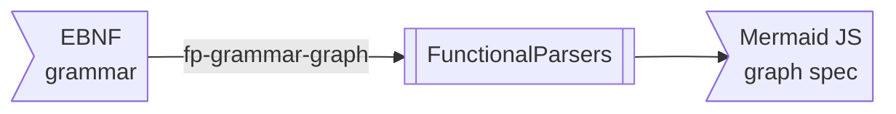
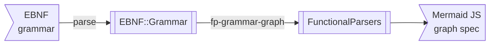
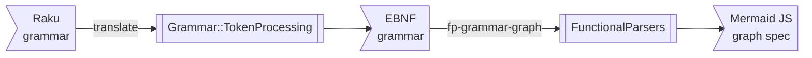
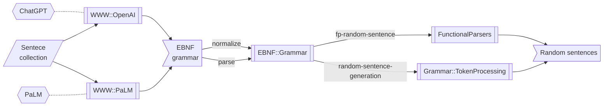

# Graph representation of grammars

## Introduction

This computational Markdown document demonstrates the mapping of 
[Extended Backus-Naur Grammars (EBNF)](https://en.wikipedia.org/wiki/Extended_Backus–Naur_form)
and Raku grammars into graphs.

The graphs are made with [Mermaid-JS](https://mermaid.js.org) and 
[Wolfram Language (WL)](https://www.wolfram.com/language/) (aka Mathematica).  

**Remark:** Mermaid-JS specs are automatically rendered in GitHub Markdown files,
and have plug-in support in Integrated Development Environments (IDEs) like IntelliJ IDEA, VS Code, Emacs, etc.

Examples using Large Language Models (LLMs) are provided. (Via 
["WWW::OpenAI"](https://raku.land/zef:antononcube/WWW::OpenAI) and 
["WWW::PaLM"](https://raku.land/zef:antononcube/WWW::PaLM), [AAp4, AAp5].)

The document has the following structure:

- **Reflections and observations**     
  I.e. "conclusions first." Those make the anecdotal examples below more scientific, not just conjecture-worthy anecdotes.
- **Packages and interactions**   
  A list the packages utilized and how they can be used in a coherent way.
- **Generating Mermaid diagrams for EBNFs**   
  Two simple and similar EBNF grammars with graphs for instructive comparison.
- **Generating graphs with LLMs**   
  Can LLMs replace Raku programming (of grammar-graphs making)?
- **Generating Mermaid diagrams for Raku grammars**   
  Same exercise but over *Raku grammars*, not some EBNFs... 
- **LLMs grammars for sentence collections**   
  An interesting way to derive EBNFs is to "just ask." Well, some questions might get really long (and their answers really expensive.) 
- **Random LLMs grammars**   
  Why ask for EBNFs of sentence collections, if we can just say "Give me a random EBNF grammar (or five.)"
- **More complicated grammar**   
  A larger grammar example, in order to illustrate the usefulness -- or *uselessness* -- of grammar-graphs.

------

## Reflections and observations

- I consider grammar graph representation "neat" and "cool" for small enough grammars, 
but I am not sure how useful it is for large grammars. 
  - Especially, large grammars with recursive dependencies between the production rules.

- I made a fair amount of experiments with relatively small grammars, and fewer experiments with a few large grammars.

- The ability to make the grammar graphs, of course, has at least didactic utility.

- Another utility of the examples given below is to show coherent interaction between the packages:
  - ["FunctionalParsers"](https://raku.land/zef:antononcube/FunctionalParsers)
  - ["EBNF::Grammar"](https://raku.land/zef:antononcube/EBNF::Grammar)
  - ["Grammar::TokenProcessing"](https://raku.land/zef:antononcube/Grammar-TokenProcessing)

- This Markdown document is "executed" with the package 
["Text::CodeProcessing"](https://raku.land/zef:antononcube/Text::CodeProcessing),
which allows generation of Markdown specs that are, say, automatically processed by Web browsers, IDEs, etc.  
  - Like Mermaid-JS charts and graphs.

- Visualizing grammars generated by Large Language Models (LLMs) -- 
like, [ChatGPT](https://openai.com/blog/chatgpt) and [PaLM](https://en.wikipedia.org/wiki/PaLM) 
-- is both didactic and "neat." 
  - One of my primary motivations for making the packages "FunctionalParsers" and "EBNF::Grammar" was to be able 
  to easily (automatically or semi-automatically) process grammars generated with LLMs. 
  - It is not trivial to parse EBNF hallucinations by LLMs. (More details below.)

- Generating Raku grammars with ChatGPT-3.5 or PaLM often produces "non-working" grammars. That is why I focused on EBNF grammars.
  - My assumption is that EBNF has been around for a longer period of time, hence, LLMs are "better trained for it."

- This Markdown document can be converted into a Mathematica notebook using "Markdown::Grammar", [AAp6].
Mathematica notebooks in [RakuMode](https://resources.wolframcloud.com/PacletRepository/resources/AntonAntonov/RakuMode/), 
[AAp7], make much easier the experiments with diagram generation and LLM utilization. (And more fun!) 

------

## Packages and interactions

Here we load the packages used below:

```perl6
use FunctionalParsers;
use FunctionalParsers::EBNF;
use EBNF::Grammar;
use Grammar::TokenProcessing;
use WWW::OpenAI;
use WWW::PaLM;
```

Here are flowcharts that summarize use cases, execution paths, and interaction between the packages:









------

## Generating Mermaid diagrams for EBNFs

The function `fp-ebnf-parse` can produce
[Mermaid-JS diagrams](https://mermaid.js.org)
corresponding to grammars with the target "MermaidJS::Graph".
Here is an example:

```perl6, output-lang=mermaid, output-prompt=NONE
my $ebnfCode1 = q:to/END/;
<top> = <a> | <b> ;
<a> = 'a' , { 'A' } , [ '1' ];
<b> = 'b' , ( 'B' | '2' );
END

fp-ebnf-parse($ebnfCode1, target=>'MermaidJS::Graph', dir-spec => 'LR').head.tail
```

Here is a legend:

- The non-terminals are shown with rectangles
- The terminals are shown with round rectangles
- The "conjunctions" are shown in disks
- The order of parsing in sequences is indicated with integer labels
- Pick-left and pick-right sequences use the labels "L" and "R" for the corresponding branches 

**Remark:** The Markdown cell above has the parameters `output-lang=mermaid, output-prompt=NONE`
which allow for direct diagram rendering of the obtained Mermaid code in various Markdown viewers (GitHub, IntelliJ, etc.)

Compare the following EBNF grammar and corresponding diagram with the ones above:

```perl6, output-lang=mermaid, output-prompt=NONE
my $ebnfCode2 = q:to/END/;
<top> = <a> | <b> ;
<a> = 'a' <& { 'A' } , [ '1' ] ;
<b> = 'b' , 'B' | '2' ;
END

fp-ebnf-parse($ebnfCode2, target=>'MermaidJS::Graph', dir-spec => 'LR').head.tail
```

------

## Generating graphs with LLMs

It is interesting to see do LLMs do better at producing (Mermaid-JS) graph representations.

More importantly, we want to answer the question:

> Can we generate graph-specs (like, Mermaid-JS) without the need of programming the corresponding interpreters?

Here is a LLM request for a Mermaid-JS spec generation for one of the simple grammars above:

```perl6
my $request = "Make a Mermaid JS diagram for the EBNF grammar:\n$ebnfCode1";
#my $mmdLLM = openai-completion($request, max-tokens => 600, format => 'values', temperature => 1.2);
my $mmdLLM = palm-generate-text($request, max-tokens => 600, format => 'values', temperature => 0.9);
```

Here is the corresponding graph:

```perl6, results=asis
$mmdLLM
```

**Remark::** After multiple experiments I can say that the obtained Mermaid-JS code is either:
- Simple, somewhat relevant, and wrong
- Closer to correct after suitable manual editing 

As for the question above -- the answer is "No". But the LLM answers provide (somewhat) good initial versions
for manual (human) building of graph specifications. 

------

## Generating Mermaid diagrams for Raku grammars

In order to generate graphs for Raku grammars we use the following steps:

1. Translate Raku-grammar code into EBNF code
2. Translate EBNF code into graph code (Mermaid-JS or WL)

Consider a grammar for parsing proclaimed feeling toward different programming languages:

```perl6
grammar LangLove {
    rule TOP  { <workflow-command> }
    rule workflow-command  { <who> 'really'? <love> <lang> }
    token who { 'I' | 'We' }
    token love { 'hate' | 'love' }
    token lang { 'Raku' | 'Perl' | 'Rust' | 'Go' | 'Python' | 'Ruby' }
}
```

Here is an example parsing:

```perl6
LangLove.parse('I hate Perl')
```

First we derive the corresponding EBNF grammar:

```perl6
my $ebnfLangLove = to-ebnf-grammar(LangLove)
```

Here is the corresponding Mermaid-JS graph:

```perl6, output-lang=mermaid, output-prompt=NONE
fp-grammar-graph($ebnfLangLove)
```

------

## LLMs grammars for sentence collections

Here is an EBNF grammar generated with ChatGPT, [AAp4], over a list of chemical formulas:

```perl6
#my @sentences = <BrI BrClH2Si CCl4 CH3I C2H5Br H2O H2O4S AgBr AgBrO AgBrO2 AgBrO3 AgBrO4 AgCL>;
my @sentences = <AgBr AgBrO AgBrO2 AgBrO3 AgBrO4 AgCL>;
my $request = "Generate EBNF grammar for the sentences:\n{@sentences.map({ $_.comb.join(' ')}).join("\n")}";
#my $ebnfLLM = openai-completion($request, max-tokens => 600, format => 'values');
my $ebnfLLM = palm-generate-text($request, max-tokens => 600, format => 'values');
```

Often LLM requests as the ones above return code as Markdown code cells, hence, we try to remove the code cell markings:

```perl6
$ebnfLLM = $ebnfLLM.subst(/ ^ '`' ** 3 <-[\v]>* \n | '`' ** 3 \h* $ /,''):g;
```

```perl6, output-lang=mermaid, output-prompt=NONE
fp-grammar-graph($ebnfLLM, style => Whatever)
```

Another way for "verify" a grammar is to generate random sentences with it:

```perl6
.say for ebnf-random-sentence($ebnfLLM, 12, style => Whatever)
```

**Remark:** Random sentences can be also generated with the function `fp-random-sentence` provided by "FunctionalParsers".

**Remark:** The function `ebnf-random-sentence` uses `fp-random-sentence`, but `ebnf-random-sentence` 
(parses and) standardizes the given EBNF grammar first, (then it gives the standardized grammar to `fp-random-sentence`.)

**Remark:** It is not trivial to parse EBNF hallucinations by LLMs. For the same EBNF-making request a given LLM 
can produce different EBNF grammars, each having "its own" EBNF style. Hence, both "FunctionalParsers" and "EBNF::Grammar"
have parsers for different EBNF styles. With the spec `style => Whatever` parsing of all of the "anticipated" styles are attempted.

------

## Random LLMs grammars

Why ask for EBNF graphs with sentence collections, if we can just say:

> Give me a random EBNF grammar. (Or five.) 
 
**Remark:** Note, the implications of testing the parsers in that way. We can try to produce extensive parser tests
by multiple randomly obtained grammars from different LLMs. (Using different LLM parameters, like, temperatures, etc.)

Here is another example using a ***random*** (hopefully small) EBNF grammar:

```perl6
my $request2 = "Give an example of simple EBNF grammar.";
#my $ebnfLLM2 = openai-completion($request2, max-tokens => 600, format => 'values', temperature => 1.2);
my $ebnfLLM2 = palm-generate-text($request2, max-tokens => 600, format => 'values', temperature => 0.9);
$ebnfLLM2 = $ebnfLLM2.subst(/ ^ '`' ** 3 <-[\v]>* \n | '`' ** 3 \h* $ /,''):g;
```

```perl6, output-lang=mermaid, output-prompt=NONE
fp-grammar-graph($ebnfLLM2, style => Whatever, dir-spec => 'LR')
```

------

## More complicated grammar

Consider the following grammar for arithmetic expressions:

```perl6
my $ebnfExpr = q:to/END/;
start   = expr ;
expr    = term '+' expr | term '-' expr | term ;
term    = term '*' factor | term '/' factor | factor ;
factor  = '+' factor | '-' factor | (expr) | integer | integer '.' integer ;
integer = digit integer | digit ;
digit   = '0' | '1' | '2' | '3' | '4' | '5' | '6' | '7' | '8' | '9' ;
END
```

Here we produce the graph using special parsing style:

```perl6, output-lang=mermaid, output-prompt=NONE
fp-grammar-graph($ebnfExpr, style => 'Relaxed')
```

------

## References

### Articles

[Wk1] Wikipedia entry, ["Extended Backus–Naur form"](https://en.wikipedia.org/wiki/Extended_Backus–Naur_form).

### Packages, repositories

[AAp1] Anton Antonov,
[FunctionParsers Raku package](https://github.com/antononcube/Raku-FunctionalParsers),
(2023),
[GitHub/antononcube](https://github.com/antononcube).

[AAp2] Anton Antonov,
[EBNF:Grammar Raku package](https://github.com/antononcube/Raku-EBNF-Grammar),
(2023),
[GitHub/antononcube](https://github.com/antononcube).

[AAp3] Anton Antonov,
[Grammar::TokenProcessing Raku package](https://github.com/antononcube/Raku-Grammar-TokenProcessing),
(2022-2023),
[GitHub/antononcube](https://github.com/antononcube).

[AAp4] Anton Antonov,
[WWW::OpenAI Raku package](https://github.com/antononcube/Raku-WWW-OpenAI),
(2023),
[GitHub/antononcube](https://github.com/antononcube).

[AAp5] Anton Antonov,
[WWW::PaLM Raku package](https://github.com/antononcube/Raku-WWW-PaLM),
(2023),
[GitHub/antononcube](https://github.com/antononcube).

[AAp6] Anton Antonov,
[Markdown::Grammar Raku package](https://github.com/antononcube/Raku-Markdown-Grammar),
(2022-2023),
[GitHub/antononcube](https://github.com/antononcube).

[AAp7] Anton Antonov,
[RakuMode WL paclet](https://resources.wolframcloud.com/PacletRepository/resources/AntonAntonov/RakuMode/),
(2023),
[Wolfram Resource System / AntonAntonov](https://resources.wolframcloud.com/publishers/resources?PublisherID=AntonAntonov).
