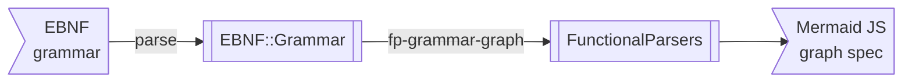

# Graph representation of grammars

## Introduction

This computational Markdown document demonstrates the mapping of 
[Extended Backus-Naur Grammars (EBNF)](https://en.wikipedia.org/wiki/Extended_Backus–Naur_form)
and Raku grammars into graphs.

The graphs are made with [Mermaid-JS](https://mermaid.js.org) and 
[Wolfram Language (WL)](https://www.wolfram.com/language/) (aka Mathematica).  

**Remark:** Mermaid-JS specs are automatically rendered in GitHub Markdown files,
and have plug-ing support in Integrated Development Environments (IDEs) like IntelliJ IDEA, VS Code, Emacs, etc.

### Reflections and observations

- I consider the graph representation "neat" and "cool" for small enough grammars, 
but I am not sure how useful it is for large grammars. 

- I made a fair amount of experiments with relatively small grammars, and experiments with a few large grammars.

- The ability to make the grammar graphs, of course, has at least didactic utility.

- Another utility of the experiments shown here is to show coherent interaction between the packages
  - ["FunctionalParsers"](https://raku.land/zef:antononcube/FunctionalParsers)
  - ["EBNF::Grammar"](https://raku.land/zef:antononcube/EBNF::Grammar)
  - ["Grammar::TokenProcessing"](https://raku.land/zef:antononcube/Grammar-TokenProcessing)

- This Markdown document is "executed" with the package 
["Text::CodeProcessing"](https://raku.land/zef:antononcube/Text::CodeProcessing)
which allows generation of Markdown specs that are, say, automatically processed by Web browsers, IDEs, etc.  
  - Like Mermaid-JS charts and graphs.

- Visualizing grammars generated by Large Language Models (LLMs) -- like, ChatGPT and PaLM -- is both didactic and "neat." 
  - One of my primary motivations for making packages "FunctionalParsers" and "EBNF::Grammar" was to be able 
  to easily (automatically or semi-automatically) process grammars generated with LLMs. 

------

## Packages and interactions

Here we load the packages used below:

```perl6
use FunctionalParsers;
use FunctionalParsers::EBNF;
use EBNF::Grammar;
use Grammar::TokenProcessing;
use WWW::OpenAI;
use WWW::PaLM;
```
```
# (Any)
```

Here are flowcharts that summarize use cases, execution paths, and interaction between the packages:





------

## Generating Mermaid diagrams for EBNFs

The function `fp-ebnf-parse` can produce
[Mermaid-JS diagrams](https://mermaid.js.org)
corresponding to grammars with the target "MermaidJS::Graph".
Here is an example:

```perl6, result=asis, output-lang=mermaid, output-prompt=NONE
my $ebnfCode3 = q:to/END/;
<top> = <a> | <b> ;
<a> = 'a' , { 'A' } , [ '1' ];
<b> = 'b' , ( 'B' | '2' );
END

fp-ebnf-parse($ebnfCode3, target=>'MermaidJS::Graph', dir-spec => 'LR').head.tail
```


Here is a legend:

- The non-terminals are shown with rectangles
- The terminals are shown with round rectangles
- The "conjunctions" are shown in disks
- The order of parsing in sequences is indicated with integer labels
- Pick-left and pick-right sequences use the labels "L" and "R" for the corresponding branches 

**Remark:** The Markdown cell above has the parameters `result=asis, output-lang=mermaid, output-prompt=NONE`
which allow for direct diagram rendering of the obtained Mermaid code in various Markdown viewers (GitHub, IntelliJ, etc.)

Compare the following EBNF grammar and corresponding diagram with the ones above:

```perl6, result=asis, output-lang=mermaid, output-prompt=NONE
my $ebnfCode4 = q:to/END/;
<top> = <a> | <b> ;
<a> = 'a' <& { 'A' } , [ '1' ] ;
<b> = 'b' , 'B' | '2' ;
END

fp-ebnf-parse($ebnfCode4, target=>'MermaidJS::Graph', dir-spec => 'LR').head.tail
```


------

## Generating Mermaid diagrams for Raku grammars

In order to generate graphs for Raku grammars we use the following steps:

1. Translate Raku-grammar code into EBNF code
2. Translate EBNF code into graph code (Mermaid-JS or WL)

Consider a grammar for parsing proclaimed feeling toward different programming languages:

```perl6
grammar LangLove {
    rule TOP  { <workflow-command> }
    rule workflow-command  { <who> 'really'? <love> <lang> }
    token who { 'I' | 'We' }
    token love { 'hate' | 'love' }
    token lang { 'Raku' | 'Perl' | 'Rust' | 'Go' | 'Python' | 'Ruby' }
}
```
```
# (LangLove)
```

Here is an example parsing:

```perl6
LangLove.parse('I hate Perl')
```
```
# ｢I hate Perl｣
#  workflow-command => ｢I hate Perl｣
#   who => ｢I｣
#   love => ｢hate｣
#   lang => ｢Perl｣
```

First we derive the corresponding EBNF grammar:

```perl6
my $ebnfLangLove = to-ebnf-grammar(LangLove)
```
```
# <TOP> = <workflow-command>  ;
# <lang> = 'Raku'  | 'Perl'  | 'Rust'  | 'Go'  | 'Python'  | 'Ruby'  ;
# <love> = 'hate'  | 'love'  ;
# <who> = 'I'  | 'We'  ;
# <workflow-command> = <who> , ['really'] , <love> , <lang>  ;
```

Here is the corresponding Mermaid-JS graph:

```perl6, result=asis, output.lang=mermaid, output.prompt=NONE
fp-grammar-graph($ebnfLangLove)
```


------

## LLMs grammars

Here is an EBNF grammar generated with ChatGPT, [AAp4], over a list of chemical formulas:

```perl6
#my @sentences = <BrI BrClH2Si CCl4 CH3I C2H5Br H2O H2O4S AgBr AgBrO AgBrO2 AgBrO3 AgBrO4 AgCL>;
my @sentences = <AgBr AgBrO AgBrO2 AgBrO3 AgBrO4 AgCL>;
my $request = "Generate EBNF grammar for the sentences:\n{@sentences.map({ $_.comb.join(' ')}).join("\n")}";
#my $ebnfLLM = openai-completion($request, max-tokens => 600, format => 'values');
my $ebnfLLM = palm-generate-text($request, max-tokens => 600, format => 'values');
```
```
# {filters => [{reason => SAFETY}], safetyFeedback => [{rating => {category => HARM_CATEGORY_DEROGATORY, probability => LOW}, setting => {category => HARM_CATEGORY_DEROGATORY, threshold => BLOCK_LOW_AND_ABOVE}} {rating => {category => HARM_CATEGORY_TOXICITY, probability => LOW}, setting => {category => HARM_CATEGORY_TOXICITY, threshold => BLOCK_LOW_AND_ABOVE}}]}
```

Often the LLM requests return code as a Markdown code cell, hence, we try to remove the code cell markings:

```perl6
$ebnfLLM = $ebnfLLM.subst(/ ^ '`' ** 3 <-[\v]>* \n | '`' ** 3 \h* $ /,''):g;
```
```
# filters	reason	SAFETY
# safetyFeedback	rating	category	HARM_CATEGORY_DEROGATORY
# probability	LOW
# setting	category	HARM_CATEGORY_DEROGATORY
# threshold	BLOCK_LOW_AND_ABOVE rating	category	HARM_CATEGORY_TOXICITY
# probability	LOW
# setting	category	HARM_CATEGORY_TOXICITY
# threshold	BLOCK_LOW_AND_ABOVE
```

```perl6, result=asis, output.lang=mermaid, output.prompt=NONE
fp-grammar-graph($ebnfLLM, style => Whatever)
```
```mermaid
graph TD
```

Another way for "verify" a grammar is to generate random sentences with it:

```perl6
.say for ebnf-random-sentence($ebnfLLM, 12, style => Whatever)
```
```
#ERROR: Cannot parser the given grammar.
# Nil
```

Here is generation with the function provided by "FunctionalParsers":

```perl6
.say for fp-random-sentence($ebnfLLM, 12, style => Whatever)
```
```
# pFILTERS()
# pFILTERS()
# pFILTERS()
# pFILTERS()
# pFILTERS()
# pFILTERS()
# pFILTERS()
# pFILTERS()
# pFILTERS()
# pFILTERS()
# pFILTERS()
# pFILTERS()
```

**Remark:** The function `ebnf-random-sentence` uses `fp-random-sentence`, but `ebnf-random-sentence` 
(parses and) standardizes the given EBNF grammar first, (then it gives the standardized grammar to `fp-random-sentence`.)

**Remark:** It is not trivial to parse EBNF hallucinations by LLMs. For the same EBNF-making request a given LLM 
can produce different EBNF grammars each having "its own" EBNF style. Hence, both "FunctionalParsers" and "EBNF::Grammar"
have parsers for different EBNF styles. With the spec `style => Whatever` parsing of all of the "anticipated" styles are attempted.


Here is another example using a ***random*** (small) EBNF:

```perl6
my $request2 = "Give me some random small EBNF grammar.";
#my $ebnfLLM2 = openai-completion($request2, max-tokens => 600, format => 'values', temperature => 1.2);
my $ebnfLLM2 = palm-generate-text($request2, max-tokens => 600, format => 'values');
$ebnfLLM2 = $ebnfLLM2.subst(/ ^ '`' ** 3 <-[\v]>* \n | '`' ** 3 \h* $ /,''):g;
```
```
# <expression> ::= <term> { <addop> <term> }
# <term> ::= <factor> { <mulop> <factor> }
# <factor> ::= <integer> | <variable> | "(" <expression> ")"
# <addop> ::= "+" | "-"
# <mulop> ::= "*" | "/"
# <integer> ::= [0-9]+
# <variable> ::= [a-zA-Z][a-zA-Z0-9]*
```

```perl6, result=asis, output.lang=mermaid, output.prompt=NONE
fp-grammar-graph($ebnfLLM2, style => Whatever)
```


------

## More complicated grammar

Consider this grammar:

```perl6
my $ebnfExpr = q:to/END/;
start   = expr ;
expr    = term '+' expr | term '-' expr | term ;
term    = term '*' factor | term '/' factor | factor ;
factor  = '+' factor | '-' factor | (expr) | integer | integer '.' integer ;
integer = digit integer | digit ;
digit   = '0' | '1' | '2' | '3' | '4' | '5' | '6' | '7' | '8' | '9' ;
END
```
```
# start   = expr ;
# expr    = term '+' expr | term '-' expr | term ;
# term    = term '*' factor | term '/' factor | factor ;
# factor  = '+' factor | '-' factor | (expr) | integer | integer '.' integer ;
# integer = digit integer | digit ;
# digit   = '0' | '1' | '2' | '3' | '4' | '5' | '6' | '7' | '8' | '9' ;
```

Here we produce the graph using special parsing style:

```perl6, result=asis, output.lang=mermaid, output.prompt=NONE
fp-grammar-graph($ebnfExpr, style => 'Relaxed')
```


------

## References

### Articles

[Wk1] Wikipedia entry, ["Extended Backus–Naur form"](https://en.wikipedia.org/wiki/Extended_Backus–Naur_form).

### Packages, repositories

[AAp1] Anton Antonov,
[FunctionParsers Raku package](https://github.com/antononcube/Raku-FunctionalParsers),
(2023),
[GitHub/antononcube](https://github.com/antononcube).

[AAp2] Anton Antonov,
[EBNF:Grammar Raku package](https://github.com/antononcube/Raku-EBNF-Grammar),
(2023),
[GitHub/antononcube](https://github.com/antononcube).

[AAp3] Anton Antonov,
[Grammar::TokenProcessing Raku package](https://github.com/antononcube/Raku-Grammar-TokenProcessing),
(2022-2023),
[GitHub/antononcube](https://github.com/antononcube).

[AAp4] Anton Antonov,
[WWW::OpenAI Raku package](https://github.com/antononcube/Raku-WWW-OpenAI),
(2023),
[GitHub/antononcube](https://github.com/antononcube).

[AAp5] Anton Antonov,
[WWW::PaLM Raku package](https://github.com/antononcube/Raku-WWW-PaLM),
(2023),
[GitHub/antononcube](https://github.com/antononcube).
