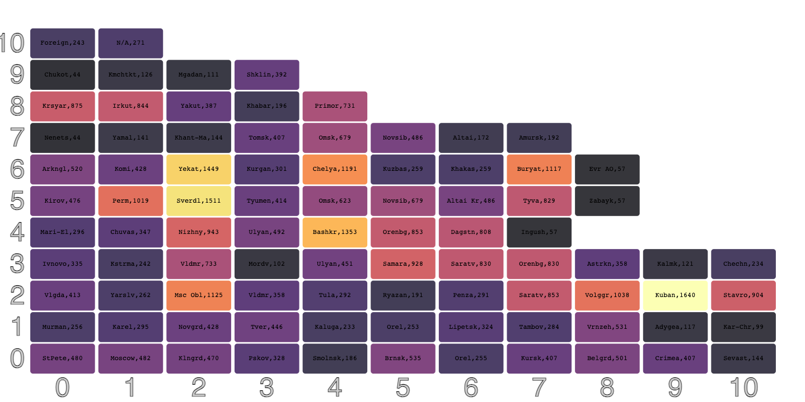
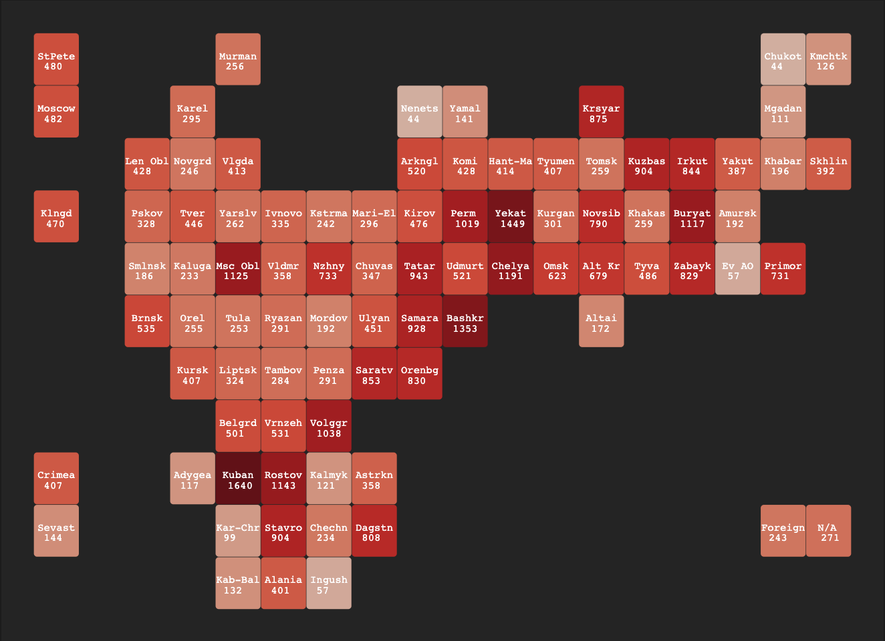
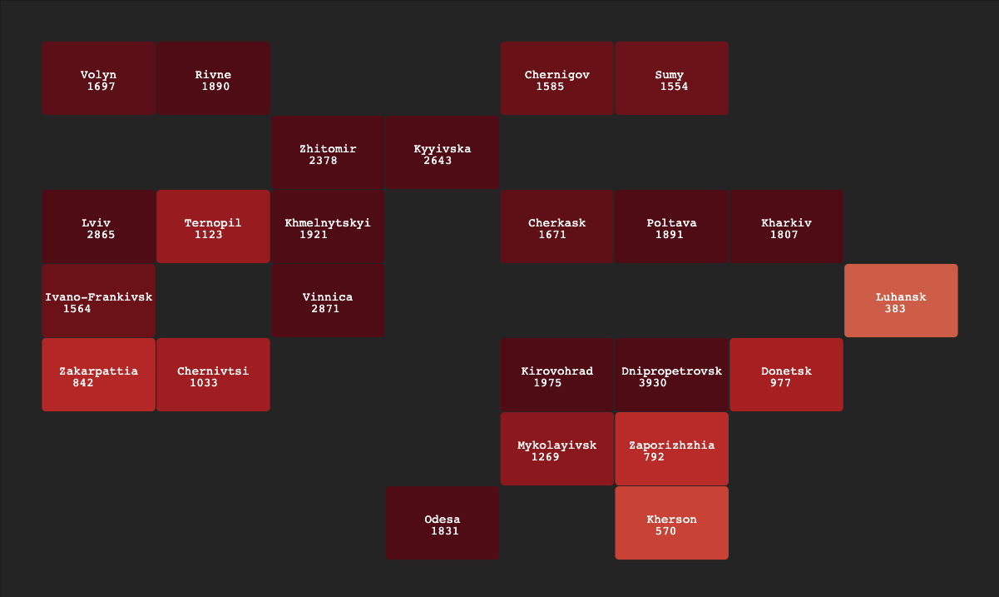

# Heatmaps for LLM vision scraped data

Anton Antonov   
[RakuForPrediction at WordPress](https://rakuforprediction.wordpress.com)   
[RakuForPrediction-book at GitHub](https://github.com/antononcube/RakuForPrediction-book)    
December 2023   
January 2024

------

## Introduction

In this document we show the use of Artificial Intelligence (AI) Vision and Large Language Models (LLMs) for data scraping from images and Web pages and we present heatmap plots corresponding to the scraped data. 

The LLM utilization and visualization are done in chat-enabled Jupyter notebook with a Raku kernel; "chatbook" for short. 
See ["Jupyter::Chatbook"](https://raku.land/zef:antononcube/Jupyter::Chatbook), [AAp4, AAv3].

The heatmap plots in the Jupyter notebook are done with the package ["JavaScript::D3"](https://raku.land/zef:antononcube/JavaScript::D3), [AAp8, AAv1, AAv2]. (Heatmap plots were recently implemented.)

We use data from sites dedicated of tracking Russian and Ukrainian casualties in NATO's war in Ukraine, (2022-present):

- Russian casualties: [Mediazona](https://en.zona.media/article/2022/05/20/casualties_eng), [MZ1]
- Ukrainian casualties: [UALosses](https://ualosses.org/), [UAL1]

**Remark:** Note that UALosses is relatively new, hence, it provides too few records of Ukrainian losses. 
The casualties of Medizona and UALosses should be considered underestimates because of the methodologies they use. 
(Tracking and verifying online records.) See:
- Section ["Our methods"](https://en.zona.media/article/2022/05/20/casualties_eng) of Mediazona
- Page ["About the project"](https://ualosses.org/about/) of UALosses 

This document is a complement to the document ["Extracting Russian casualties in Ukraine data from Mediazona publications"](https://mathematicaforprediction.wordpress.com/2023/12/15/extracting-russian-casualties-in-ukraine-data-from-mediazona-publications), [AA4], 
and it uses AI Vision and LLM functionalities described in [AA1-AA3].

### Outline

Here is an outline of the workflow steps shown below:

1. Setup (packages and JavaScript plotting)
2. Get a screenshot of Russian casualties heatmap plot from [Mediazona](https://en.zona.media/article/2022/05/20/casualties_eng), [MZ1]
3. Using OpenAI's AI Vision extract data from the screenshot
4. Verify and manually adjust the obtained data 
5. Make a heatmap plot
6. Verify the plotted data
7. Download page with regional Ukrainian casualties from [UALosses](https://ualosses.org/regions/), [UAL1]
8. Use LLM to obtain the tabular data for those casualties 
9. Adjust, translate, or match names of regions (via LLMs)
10. Make the corresponding heatmap plot
11. Observations and conclusions   


-------

## Setup

In this section we load the necessary packages and setup chatbook's environment for Javascript plots.


```raku
use JSON::Fast;
use HTTP::Tiny;

use Data::Generators;
use Data::Reshapers;
use Data::Summarizers;

use JavaScript::D3;
```


```raku
%% javascript
require.config({
     paths: {
     d3: 'https://d3js.org/d3.v7.min'
}});

require(['d3'], function(d3) {
     console.log(d3);
});
```

-----

## Heatmap screenshot import

Here we get a screenshot image from [AAr1, MZ1] of the Russian casualties and we import it into the chatbook's session: 


```raku
#% markdown
my $url = 'https://raw.githubusercontent.com/antononcube/SystemModeling/master/Projects/War-modeling/Diagrams/Mediazona-Russian-casualties-choropleth-upto-2024-01-19.png';
my $img = image-import($url);
```


**Remark:** The function `image-import` is from the package ["Image::Markup::Utilities"](https://raku.land/zef:antononcube/Image::Markup::Utilities), [AAp5], which is automatically loaded in a notebook session of ["Jupyter::Chatbook"](https://raku.land/zef:antononcube/Jupyter::Chatbook), [AAp4].

------

## Data extraction via AI Vision

Here we extract the data from imported screenshot using the function `llm-vision-synthesize`, [AAp1, AAp2, AA3]:


```raku
llm-vision-synthesize("Give row-wise the Russian states and numbers in the squares of the choropleth.", $url, max-tokens => 2000)
```


    The image contains a lot of text and numbers, which appear to be related to Russian casualties in Ukraine, categorized by different Russian states. I'll provide the information row-wise as requested:
    
    First row:
    - StPete: 480
    - Moscow: 482
    - Klng: 470
    
    Second row:
    - Murman: 256
    - Karel: 295
    - Len Obl: 428
    - Novgrd: 246
    - Vlgda: 413
    - Arkngl: 520
    - Komi: 414
    - Hant-Ma: 407
    - Tyumen: 259
    - Tomsk: 904
    - Kuzbas: 259
    - Irkut: 844
    - Yakut: 387
    - Khabar: 196
    - Chukot: 44
    - Kmchtk: 126
    
    Third row:
    - Pskov: 328
    - Tver: 446
    - Yarslv: 262
    - Ivonvo: 335
    - Kstrma: 242
    - Mari-El: 296
    - Kirov: 476
    - Perm: 1019
    - Yekat: 1449
    - Kurgan: 301
    - Novsib: 790
    - Khakas: 259
    - Buryat: 1117
    - Amursk: 192
    - Mgadan: 111
    
    Fourth row:
    - Smlnsk: 186
    - Kaluga: 233
    - Msc Obl: 1125
    - Vldmr: 358
    - Nizhny: 733
    - Chuvas: 347
    - Tatar: 943
    - Udmurt: 521
    - Chelya: 1191
    - Omsk: 623
    - Alt Kr: 679
    - Tyva: 486
    - Zabayk: 829
    - Evr AO: 57
    - Primor: 731
    
    Fifth row:
    - Brnsk: 535
    - Orel: 255
    - Tula: 253
    - Ryazan: 292
    - Mordov: 191
    - Ulyan: 451
    - Samara: 928
    - Bashkr: 1353
    - Altai: 172
    - Foreign: 243
    - N/A: 271
    
    Sixth row:
    - Kursk: 407
    - Liptsk: 324
    - Tambov: 284
    - Penza: 291
    - Saratv: 853
    - Orenbg: 830
    - Belgrd: 501
    - Vrnezh: 531
    - Volggr: 1038
    
    Seventh row:
    - Crimea: 407
    - Adygea: 117
    - Kuban: 1640
    - Rostov: 1143
    - Kalmyk: 121
    - Astrkn: 358
    - Sevast: 144
    
    Eighth row:
    - Kar-Chr: 99
    - Stavro: 904
    - Chechn: 234
    - Dagstn: 808
    - Kab-Bal: 132
    - Alania: 401
    - Ingush: 57
    
    The bottom of the image also states "At least 42,284 confirmed military deaths from 24 Feb 2022 to 15 Jan 2024." It explains that the timeline shows the number of confirmed casualties within a given time frame and notes that the number is not equal to the number of casualties per day. It also mentions that if the report does not mention the date, the date of its publication, that is, the earliest date we know when the person was confirmed to have been killed, is used. There is a note that Crimea and Sevastopol were annexed by Russia in 2014.


The result we get has the data from the screenshot, but in order to make a heatmap plot we would benefit from a more structured data representation that reflects the Geo-inspired structure of the choropleth. 

Here is we prepare and use a more detailed and instructive prompt and combine it with:
- JSON only prompt from ["LLM::Prompts"](https://raku.land/zef:antononcube/LLM::Prompts), [AAp3]
- JSON sub-parser from ["Text::SubParsers"](https://raku.land/zef:antononcube/Text::SubParsers), [AAp6]


```raku
my $p = q:to/END/;
The image has boxes arranged in jagged array. 
The full array would have been with 11 rows and 17 columns. 
Give a JSON dictionary of the content of the boxes in the image. 
The keys should be matrix coordinates, the values are two element lists corresponding to the labels inside the boxes.
END

my $res = llm-vision-synthesize([$p, llm-prompt("NothingElse")("JSON")], $url, max-tokens => 2000, form => sub-parser('JSON'):drop)
```


    [[9,1] => [Alania 401] [3,2] => [Msc Obl 1125] [1,3] => [Vlgda 413] [8,4] => [Dagstn 808] [0,7] => [Chukot 44] [0,1] => [Murm 256] [2,9] => [Kurgan 301] [3,4] => [Nizhny 733] [7,4] => [Kalmyk 121] [5,2] => [Tambov 284] [2,5] => [Mari-El 296] [4,3] => [Ryazan 291] [1,8] => [Tomsk 259] [3,0] => [Smlnsk 186] [3,13] => [Evr AO 57] [2,13] => [Amursk 192] [2,12] => [Buryat 1117] [6,2] => [Volggr 1038] [3,10] => [Alt Kr 679] [2,10] => [Novsib 790] [1,13] => [Skhlin 392] [9,0] => [Kab-Bal 132] [1,2] => [Novgrd 246] [0,9] => [Mgdan 111] [8,1] => [Kar-Chr 99] [4,5] => [Ulyan 451] [0,3] => [Karel 295] [1,9] => [Kuzbas 904] [2,3] => [Ivnovo 335] [7,0] => [Crimea 407] [0,5] => [Yamal 141] [4,0] => [Brnsk 535] [1,0] => [Klngrd 470] [5,0] => [Kursk 407] [3,1] => [Kaluga 233] [4,7] => [Bashkr 1353] [1,4] => [Arkngl 520] [2,0] => [Pskov 328] [5,5] => [Orenbg 830] [1,10] => [Irkut 844] [4,2] => [Tula 253] [8,3] => [Chechn 234] [2,7] => [Perm 1019] [4,8] => [Altai 172] [5,1] => [Lipstk 324] [3,7] => [Udmurt 521] [1,1] => [Len Obl 428] [5,4] => [Sarat 853] [10,1] => [N/A 271] [1,5] => [Komi 428] [1,7] => [Tyumen 407] [3,11] => [Tyva 486] [7,2] => [Kuban 1640] [4,6] => [Samara 928] [4,1] => [Orel 255] [2,6] => [Kirov 476] [0,8] => [Kmcht 126] [2,1] => [Tver 446] [2,8] => [Yekat 1449] [7,3] => [Rostov 1143] [8,2] => [Stavro 904] [8,0] => [Sevast 144] [2,4] => [Kstrma 242] [1,11] => [Yakut 387] [3,14] => [Primor 731] [0,2] => [Moscow 482] [0,0] => [StPete 480] [3,5] => [Chuvas 347] [0,6] => [Krsyar 875] [7,1] => [Adygea 117] [2,11] => [Khakas 259] [1,12] => [Khabar 196] [3,8] => [Chelya 1191] [4,4] => [Mordov 192] [6,0] => [Belgrd 501] [1,6] => [Hant-Ma 414] [9,2] => [Ingush 57] [3,6] => [Tatar 943] [2,2] => [Yarslv 262] [7,5] => [Astrkn 358] [0,4] => [Nenets 44] [10,0] => [Foreign 243] [3,12] => [Zabayk 829] [3,9] => [Omsk 623] [6,1] => [Vrnezh 531] [3,3] => [Vldmr 358] [5,3] => [Penza 291]]


**Remark:** Again, the packages "LLM::Prompts", "Text::SubParsers" are automatically loaded in a chatbook session.

In order to explore the obtained data further we inform ourselves about its structure: 


```raku
deduce-type($res)
```


    Vector(Pair(Atom((Str)), Vector(Atom((Str)), 2)), 87)


**Remark:** The function `deduce-type` is from the package ["Data::TypeSystem"](https://raku.land/zef:antononcube/Data::TypeSystem), [AAp7], which is automatically loaded in a chatbook session. "Data::TypeSystem" is used other data-transformation packages, and, in "JavaScript::D3", [AAp8], used for the heatmaps below.

From the deduced type result we see that the structure corresponds to what we specified in the prompt -- a list of pairs. 
But the JSON conversion from the sub-parser gives:
- Keys that are not two-element lists of coodinates, but (corresponding) strings
- Values that are lists of two strings (instead of a string and a number)

Here the data above is transformed into a dataset (a list of hash-maps):


```raku
my @ds3D = $res.map({ <y x z label>.Array Z=> [ |from-json($_.key), $_.value[1].Int, $_.value ].flat })>>.Hash;
say dimensions(@ds3D);
say deduce-type(@ds3D);
```

    (87 4)
    Vector(Struct([label, x, y, z], [Array, Int, Int, Int]), 87)


Using that dataset we can overview the extracted data in the corresponding choropleth (or heatmap plot):


```raku
#%js
js-d3-heatmap-plot(@ds3D, width => 1200, plot-labels-font-size =>10)
```



We can see that the vertical orientation is inverted. We got matrix coordinates, i.e. row indexes are ordered top-bottom. 
We are given heatmap plot bottom-top.

----

## Manual data adjustment

In this section we adjust extracted data in order to produce a heatmap that corresponds to that of Midiazona.
We also, opportunistically, verify the data results. (Correct AI Vision recognition of text and numbers should be both trusted and verified.)

Here is the manual adjustment of the data (placed into a new data structure):


```raku
my %locCas = (
   (1, 1) => ["StPete", 480], (1, 4) => ["Murman", 256], (1, 16) => ["Chukot", 44], (1, 17) => ["Kmchtk", 126],
   (2, 1) => ["Moscow", 482], (2, 3) => ["Karel", 295], (2, 8) => ["Nenets", 44], (2, 9) => ["Yamal", 141], (2, 12) => ["Krsyar", 875], (2, 16) => ["Mgadan", 111],
   
   (3, 2) => ["Len Obl", 428], (3, 3) => ["Novgrd", 246], (3, 4) => ["Vlgda", 413], (3, 8) => ["Arkngl", 520], (3, 9) => ["Komi", 428], (3, 10) => ["Hant-Ma", 414], (3, 11) => ["Tyumen", 407], (3, 12) => ["Tomsk", 259], (3, 13) => ["Kuzbas", 904], (3, 14) => ["Irkut", 844],
   (3, 15) => ["Yakut", 387], (3, 16) => ["Khabar", 196], (3, 17) => ["Skhlin", 392],
   
   (4, 1) => ["Klngd", 470], (4, 2) => ["Pskov", 328], (4, 3) => ["Tver", 446], (4, 4) => ["Yarslv", 262], (4, 5) => ["Ivnovo", 335], (4, 6) => ["Kstrma", 242], (4, 7) => ["Mari-El", 296], (4, 8) => ["Kirov", 476], (4, 9) => ["Perm", 1019], (4, 10) => ["Yekat", 1449], (4, 11) => ["Kurgan", 301], (4, 12) => ["Novsib", 790], (4, 13) => ["Khakas", 259],
   (4, 14) => ["Buryat", 1117], (4, 15) => ["Amursk", 192],
   
   (5, 2) => ["Smlnsk", 186], (5, 3) => ["Kaluga", 233], (5, 4) => ["Msc Obl", 1125], (5, 5) => ["Vldmr", 358], (5, 6) => ["Nzhny", 733], (5, 7) => ["Chuvas", 347], (5, 8) => ["Tatar", 943], (5, 9) => ["Udmurt", 521], (5, 10) => ["Chelya", 1191], (5, 11) => ["Omsk", 623], (5, 12) => ["Alt Kr", 679],
   (5, 13) => ["Tyva", 486], (5, 14) => ["Zabayk", 829], (5, 15) => ["Ev AO", 57], (5, 16) => ["Primor", 731],
   
   (6, 2) => ["Brnsk", 535], (6, 3) => ["Orel", 255], (6, 4) => ["Tula", 253], (6, 5) => ["Ryazan", 291], (6, 6) => ["Mordov", 192], (6, 7) => ["Ulyan", 451],
   (6, 8) => ["Samara", 928], (6, 9) => ["Bashkr", 1353], (6, 12) => ["Altai", 172],
   
   (7, 3) => ["Kursk", 407], (7, 4) => ["Liptsk", 324], (7, 5) => ["Tambov", 284], (7, 6) => ["Penza", 291], (7, 7) => ["Saratv", 853], (7, 8) => ["Orenbg", 830],
   
   (8, 4) => ["Belgrd", 501], (8, 5) => ["Vrnzeh", 531], (8, 6) => ["Volggr", 1038],
   
   (9, 1) => ["Crimea", 407], (9, 3) => ["Adygea", 117], (9, 4) => ["Kuban", 1640], (9, 5) => ["Rostov", 1143], (9, 6) => ["Kalmyk", 121], (9, 7) => ["Astrkn", 358],
   
   (10, 1) => ["Sevast", 144], (10, 4) => ["Kar-Chr", 99], (10, 5) => ["Stavro", 904], (10, 6) => ["Chechn", 234], (10, 7) => ["Dagstn", 808],
   
   (11, 4) => ["Kab-Bal", 132], (11, 5) => ["Alania", 401], (11, 6) => ["Ingush", 57],
   
   (10, 16) => ["Foreign", 243], (10, 17) => ["N/A", 271]
);

say "No of records    : {%locCas.elems}";
say "Total casualties : {%locCas.values.map(*[1]).sum}";
say deduce-type(%locCas);
```

    No of records    : 87
    Total casualties : 42284
    Assoc(Atom((Str)), Tuple([Atom((Str)), Atom((Int))]), 87)


**Remark:** The total number of casualties from the data structure is the same as in the screenshot from Mediazona above.

-------

## Heatmap plot

Here we transform the data into a dataset and show the data type:


```raku
my @ds3D = %locCas.map({ <y x z label>.Array Z=> [ |$_.key.split(/\h/)>>.Int, $_.value[1], $_.value ].flat })>>.Hash;
say @ds3D.elems;
say deduce-type(@ds3D);
```

    87
    Vector(Struct([label, x, y, z], [Array, Int, Int, Int]), 87)


Here is the corresponding summary:


```raku
sink records-summary(select-columns(@ds3D, <x y z>))
```

    +----------------------+--------------------+--------------------+
    | z                    | y                  | x                  |
    +----------------------+--------------------+--------------------+
    | Min    => 44         | Min    => 1        | Min    => 1        |
    | 1st-Qu => 246        | 1st-Qu => 3        | 1st-Qu => 4        |
    | Mean   => 486.022989 | Mean   => 5.367816 | Mean   => 7.781609 |
    | Median => 401        | Median => 5        | Median => 7        |
    | 3rd-Qu => 731        | 3rd-Qu => 7        | 3rd-Qu => 12       |
    | Max    => 1640       | Max    => 11       | Max    => 17       |
    +----------------------+--------------------+--------------------+


Here we transform the dataset to have:
- Two-row labels
- Separation gap for "odd" regions (Moscow, Crimea, etc.)
- Casualty values that are suitably rescaled for more informative visualization


```raku
my @ds3D2 = @ds3D>>.clone.map({ $_<z> = sqrt($_<z>); $_<x> = $_<x> > 1 ?? $_<x> + 1 !! $_<x> ; $_<y> = 12 - $_<y>; $_<label> = "<tspan>{$_<label>.head}</tspan><tspan dx='-{$_<label>.head.chars/2}em', dy='1em'>{$_<label>.tail}</tspan>"; $_ });
@ds3D2.elems
```


    87


Here is the heatmap plot:


```raku
#%js
js-d3-heatmap-plot(@ds3D2, width => 1100, height => 800,
    x-tick-labels => (1..18),
    plot-labels-font-size => 13,
    plot-labels-color => 'white', 
    color-palette => 'Reds', 
    background => "#282828", 
    tick-labels-font-size => 0,
    low-value => 0,
    high-value => sqrt(1800),
    mesh => 0.01
)
```



----

## Additional verifications

We can use LLMs do to some additional verification of the data.
For example, we asks about certain summary statistics over Russia that might increase our confidence in the extracted data.


```raku
#% chat, temperature=0.2, model=gpt-4
What are types of the administrative divisions of Russia? 
Answer concisely, only the types and the integer count of the corresponding entities per type.
```


    The administrative divisions of Russia include the following types and their corresponding integer count:
    
    1. Federal subjects: 85
    2. Autonomous okrugs: 4
    3. Autonomous oblast: 1
    4. Federal cities: 3
    5. Republics: 22
    6. Krais: 9
    7. Oblasts: 46


------

## Scrape Ukrainian losses

Here we import the web page of regional Ukrainian losses from ["UALosses"](https://ualosses.org/districts/), [UAL1]:


```raku
my $response = HTTP::Tiny.new.get( 'https://ualosses.org/regions/' );
my $htmlRes = $response<content>.decode;
say $htmlRes.chars;

```

    27044


Here we show the table of from the imported page (by HTML applying a regex over its HTML code):


```raku
#%html
my $htmlTable = do with $htmlRes ~~ / '<table>' (.*) '</table>' / { $/.Str }
```

```
## For brevity the output is skipped -- see the table below.
```

The easiest way -- and, maybe, the most reliable way -- to transform that HTML table into a Raku data structure is to use an LLM with a specially crafted prompt.

Here is such an LLM invocation:
- Uses the HTML table obtained above
- Says that only JSON and nothing else should be returned
- Post-process the result with a JSON sub-parser


```raku
my $uaRes = llm-synthesize([
    "Convert the HTML table into a Raku list of hashmaps. The values of 'Death Count' and 'Population (2022)' are integers.", 
    $htmlTable, 
    llm-prompt('NothingElse')('JSON')
    ], 
    e => llm-configuration('chatgpt', model => 'gpt-3.5-turbo-16k-0613', max-tokens => 2000), 
    form => sub-parser('JSON'):drop
);

say deduce-type($uaRes);
```

    Vector(Struct([Average age at death, Death Count, Death Count per Capita, Name, Population (2022)], [Str, Int, Str, Str, Int]), 25)


Here we display the obtained data structure as an HTML table:


```raku
#% html
#my $dsUALosses = $uaRes.clone.map({ my %h = $_.Hash , %('Death Count' => $_{'Death Count'}.Int // 0, 'Population (2022)' => $_{'Population (2022)'}.Int); %h });
my @dsUALosses = |$uaRes;  
@dsUALosses ==> data-translation(field-names=>('Name', 'Population (2022)', 'Death Count', 'Death Count per Capita', 'Average age at death'))
```


<table border="1"><thead><tr><th>Name</th><th>Population (2022)</th><th>Death Count</th><th>Death Count per Capita</th><th>Average age at death</th></tr></thead><tbody><tr><td>Kirovohrad Oblast</td><td>903712</td><td>1975</td><td>2.185 per 1000</td><td>37.5 years</td></tr><tr><td>Zhytomyr Oblast</td><td>1179032</td><td>2378</td><td>2.017 per 1000</td><td>36.4 years</td></tr><tr><td>Vinnytsia Oblast</td><td>1509515</td><td>2871</td><td>1.902 per 1000</td><td>37.7 years</td></tr><tr><td>Volyn Oblast</td><td>1021356</td><td>1697</td><td>1.662 per 1000</td><td>36.8 years</td></tr><tr><td>Rivne Oblast</td><td>1141784</td><td>1890</td><td>1.655 per 1000</td><td>37.6 years</td></tr><tr><td>Chernihiv Oblast</td><td>959315</td><td>1585</td><td>1.652 per 1000</td><td>37.1 years</td></tr><tr><td>Khmelnytskyi Oblast</td><td>1228829</td><td>1921</td><td>1.563 per 1000</td><td>36.4 years</td></tr><tr><td>Sumy Oblast</td><td>1035772</td><td>1554</td><td>1.500 per 1000</td><td>37.4 years</td></tr><tr><td>Kyiv Oblast</td><td>1795079</td><td>2643</td><td>1.472 per 1000</td><td>37.7 years</td></tr><tr><td>Cherkasy Oblast</td><td>1160744</td><td>1671</td><td>1.440 per 1000</td><td>38.1 years</td></tr><tr><td>Poltava Oblast</td><td>1352283</td><td>1891</td><td>1.398 per 1000</td><td>37.5 years</td></tr><tr><td>Dnipropetrovsk Oblast</td><td>3096485</td><td>3930</td><td>1.269 per 1000</td><td>37.1 years</td></tr><tr><td>Mykolaiv Oblast</td><td>1091821</td><td>1269</td><td>1.162 per 1000</td><td>36.1 years</td></tr><tr><td>Chernivtsi Oblast</td><td>890457</td><td>1033</td><td>1.160 per 1000</td><td>37.7 years</td></tr><tr><td>Ivano-Frankivsk Oblast</td><td>1351822</td><td>1564</td><td>1.157 per 1000</td><td>38.0 years</td></tr><tr><td>Lviv Oblast</td><td>2478133</td><td>2865</td><td>1.156 per 1000</td><td>37.5 years</td></tr><tr><td>Ternopil Oblast</td><td>1021713</td><td>1123</td><td>1.099 per 1000</td><td>37.8 years</td></tr><tr><td>Odesa Oblast</td><td>2351392</td><td>1831</td><td>0.779 per 1000</td><td>36.1 years</td></tr><tr><td>Kharkiv Oblast</td><td>2598961</td><td>1807</td><td>0.695 per 1000</td><td>36.3 years</td></tr><tr><td>Zakarpattia Oblast</td><td>1244476</td><td>842</td><td>0.677 per 1000</td><td>37.1 years</td></tr><tr><td>Kherson Oblast</td><td>1001598</td><td>570</td><td>0.569 per 1000</td><td>35.4 years</td></tr><tr><td>Zaporizhzhia Oblast</td><td>1638462</td><td>792</td><td>0.483 per 1000</td><td>36.1 years</td></tr><tr><td>Kyiv</td><td>2952301</td><td>977</td><td>0.331 per 1000</td><td>37.8 years</td></tr><tr><td>Donetsk Oblast</td><td>4059372</td><td>977</td><td>0.241 per 1000</td><td>36.0 years</td></tr><tr><td>Luhansk Oblast</td><td>2102921</td><td>383</td><td>0.182 per 1000</td><td>34.8 years</td></tr></tbody></table>


The function `data-translation` is from the package ["Data::Translators"](https://raku.land/zef:antononcube/Data::Translators), which is automatically loaded in a chatbook session.

Here is a verification sum:


```raku
@dsUALosses.map( *{"Death Count"} ).sum
```


    42039


Here we make a dictionary of region ("oblast") name to casualties:


```raku
my %uaOblastCas = @dsUALosses.map({ $_<Name> => $_{"Death Count"} })
```


    {Cherkasy Oblast => 1671, Chernihiv Oblast => 1585, Chernivtsi Oblast => 1033, Dnipropetrovsk Oblast => 3930, Donetsk Oblast => 977, Ivano-Frankivsk Oblast => 1564, Kharkiv Oblast => 1807, Kherson Oblast => 570, Khmelnytskyi Oblast => 1921, Kirovohrad Oblast => 1975, Kyiv => 977, Kyiv Oblast => 2643, Luhansk Oblast => 383, Lviv Oblast => 2865, Mykolaiv Oblast => 1269, Odesa Oblast => 1831, Poltava Oblast => 1891, Rivne Oblast => 1890, Sumy Oblast => 1554, Ternopil Oblast => 1123, Vinnytsia Oblast => 2871, Volyn Oblast => 1697, Zakarpattia Oblast => 842, Zaporizhzhia Oblast => 792, Zhytomyr Oblast => 2378}


-----

## Heatmap Ukraine casualties

Here we prepare choropleth stencil for the Ukrainian losses: 


```raku
my %uaLoc = (
    (1, 1) => "Volyn", (1, 2) => "Rivne", (1, 5) => "Chernigov", (1, 6) => "Sumy",
   
    (2, 3) => "Zhitomir", (2, 4) => "Kyiv", (2, 4) => "Kyyivska",

    (3, 1) => "Lviv", (3, 2) => "Ternopil", (3, 3) => "Khmelnytskyi", (3, 5) => "Cherkask", (3, 6) => "Poltava", (3, 7) => "Kharkiv",
    
    (4, 1) => "Ivano-Frankivsk", (4, 3) => "Vinnica", (4, 8) => "Luhansk",
 
    (5, 1) => "Zakarpattia", (5, 2) => "Chernivtsi", (5, 5) => "Kirovohrad", (5, 6) => "Dnipropetrovsk", (5, 7) => "Donetsk",
  
    (6, 5) => "Mykolayivsk", (6, 6) => "Zaporizhzhia",

    (7, 4) => "Odesa", (7, 6) => "Kherson"
);

```


    {1 1 => Volyn, 1 2 => Rivne, 1 5 => Chernigov, 1 6 => Sumy, 2 3 => Zhitomir, 2 4 => Kyyivska, 3 1 => Lviv, 3 2 => Ternopil, 3 3 => Khmelnytskyi, 3 5 => Cherkask, 3 6 => Poltava, 3 7 => Kharkiv, 4 1 => Ivano-Frankivsk, 4 3 => Vinnica, 4 8 => Luhansk, 5 1 => Zakarpattia, 5 2 => Chernivtsi, 5 5 => Kirovohrad, 5 6 => Dnipropetrovsk, 5 7 => Donetsk, 6 5 => Mykolayivsk, 6 6 => Zaporizhzhia, 7 4 => Odesa, 7 6 => Kherson}


Since the stencil was prepared using a Geo-data source different from [ualosses.org](https://ualosses.org/), 
here we formulate and execute an LLM request to make a dictionary that matches the administrative division names 
from the casualties table and stencil:


```raku
my %uaOblastNames = llm-synthesize([
    "Match the values of the list:\n {to-json(%uaLoc.values)} \n with the list: \n {to-json(@dsUALosses.map(*<Name>))} \n into a JSON dictionary.",
    llm-prompt('NothingElse')('JSON')
    ], 
    e => llm-configuration('chatgpt', model => 'gpt-3.5-turbo-16k-0613', max-tokens => 2000), 
    form => sub-parser('JSON'):drop
)
```


    {Cherkask => Cherkasy Oblast, Chernigov => Chernihiv Oblast, Chernivtsi => Chernivtsi Oblast, Dnipropetrovsk => Dnipropetrovsk Oblast, Donetsk => Donetsk Oblast, Ivano-Frankivsk => Ivano-Frankivsk Oblast, Kharkiv => Kharkiv Oblast, Kherson => Kherson Oblast, Khmelnytskyi => Khmelnytskyi Oblast, Kirovohrad => Kirovohrad Oblast, Kyyivska => Kyiv Oblast, Luhansk => Luhansk Oblast, Lviv => Lviv Oblast, Mykolayivsk => Mykolaiv Oblast, Odesa => Odesa Oblast, Poltava => Poltava Oblast, Rivne => Rivne Oblast, Sumy => Sumy Oblast, Ternopil => Ternopil Oblast, Vinnica => Vinnytsia Oblast, Volyn => Volyn Oblast, Zakarpattia => Zakarpattia Oblast, Zaporizhzhia => Zaporizhzhia Oblast, Zhitomir => Zhytomyr Oblast}


Here we fill-in the stencil with the casualties numbers:


```raku
my %uaLocCas = %uaLoc.map({ $_.key => [$_.value, %uaOblastCas{ %uaOblastNames{$_.value} } // 0] })
```


    {1 1 => [Volyn 1697], 1 2 => [Rivne 1890], 1 5 => [Chernigov 1585], 1 6 => [Sumy 1554], 2 3 => [Zhitomir 2378], 2 4 => [Kyyivska 2643], 3 1 => [Lviv 2865], 3 2 => [Ternopil 1123], 3 3 => [Khmelnytskyi 1921], 3 5 => [Cherkask 1671], 3 6 => [Poltava 1891], 3 7 => [Kharkiv 1807], 4 1 => [Ivano-Frankivsk 1564], 4 3 => [Vinnica 2871], 4 8 => [Luhansk 383], 5 1 => [Zakarpattia 842], 5 2 => [Chernivtsi 1033], 5 5 => [Kirovohrad 1975], 5 6 => [Dnipropetrovsk 3930], 5 7 => [Donetsk 977], 6 5 => [Mykolayivsk 1269], 6 6 => [Zaporizhzhia 792], 7 4 => [Odesa 1831], 7 6 => [Kherson 570]}


Here we convert the hash-map into a dataset (suitable for displaying with "JavaScript::D3"):


```raku
my @dsUA3D = %uaLocCas.map({ <y x z label>.Array Z=> [ |$_.key.split(/\h/)>>.Int, $_.value[1], $_.value ].flat })>>.Hash;
say @dsUA3D.elems;
say deduce-type(@dsUA3D);
```

    24
    Vector(Struct([label, x, y, z], [Array, Int, Int, Int]), 24)


As with the Russian casualties heatmap plot above, here we transform the Ukrainian losses dataset to have:
- Two-row labels
- Casualty values that are suitably rescaled for more informative visualization


```raku
my @dsUA3D2 = @dsUA3D>>.clone.map({ $_<z> = sqrt($_<z>); $_<y> = 12 - $_<y>; $_<label> = "<tspan>{$_<label>.head}</tspan><tspan dx='-{$_<label>.head.chars/2}em', dy='1em'>{$_<label>.tail}</tspan>"; $_ });
@dsUA3D2.elems
```


    24


Here we make the heatmap plot:


```raku
#%js
js-d3-heatmap-plot(@dsUA3D2, width => 1000, height => 600,
    x-tick-labels => (1..8),
    plot-labels-font-size => 12,
    plot-labels-color => 'white', 
    color-palette => 'Reds', 
    background => "#282828", 
    tick-labels-font-size => 0,
    low-value => 0,
    high-value => sqrt(1800),
    mesh => 0.01
)
```



------

## Observation and conclusions

In this section we give several groups of observation and conclusions that came out doing the presented data scraping and plot making.

### Choropleths

- Suitable Geo-data for the choropleth stencils have to be obtained and tweaked.
- Russia 
    - The initial values for the choropleth coordinates were derived via AI Vision.
    - Review and manual adjustment was (of course) required.
    - Since the total number of administration districts is 85, having a set of initial values sped up the final stencil derivation.
- Ukraine 
    - The choropleth stencil coordinates were derived from a Geo plot using Mathematica.
    - Compared to UALosses, Mathematica uses slightly different names of the Ukrainian administrative divisions (or regions.)
- The choropleth stencils could be automatically derived from the actual geometric centers of the administrative divisions, but it seemed easier and less error-prone to make those stencils manually.


### Data scraping

- AI Vision can be effectively used to get data from images in Web pages or other types of documents. See [AA1-AA4] for more details.
- LLMs can be used to convert data elements -- like tables -- of Web pages into programming data structures (that suitable in further computations.)
  - The data conversions we did using LLMs are done "through JSON", because:
    - JSON is a popular well represented data format in LLMs training data
    - Raku has good JSON-to-Raku and Raku-to-JSON converters.
- Small discrepancies or errors from data scraping procedures can be smoothed, detected, or eliminated using LLMs.

### Heatmap plots

- The heatmap plot function `js-d3-heatmap-plot` of "JavaScript:D3" allows:
  - Use of sparse data
  - Rectangles with labels
  - Different color palettes for the values of the rectangles
  - Tunable fonts and colors for axis labels and plot labels
- In order to have two-row labels in the rectangles special HTML-spec has to be used.
  - That is constraint coming up from the implementation of the underlying [Javascript library D3](https://d3js.org).

------

## References

### Articles

[AA1] Anton Antonov,
["AI vision via Raku"](https://rakuforprediction.wordpress.com/2023/11/25/ai-vision-via-raku/),
(2023),
[RakuForPrediction at WordPress](https://rakuforprediction.wordpress.com).

[AA2] Anton Antonov,
["AI vision via Wolfram Language"](https://community.wolfram.com/groups/-/m/t/3072318),
(2023),
[Wolfram Community](https://community.wolfram.com).

[AA3] Anton Antonov,
["Day 24 – Streamlining AI vision workflows"](https://raku-advent.blog/2023/12/24/day-24-streamlining-ai-vision-workflows/),
(2023),
[RakuAdventCalendar at WordPress](https://raku-advent.blog).

[AA4] Anton Antonov,
["Extracting Russian casualties in Ukraine data from Mediazona publications"](https://mathematicaforprediction.wordpress.com/2023/12/15/extracting-russian-casualties-in-ukraine-data-from-mediazona-publications/),
(2023),
[MathematicaForPrediction at WordPress](https://mathematicaforprediction.wordpress.com).

[MZ1] Mediazona, 
[Russian casualties in Ukraine](https://en.zona.media/article/2022/05/20/casualties_eng), 
(2022-2024).

[UAL1] UALosses, 
[Ukrainian losses](https://ualosses.org/), 
(2023-2024).

### Packages, repositories

[AAp1] Anton Antonov,
[WWW::OpenAI](https://github.com/antononcube/Raku-WWW-OpenAI) Raku package,
(2023),
[GitHub/antononcube](https://github.com/antononcube).


[AAp2] Anton Antonov,
[LLM::Functions](https://github.com/antononcube/Raku-LLM-Functions) Raku package,
(2023),
[GitHub/antononcube](https://github.com/antononcube).


[AAp3] Anton Antonov,
[LLM::Prompts](https://github.com/antononcube/Raku-LLM-Prompts) Raku package,
(2023),
[GitHub/antononcube](https://github.com/antononcube).


[AAp4] Anton Antonov,
[Jupyter::Chatbook](https://github.com/antononcube/Raku-Jupyter-Chatbook) Raku package,
(2023),
[GitHub/antononcube](https://github.com/antononcube).


[AAp5] Anton Antonov,
[Image::Markup::Utilities](https://github.com/antononcube/Raku-Image-Markup-Utilities) Raku package,
(2023),
[GitHub/antononcube](https://github.com/antononcube).


[AAp6] Anton Antonov,
[Text::SubParsers](https://github.com/antononcube/Raku-Text-SubParsers) Raku package,
(2023),
[GitHub/antononcube](https://github.com/antononcube).

[AAp7] Anton Antonov,
[Data::TypeSystem](https://github.com/antononcube/Raku-Data-TypeSystem) Raku package,
(2023),
[GitHub/antononcube](https://github.com/antononcube).

[AAp8] Anton Antonov,
[JavaScript::D3](https://github.com/antononcube/Raku-JavaScript-D3) Raku package,
(2022-2023),
[GitHub/antononcube](https://github.com/antononcube).

[AAp9] Anton Antonov,
[Data::Translators](https://github.com/antononcube/Raku-Data-Translators) Raku package,
(2023),
[GitHub/antononcube](https://github.com/antononcube).

[AAr1] Anton Antonov,
[SystemModeling at GitHub](https://github.com/antononcube/SystemModeling),
(2020-2024),
[GitHub/antononcube](https://github.com/antononcube).

### Videos

[AAv1] Anton Antonov,
["The Raku-ju hijack hack for D3.js"](https://www.youtube.com/watch?v=YIhx3FBWayo),
(2022),
[YouTube/@AAA4Prediction](https://www.youtube.com/@AAA4prediction).

[AAv2] Anton Antonov,
["Random mandalas generation (with D3.js via Raku)"](https://www.youtube.com/watch?v=THNnofZEAn4),
(2022),
[YouTube/@AAA4Prediction](https://www.youtube.com/@AAA4prediction).

[AAv3] Anton Antonov,
["Integrating Large Language Models with Raku"](https://www.youtube.com/watch?v=-OxKqRrQvh0),
(2023),
[YouTube/@therakuconference6823](https://www.youtube.com/@therakuconference6823).
