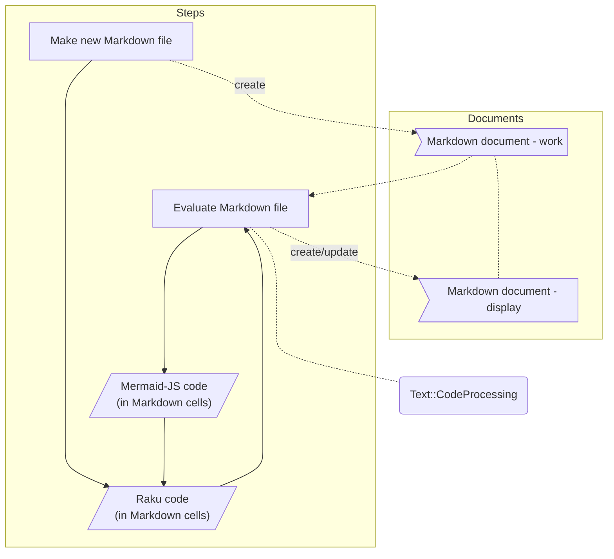

# Interactive Mermaid diagrams generation via Markdown evaluation

## Introduction 

In this document (and related presentation) we the interactive making 
[Mermaid-JS](https://mermaid-js.github.io/mermaid/)
via evaluation of code cells in Markdown documents.

The "interactive" changes are possible because of the following package updates:

- Markdown cells processed by ["Text::CodeProcessing"](https://raku.land/zef:antononcube/Text::CodeProcessing), [AAp1],
  can have an argument that specifies the language of the output cells. 
   - (E.g. `outputLang=mermaid`.)

- ["UML::Translators"](https://raku.land/zef:antononcube/UML::Translators), [AAp2], can generate 
  Mermaid-JS specs. 
  - (In addition to [PlantUML](https://plantuml.com) and WL specs.) 

-------

## Presentation plan

Here is a flowchart of the presentation:



-------

## UML diagram

Here we load the package 
["UML::Translators"](https://raku.land/zef:antononcube/UML::Translators), [AAp2],
and derive the Mermaid-JS spec for "ML::Clustering":

```perl6
use UML::Translators;
to-uml-spec('ML::Clustering', format => 'mermaid')
```

Here we create **directly** a Mermaid cell into the Markdown file:

```perl6, outputLang=mermaid, outputPrompt=NONE
use UML::Translators;
to-uml-spec('ML::Clustering', format => 'mermaid')
```

**Remark:** We use above the Markdown cell arguments `perl6, outputLang=mermaid, outputPrompt=NONE`. 

------

## Pie chart

Here we generate a dataset with random numerical columns

```perl6
use Data::Generators;
use Data::Reshapers;
my @tbl = random-tabular-dataset(12, 3, 
        column-names-generator => &random-pet-name, 
        generators => [
            { random-variate(NormalDistribution.new( µ => 10, σ => 20), $_ ) },
            { random-variate(NormalDistribution.new( µ => 2, σ => 2), $_ ) },
            { random-variate(NormalDistribution.new( µ => 32, σ => 10), $_ ) }]);
say to-pretty-table(@tbl);
```

Here sum the columns:

```perl6
@tbl.&transpose.map({ $_.key => [+] $_.value })
```

Plot the sums with a Mermaid pie chart:

```perl6, outputLang=mermaid, outputPrompt=NONE
say 'pie showData';
say ' title My Great Pie Chart!';
@tbl.&transpose.map({ $_.key => [+] $_.value }).map({ say " {$_.key.raku} : {$_.value}" })
```

------

## Make trie 

Here we make a prefix tree (trie):

```perl6
use ML::TriesWithFrequencies;
my $tr = trie-create-by-split( <bar bark bars balm cert cell> );
trie-say($tr);
```

Here we just get nodes:

```perl6, outputPrompt=NONE
say 'mindmap';
say $tr.form.subst( / '├' | '─' | '└' | '│' | '└' /, ' '):g
```

Here we plot it with Mermaid-JS as a **mindmap** (requires version 9.2.2+):

```perl6, outputLang=mermaid, outputPrompt=NONE, eval=FALSE
say 'mindmap';
say $tr.form.subst( / '├' | '─' | '└' | '│' | '└' /, ' '):g;
```

Here we transform the trie into list of edges:

```perl6
my @edges = $tr.node-probabilities.root-to-leaf-paths>>.map({ "{$_.key}:{$_.value.Str}" }).map({ $_.rotor(2 => -1).map({ "{$_[0]} --> {$_[1]}" }) }).&flatten;
.say for @edges.unique; 
```

Here we plot it with Mermaid-JS as a **graph**:

```perl6, outputLang=mermaid, outputPrompt=NONE
say 'graph TD';
.say for @edges.unique; 
```

------

## References

### Articles

[AA1] Anton Antonov
["Text::CodeProcessing"](https://rakuforprediction.wordpress.com/2021/07/13/raku-textcodeprocessing/),
(2021),
[RakuForPrediction at WordPress](https://rakuforprediction.wordpress.com/2022/11/05/conversion-and-evaluation-of-raku-files/).

[AA2] Anton Antonov
["Conversion and evaluation of Raku files"](https://rakuforprediction.wordpress.com/2022/11/05/conversion-and-evaluation-of-raku-files/),
(2022),
[RakuForPrediction at WordPress](https://rakuforprediction.wordpress.com/2022/11/05/conversion-and-evaluation-of-raku-files/).

[AA3] Anton Antonov,
["Generating UML diagrams for Raku namespaces](https://rakuforprediction.wordpress.com/2022/06/12/generating-uml-diagrams-for-raku-namespaces/),
(2022),
[RakuForPrediction at WordPress](https://rakuforprediction.wordpress.com/2022/11/05/conversion-and-evaluation-of-raku-files/).


### Packages

[AAp1] Anton Antonov,
[Text::CodeProcessing Raku package](https://raku.land/zef:antononcube/Text::CodeProcessing),
(2021-2022),
[Zef ecosystem](https://raku.land/zef:antononcube).

[AAp2] Anton Antonov,
[UML::Translators Raku package](https://raku.land/zef:antononcube/UML::Translators),
(2021-2022),
[Zef ecosystem](https://raku.land/zef:antononcube).

### Videos

[AAv1] Anton Antonov
["Conversion and evaluation of Raku files"](https://www.youtube.com/watch?v=GJO7YqjGn6o),
(2022),
[Anton Antonov's channel at YouTube](https://www.youtube.com/@AAA4prediction).