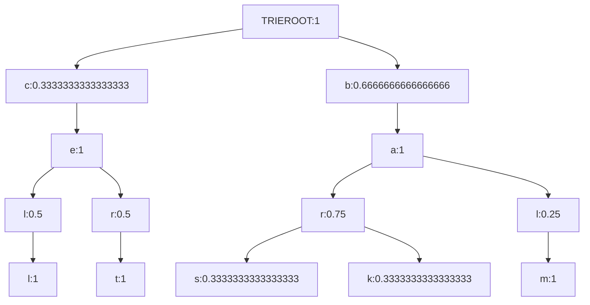

# Interactive Mermaid diagrams generation with Markdown evaluation

## Introduction 

In this document (and related presentation) we the interactive making 
[Mermaid-JS](https://mermaid-js.github.io/mermaid/)
via evaluation of code cells in Markdown documents.

The "interactive" changes are possible because of the following package updates:

- Markdown cells processed by ["Text::CodeProcessing"](https://raku.land/zef:antononcube/Text::CodeProcessing), [AAp1],
  can have an argument that specifies the language of the output cells. 
   - (E.g. `outputLang=mermaid`.)

- ["UML::Translators"](https://raku.land/zef:antononcube/UML::Translators), [AAp2], can generate 
  Mermaid-JS specs. 
  - (In addition to [PlantUML](https://plantuml.com) and WL specs.) 

-------

## Presentation plan

Here is a flowchart of the presentation:


-------

## UML diagram

Here we load the package 
["UML::Translators"](https://raku.land/zef:antononcube/UML::Translators), [AAp2],
and derive the Mermaid-JS spec for "ML::Clustering":

```perl6
use UML::Translators;
to-uml-spec('ML::Clustering', format => 'mermaid')
```
```
# classDiagram
# class find_clusters {
#   <<routine>>
# }
# find_clusters --|> Routine
# find_clusters --|> Block
# find_clusters --|> Code
# find_clusters --|> Callable
# 
# 
# class ML_Clustering_DistanceFunctions {
#   <<role>>
#   +args-check()
#   +bray-curtis-distance()
#   +canberra-distance()
#   +chessboard-distance()
#   +cosine-distance()
#   +distance()
#   +euclidean-distance()
#   +manhattan-distance()
#   +squared-euclidean-distance()
# }
# 
# 
# class k_means {
#   <<routine>>
# }
# k_means --|> Routine
# k_means --|> Block
# k_means --|> Code
# k_means --|> Callable
# 
# 
# class ML_Clustering_KMeans {
#   +BUILDALL()
#   +args-check()
#   +bray-curtis-distance()
#   +canberra-distance()
#   +chessboard-distance()
#   +cosine-distance()
#   +distance()
#   +euclidean-distance()
#   +find-clusters()
#   +hamming-distance()
#   +manhattan-distance()
#   +norm()
#   +squared-euclidean-distance()
# }
# ML_Clustering_KMeans --|> ML_Clustering_DistanceFunctions
```

Here we create **directly** a Mermaid cell into the Markdown file:

```perl6, outputLang=mermaid, outputPrompt=NONE
use UML::Translators;
to-uml-spec('ML::Clustering', format => 'mermaid')
```


**Remark:** We use above the Markdown cell arguments `perl6, outputLang=mermaid, outputPrompt=NONE`. 

------

## Pie chart

Here we generate a dataset with random numerical columns

```perl6
use Data::Generators;
use Data::Reshapers;
my @tbl = random-tabular-dataset(12, 3, 
        column-names-generator => &random-pet-name, 
        generators => [
            { random-variate(NormalDistribution.new( µ => 10, σ => 20), $_ ) },
            { random-variate(NormalDistribution.new( µ => 2, σ => 2), $_ ) },
            { random-variate(NormalDistribution.new( µ => 32, σ => 10), $_ ) }]);
say to-pretty-table(@tbl);
```
```
# +-----------+-----------+------------+
# |   Nukka   |    Jose   |  Atticus   |
# +-----------+-----------+------------+
# | 26.993108 |  5.121371 | 24.059709  |
# | 32.584785 |  1.982418 | -8.021691  |
# | 44.477633 | -1.768160 |  1.037729  |
# | 10.738849 |  1.679274 | -2.170495  |
# | 32.005235 | -1.953524 | -0.106297  |
# | 39.800248 | -0.099708 | 16.759329  |
# | 40.206338 | -0.369219 | -11.927352 |
# | 29.874315 |  0.228058 | -1.048279  |
# | 33.348450 |  1.150010 | -26.009811 |
# | 47.127736 |  3.668894 | -22.681102 |
# | 49.261273 |  2.854425 |  2.246407  |
# | 23.403552 |  2.423418 | 18.699085  |
# +-----------+-----------+------------+
```

Here sum the columns:

```perl6
@tbl.&transpose.map({ $_.key => [+] $_.value })
```
```
# (Jose => 14.917257551261468 Atticus => -9.162769733472317 Nukka => 409.82151984716984)
```

Plot the sums with a Mermaid pie chart:

```perl6, outputLang=mermaid, outputPrompt=NONE
say 'pie showData';
say ' title My Great Pie Chart!';
@tbl.&transpose.map({ $_.key => [+] $_.value }).map({ say " {$_.key.raku} : {$_.value}" })
```
```mermaid
pie showData
 title My Great Pie Chart!
 "Jose" : 14.917257551261468
 "Atticus" : -9.162769733472317
 "Nukka" : 409.82151984716984
```

------

## Make trie 

Here we make a prefix tree (trie):

```perl6
use ML::TriesWithFrequencies;
my $tr = trie-create-by-split( <bar bark bars balm cert cell> );
trie-say($tr);
```
```
# TRIEROOT => 6
# ├─b => 4
# │ └─a => 4
# │   ├─l => 1
# │   │ └─m => 1
# │   └─r => 3
# │     ├─k => 1
# │     └─s => 1
# └─c => 2
#   └─e => 2
#     ├─l => 1
#     │ └─l => 1
#     └─r => 1
#       └─t => 1
```

Here we just get nodes:

```perl6, outputPrompt=NONE
say 'mindmap';
say $tr.form.subst( / '├' | '─' | '└' | '│' | '└' /, ' '):g
```
```
mindmap
TRIEROOT => 6
  b => 4
    a => 4
      l => 1
        m => 1
      r => 3
        k => 1
        s => 1
  c => 2
    e => 2
      l => 1
        l => 1
      r => 1
        t => 1
```

Here we plot it with Mermaid-JS as a **mindmap** (requires version 9.2.2+):

```perl6, outputLang=mermaid, outputPrompt=NONE, eval=FALSE
say 'mindmap';
say $tr.form.subst( / '├' | '─' | '└' | '│' | '└' /, ' '):g;
```


Here we transform the trie into list of edges:

```perl6
my @edges = $tr.node-probabilities.root-to-leaf-paths>>.map({ "{$_.key}:{$_.value.Str}" }).map({ $_.rotor(2 => -1).map({ "{$_[0]} --> {$_[1]}" }) }).&flatten;
.say for @edges.unique; 
```
```
# TRIEROOT:1 --> c:0.3333333333333333
# c:0.3333333333333333 --> e:1
# e:1 --> l:0.5
# l:0.5 --> l:1
# e:1 --> r:0.5
# r:0.5 --> t:1
# TRIEROOT:1 --> b:0.6666666666666666
# b:0.6666666666666666 --> a:1
# a:1 --> r:0.75
# r:0.75 --> s:0.3333333333333333
# r:0.75 --> k:0.3333333333333333
# a:1 --> l:0.25
# l:0.25 --> m:1
```

Here we plot it with Mermaid-JS as a **graph**:

```perl6, outputLang=mermaid, outputPrompt=NONE
say 'graph TD';
.say for @edges.unique; 
```


------

## References

### Articles

[AA1] Anton Antonov
["Text::CodeProcessing"](https://rakuforprediction.wordpress.com/2021/07/13/raku-textcodeprocessing/),
(2021),
[RakuForPrediction at WordPress](https://rakuforprediction.wordpress.com/2022/11/05/conversion-and-evaluation-of-raku-files/).

[AA2] Anton Antonov
["Conversion and evaluation of Raku files"](https://rakuforprediction.wordpress.com/2022/11/05/conversion-and-evaluation-of-raku-files/),
(2022),
[RakuForPrediction at WordPress](https://rakuforprediction.wordpress.com/2022/11/05/conversion-and-evaluation-of-raku-files/).

[AA3] Anton Antonov,
["Generating UML diagrams for Raku namespaces](https://rakuforprediction.wordpress.com/2022/06/12/generating-uml-diagrams-for-raku-namespaces/),
(2022),
[RakuForPrediction at WordPress](https://rakuforprediction.wordpress.com/2022/11/05/conversion-and-evaluation-of-raku-files/).


### Packages

[AAp1] Anton Antonov,
[Text::CodeProcessing Raku package](https://raku.land/zef:antononcube/Text::CodeProcessing),
(2021-2022),
[Zef ecosystem](https://raku.land/zef:antononcube).

[AAp2] Anton Antonov,
[UML::Translators Raku package](https://raku.land/zef:antononcube/UML::Translators),
(2021-2022),
[Zef ecosystem](https://raku.land/zef:antononcube).

### Videos

[AAv1] Anton Antonov
["Conversion and evaluation of Raku files"](https://www.youtube.com/watch?v=GJO7YqjGn6o),
(2022),
[Anton Antonov's channel at YouTube](https://www.youtube.com/@AAA4prediction).