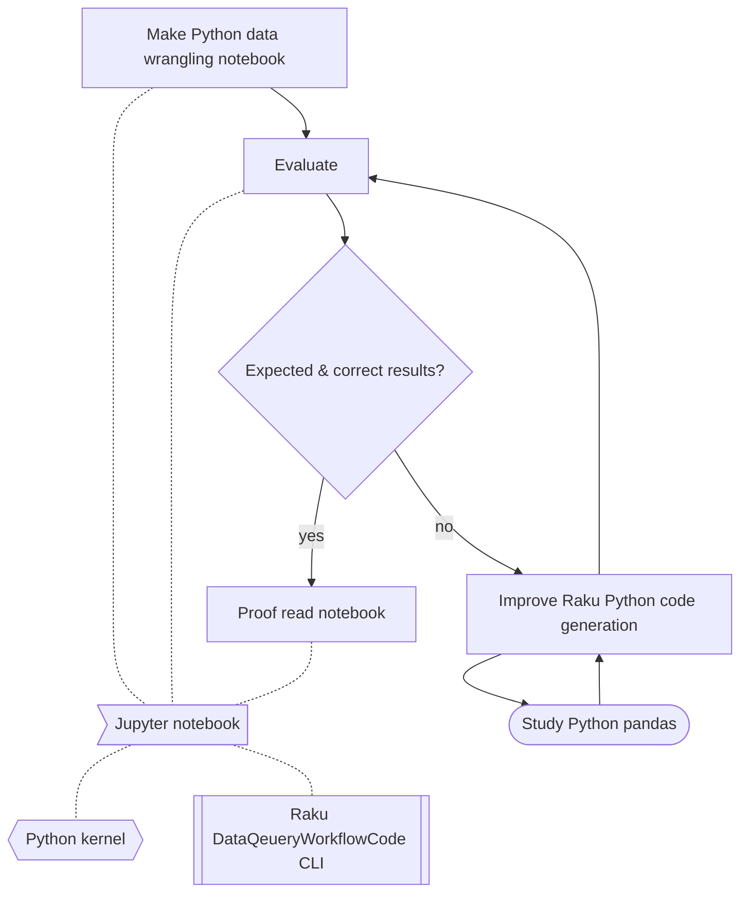
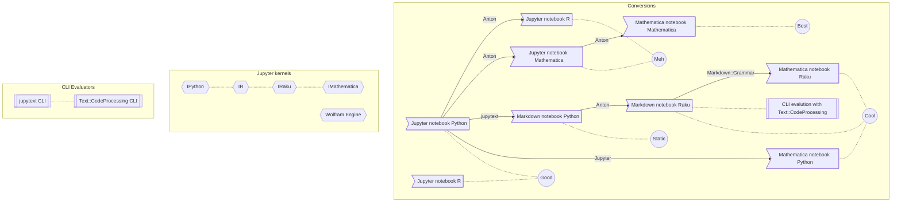

# Making notebooks with standard data wrangling examples

## Introduction

This document describes the preparation of a set of notebooks for standard data wrangling use cases.

Multiple notebook formats and programming languages are considered:

- Formats: Jupyter, Mathematica, Markdown
- Programming languages: Python, R, Raku, Mathematica

------

## Notebook preparation

The flow charts below outlines the preparation of the notebooks.

The notebooks were made in the following order:

1. Python Jupyter notebook 
2. Raku Jupyter notebook 
   - *Based on the Python Jupyter notebook*
3. R Jupyter notebook base
   - *Based on the Python Jupyter notebook*
4. WL Jupyter notebook
   - *Annoying*
5. WL Mathematica notebook
6. Raku Mathematica notebook
7. Make Python Mathematica notebook

------

## First thing - Jupyter notebook with Python examples

[](https://mermaid.live/edit#pako:eNpNksGO2jAQhl_F8qFqJUAhuzghh63ohgOrUiVQqVITDi4eIEpiR46zu9mQd-9sDAIfrPH48-_fM-7oXgmgAT1qXp3I7zCVBMf65dePZM1zIFFrTkoSwQ0nb5rLY5HJI5HKwD-l8h0Zj5_I8nZoPBnj_PTSVK0BfeMsYQGysqJddxHPQUso-v4e2jz_XCXJhucNCfHuGBrQ7R-l80Oh3p7RM0Fgd9FdJstXXjTcwA79xItL1pqxi3jRLd8r2BsQ5AvZK60xJhrqpjD19354x1mq82oT2QMYJKuy0uoVyGDjYvazXuQIEjQ3mZK2Atso-ppsTSPaK1ZxKXi9-2bFcH_g7tXvSxcvrIEW6nO8CK_JMIm0Uge0ycWtltdnWYqOaAm65JnALnafuZSaE5SQ0gBDwXWe0lT2yPHGqG0r9zQwuoERbSpsK4QZx-aXNDjwosYsOv-rVHmFQGRG6bX9JcNnGRAadPSdBlPmTPyZ57v-jPnMZfP5iLY0cGds4j7g7Mw979Gf-rN-RD8GVWfCHOaxB4c9-mzqzj3W_wfFicep)

------

## Converting

[](https://mermaid.live/edit#pako:eNqFVFFvqjAU_itNn1iiRt1E7MOSe51ZNJfEOJMld-yhShWu0JpSpl7wv68HdALixsMp9Dvf6fnajyZ4KVyGCV4FYrf0qFRo_uRwpJ8oXqwl3XpoKPgHk5EveJQj8Nju9NHBNpUbV-w44kKxhRAbND0oT3AHv6Nmq4leFFX-0jDy8e7uwp_wBRSYxNuDYvIW_1kI1zAgVrizOu7sTLOZZxg6VEl0E3_Lu7mcXUezqfJYCMLodwvbudJC9i21QyECw4BY4du3-DUt_GaRMgyIpSLuSfz1iQHwYwdf7Jomfi4wOlV4e3Pw8M8YsQ8axEobCu185aE52ytChtqIUymWLIp8vtYF38tuQc3mI0pPp5DCrtbh_zJ8r1Jt0JJbc_gXV4Knp-2obk-m4NxrXfGcDX4ou6OI2lW0yp1dLwv45WgIeZY0DKl0cFpqhnEXhsrvefblhknOgsIvOs7dlSSnl-OxgEFVjcBQnofJ0kzhzDVW-Cpl5UvoDRzPsqDrwlg06Ffy6yhJXkWw0irRiK99zs6l6hWCZUZgGaqELAiczMFQ5xOHtLJrZvPhFDLq_HWdPZnrhoFSaQU3cMhkSH1XX5MJgA4GUczBRL-6-tQc7PCjzqOxEi8HvsREyZg1cLx1qWJPPtU6QkxWNIj07Jbyv0Jcvpnra112fg9n13GWg0mC95h0zHbL6vWtrtUzLbNrDgYNfMCk2zNb3Xsd24N-_8HqWL1jA__PyrZbZtvsm_dt88EyO91B3zx-AkIty3c)

------

## Idiosyncrasies

### Jupyter notebook Raku

### Mathematica notebook Raku
