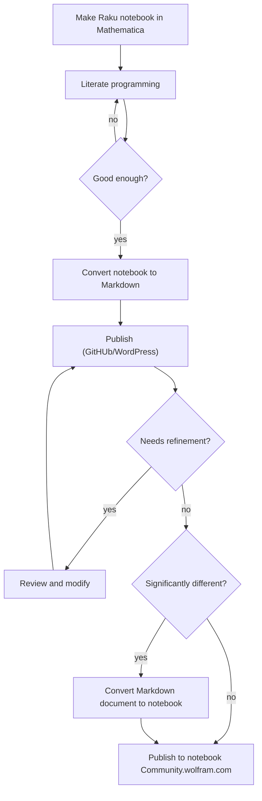
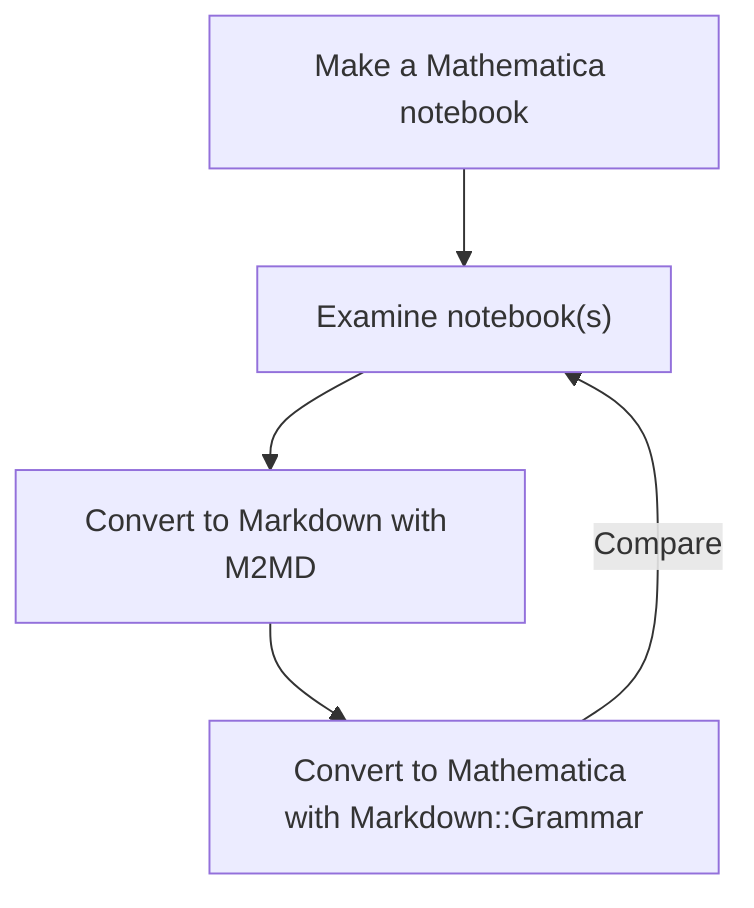

# Markdown::Grammar

## Introduction

This document proclaims and briefly describes the Raku package ["Markdown::Grammar"](https://raku.land/zef:antononcube/Markdown::Grammar).

"Markdown::Grammar" has parser grammar suitable for making converters of Markdown files into files of different kind of formats:

- [X] Mathematica notebook
- [ ] RMarkdown notebook
- [ ] Jupyter notebook
- [X] Pod6 file
- [ ] Org-mode file

See the video
["Markdown to Mathematica converter (CLI and StackExchange examples)"](https://www.youtube.com/watch?v=39ekokgnoqE), [AAv1],
for a (quick, 7.5 min) demo.

### Motivation

#### Mathematica notebooks

I am most interested in generating Mathematica notebooks from Markdown.

I have written 
[a fair amount of Raku-related Markdown documents](https://github.com/antononcube/RakuForPrediction-book/tree/main/Articles). 
Many of those Markdown documents were generated from Mathematica notebooks using
[M2MD](https://github.com/kubaPod/M2MD), [JPp1].
But of course, most of the time, further changes and embellishments were made over those Markdown documents.
Hence it would be very nice to be able to go back to Mathematica.

**Remark:** Raku can be used in Mathematica via the so called `RakuMode` -- see [AA1].

**Remark:** Markdown documents with Raku cells code can be evaluated with Command Line Interface (CLI)
scripts of the package
["Text::CodeProcessing"](https://raku.land/cpan:ANTONOV/Text::CodeProcessing), [AAp1].
For more details see the article
["Connecting Mathematica and Raku"](https://rakuforprediction.wordpress.com/2021/12/30/connecting-mathematica-and-raku/), [AA1].

Here is a flowchart that gives better idea of the workflow outlined above:



[](https://mermaid.live/edit#pako:eNpNklGPojAUhf9K06edxGHVGQvysPuAhn0QQ8TNJivzUO1FG6XXlDIui_73KQIz8kAo_e45Pfe2pjsUQH261_x8IOtZqoh9Vmq7ifgRyIofS6LQwBbxSKQiETcHyLmRO_72_PxjsW4LFuvNQhrQ3AA5a7RqeS7VvkHCeYuE8zpEFAQUlvvDz5vdulZQXINlux8sNwGqd9Dmy9CgNdRHgRfVSMUtGW9SGpfbkywO5Fsoza_f2-9_UItYQ1E8pbRBk45N4t5n1UXbrOBdwoVwJUiOQmbVg3Q4b3CF1z5YEtdLAFEQDZlUkIMy7dEtk3TdSmZ1IvdKZrYpypwqYkUz0J_oPWXUs11xHHSxo8_YfVQicFc2Tk3-vhf3Q3Y1cfDQgQeGBJjnpZKmci54yuwQnB3mtiG2hg5oDjrnUthp141OSptRQkp9-ymsd0pTdbMcLw0mldpR3-gSBrQ8CzvXmeTNWKmf8VNh_565-ov4tQYhDeqovU73W3VnqF_Tf9QfsaHjTVxv7E2Yx8ZsOh3QivrjCXPGL_Y9nLruqzfyJrcB_X-XHTpsyFz2MmSvHhuNpy67fQClb9yL)

#### Pod6

The notebook formats have syntax that makes it hard to evaluate the conversions visually.
That is why I use Pod6 -- during development it is much easier to evaluate the Pod6 interpretations
produced by the package.
(I.e. no need to use another tool to open and evaluate the obtained conversion artifact.)

------

## Installation

From Zef ecosystem:

```shell
zef install Markdown::Grammar
```

From GitHub:

```shell
zef install https://github.com/antononcube/Raku-Markdown-Grammar.git
```

------

## Round trip translation

Consider the following round trip translation experiment:

1. Make a Mathematica notebook

2. Convert WL notebook into Markdown file with the Mathematica package [M2MD](https://github.com/kubaPod/M2MD)

3. Convert the obtained Markdown file into Mathematica notebook using the Raku package "Markdown::Grammar"

4. Compare the notebooks


Here is the corresponding flowchart:



[](https://mermaid.live/edit#pako:eNpdkEFPwjAYhv9K8500Gcs2WNf14AUWLu6kiYnUw-dW3YJtl1IEHPx3CxuS2EPztXneJ-3bQ2VqCRw-LXYNeV4ITfx6eVyVuJYESYmukQpdWyHRxsl3Y9ZvZDJ5IMWAFisBxR5Vq-UfcLe5FzBQZVKOzvPk2bnR39I64ox323VtdprsWtcM5DW1HDPL_4nba4bQqOB8aVEptFfDcW5Uh1YeCwhASauwrf03-7NXwNkiBXA_1t4gQOiT53DrzNNBV8Cd3coAtl2NTi5a9O0o4B_4tfG3HepXY25nWbfO2HLo8VLnhQHewx54TKOQpRlLWEoZTWieB3AAnqQ0TKZ-j_Ism7GYpacAfi7aKKQRzeg0ojNG4yTP6OkXH0mCKQ)

------

## Related work

Here is a table of converters from- or to Markdown:

| From \ To   | HTML                                                                                                                                             | Jupyter                                           | Markdown                                                                     | Mathematica                                                                                                                       | Pod6                                                                     |
|-------------|--------------------------------------------------------------------------------------------------------------------------------------------------|---------------------------------------------------|------------------------------------------------------------------------------|-----------------------------------------------------------------------------------------------------------------------------------|--------------------------------------------------------------------------|
| HTML        |                                                                                                                                                  | [pandoc](https://pandoc.org)                      | [pandoc](https://pandoc.org)                                                 |                                                                                                                                   |                                                                          | 
| Jupyter     | [Jupyter](https://jupyter.org)                                                                                                                   |                                                   | [Jupyter](https://jupyter.org) , [jupytext](https://jupytext.readthedocs.io) |                                                                                                                                   |                                                                          |
| Markdown    | [pandoc](https://pandoc.org) , [Markit](https://raku.land/cpan:UZLUISF/Markit) , [Text::Markdown](https://raku.land/zef:JJMERELO/Text::Markdown) | [jupytext](https://jupytext.readthedocs.io)       |                                                                              | [Markdown2WL](https://github.com/dishmint/Markdown2WL) , [Markdown::Grammar](https://raku.land/zef:antononcube/Markdown::Grammar) | [Markdown::Grammar](https://raku.land/zef:antononcube/Markdown::Grammar) | 
| Mathematica |                                                                                                                                                  |                                                   | [M2MD](https://github.com/kubaPod/M2MD)                                      |                                                                                                                                   |                                                                          |
| Pod6        |                                                                                                                                                  |                                                   | [Pod::To::Markdown](https://raku.land/cpan:SOFTMOTH/Pod::To::Markdown)       |                                                                                                                                   |                                                                          |


**Remark:** [Pandoc](https://pandoc.org) attempts to be an universal converter, applicable for all couples of formats.

**Remark:** Except
["this package"](https://github.com/antononcube/Raku-Markdown-Grammar)
there are no other converters from Markdown to
[Pod6](https://docs.raku.org/language/pod).

**Remark:** In general I like the idea of a Markdown-to-Mathematica converter written in Mathematica.
The package
["Markdown2WL"](https://github.com/dishmint/Markdown2WL)
attempts that, but unfortunately it is fairly incomplete.
------

## Command line interface

The package provides a Command Line Interface (CLI) script, `from-markdown`. Here is its usage message:

```shell
> from-markdown --help
# Usage:
#  from-markdown [-t|--to=<Str>] [-o|--output=<Str>] <file> -- Converts Markdown files into Mathematica notebooks.
#  
#    <file>               Input file.
#    -t|--to=<Str>        Format to convert to. (One of 'mathematica' or 'pod6'.) [default: 'mathematica']
#    -o|--output=<Str>    Output file; if an empty string then the result is printed to stdout. [default: '']
```

The CLI script `from-markdown` takes both file names and (Markdown) text. Here is an usage example for the latter:

```shell
> from-markdown -to=pod6 'Here is data wrangling code:

    obj = dfTitanic;
    obj = GroupBy[ obj, #["passengerSex"]& ];
    Echo[Map[ Length, obj], "counts:"]

## References'

# =begin
# =para
# Here is data wrangling code:
# =begin code
# obj = dfTitanic;
# obj = GroupBy[ obj, #["passengerSex"]& ];
# Echo[Map[ Length, obj], "counts:"]
# =end code
# =begin head2
# References
# =end head2
# =end pod
```

------

## Usage example

Consider the following Markdown text:

```perl6
my $mtext = q:to/END/;
Here is data wrangling code:

    obj = dfTitanic;
    obj = GroupBy[ obj, #["passengerSex"]& ];
    Echo[Map[ Length, obj], "counts:"]

## References

### Articles

[AA1] Anton Antonov,
["Introduction to data wrangling with Raku"](https://rakuforprediction.wordpress.com/2021/12/31/introduction-to-data-wrangling-with-raku/),
(2021),
[RakuForPrediction at WordPress](https://rakuforprediction.wordpress.com).
END

say $mtext.chars;
```

Here is the corresponding Mathematica notebook:

```perl6
use Markdown::Grammar;

from-markdown($mtext, to => 'mathematica')
```

Here is the corresponding Pod6 text:

```perl6
from-markdown($mtext, to => 'pod6')
```

------

## Acknowledgments

Many thanks to Jakub (Kuba) Podkalicki for programming the package "M2MD", and helping me to understand
a fair amount of Mathematica's
[low-Level notebook programming](https://reference.wolfram.com/language/guide/LowLevelNotebookProgramming.html).

------

## References

### Articles

[AA1] Anton Antonov,
["Connecting Mathematica and Raku"](https://rakuforprediction.wordpress.com/2021/12/30/connecting-mathematica-and-raku/),
(2021),
[RakuForPrediction at WordPress]([https://rakuforprediction.wordpress.com/).

[FZ1] Faizon Zaman,
["Parsing markdown files"](https://community.wolfram.com/groups/-/m/t/2142852),
(2021),
[Community.wolfram.com](https://community.wolfram.com).

### Guides

[JG1] John Gruber, [Markdown: Syntax](https://daringfireball.net/projects/markdown/).

[MC1] Matt Cone, [Markdown Guide](https://www.markdownguide.org).

[RC1] Raku Community, [Raku Pod6](https://docs.raku.org/language/pod).

### Packages

[AAp1] Anton Antonov
[Text::CodeProcessing Raku package](https://github.com/antononcube/Raku-Text-CodeProcessing),
(2021-2022),
[GitHub/antononcube](https://github.com/antononcube).

[FZp1] Faizon Zaman,
[Markdown2WL Mathematica package](https://github.com/dishmint/Markdown2WL),
(2021),
[GitHub/dishmint](https://github.com/dishmint/Markdown2WL).

[JPp1] Jakub Podkalicki,
[M2MD](https://github.com/kubaPod/M2MD),
(2018-2022),
[GitHub/kubaPod](https://github.com/kubaPod).

### Videos

[AAv1] Anton Antonov,
["Markdown to Mathematica converter (CLI and StackExchange examples)"](https://www.youtube.com/watch?v=39ekokgnoqE),
(2022),
[Anton A. Antonov's channel at YouTube](https://www.youtube.com/channel/UC5qMPIsJeztfARXWdIw3Xzw).