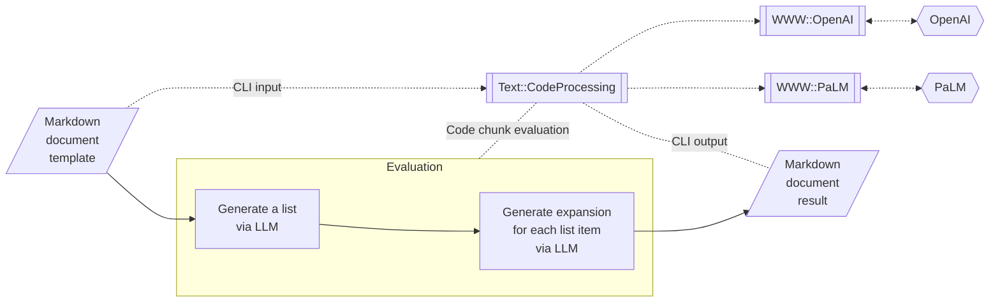

# 12 steps guide template

## Introduction

This computation Markdown document [AA1, AAv1] can be seen as a template for guide-documents using Large Language Model (LLMs), [AA2, Wk1].
See the references for more details of the underlying mechanics. (Written in Raku, [AA1, AA2, AAp1÷AAp3].)

**Remark:** The package 
["Text::CodeProcessing"](https://raku.land/zef:antononcube/Text::CodeProcessing), [AAp1],
has "code chunk" for accessing the LLMs OpenAI / ChatGPT, [AAp2], and PaLM, [AAp3].

**Remark:** Obviously, this introduction and the references at the bottom can be removed.

Here is a flowchart that summarizes the execution steps:



## Simply put

```palm, format=values, temperature=0.8, max-tokens=600, results=asis, output-prompt=NONE, echo=FALSE
Generate a 12 steps outline for quiting addiction to programmaring Python (and replacing with Raku.)
```

-----

## Expansions generation script

```perl6, results=asis, output-prompt=NONE, echo=FALSE
my $txt = _;
my $txtExpanded = do for $txt.split(/ ^^ \d+ /, :v, :skip-empty)>>.Str.rotor(2) -> $p {
    my $res = "-" x 120; 
    $res ~= "\n## {$p[0]}.";
    my $start = '';
    if $p[1] ~~ / '**' (.*?) '**'/ {
        $start = $0.Str;
        $res ~= ' ' ~ $start.subst( / <punct>+ $$/, '');
    };
    $res ~= "\n\n>... {$p[1].subst(/'**' $start '**'/, '').subst( / ^^ <punct>+ /, '')}"; 
    $res ~= "\n\n", palm-generate-text( "Expand upon: {$p[1]}", temperature => 0.75, max-tokens => 400, format=>'values' );
}

$txtExpanded.join("\n\n") 
```

------

## References

### Articles

[AA1] Anton Antonov,
["Conversion and evaluation of Raku files"](https://rakuforprediction.wordpress.com/2022/11/05/conversion-and-evaluation-of-raku-files/),
(2022),
[RakuForPrediction at WordPress](https://rakuforprediction.wordpress.com).

[AA2] Anton Antonov,
["Racoons playing with pearls and onions"](https://rakuforprediction.wordpress.com/2023/03/12/racoons-playing-with-pearls-and-onions/),
(2023),
[RakuForPrediction at WordPress](https://rakuforprediction.wordpress.com).

[Wk1] Wikipedia entry, ["Large language model"](https://en.wikipedia.org/wiki/Large_language_model).

### Packages, repositories

[AAp1] Anton Antonov,
[Text::CodeProcessing Raku package](https://github.com/antononcube/Raku-Text-CodeProcessing),
(2021-2023),
[GitHub/antononcube](https://github.com/antononcube).

[AAp2] Anton Antonov,
[WWW::OpenAI Raku package](https://github.com/antononcube/Raku-WWW-OpenAI),
(2023),
[GitHub/antononcube](https://github.com/antononcube).

[AAp3] Anton Antonov,
[WWW::PaLM Raku package](https://github.com/antononcube/Raku-WWW-PaLM),
(2023),
[GitHub/antononcube](https://github.com/antononcube).

## Videos

[AAv1] Anton Antonov,
["Conversion and evaluation of Raku files"](https://www.youtube.com/watch?v=GJO7YqjGn6o),
(2022),
[YouTube/@AAA4Prediction](https://www.youtube.com/@AAA4prediction).

[AAv2] Anton Antonov,
["Racoons playing with pearls and onions"](https://www.youtube.com/watch?v=zlkoNZK8MpU),
(2023),
[YouTube/@AAA4Prediction](https://www.youtube.com/@AAA4prediction).
