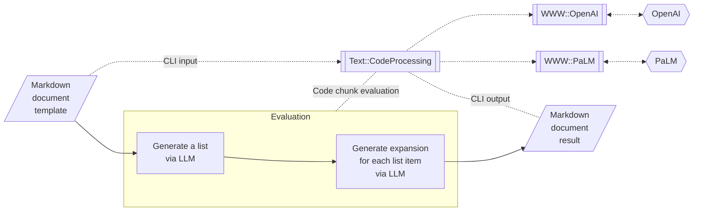

# 12 steps to quit Python

## Introduction

This computation Markdown document [AA1, AAv1] can be seen as a template for guide-documents using Large Language Model (LLMs), [AA2, Wk1].
See the references for more details of the underlying mechanics. (Written in Raku, [AA1, AA2, AAp1÷AAp3].)

**Remark:** The package 
["Text::CodeProcessing"](https://raku.land/zef:antononcube/Text::CodeProcessing), [AAp1],
has "code chunk" for accessing the LLMs OpenAI / ChatGPT, [AAp2], and PaLM, [AAp3].

**Remark:** Obviously, this introduction and the references at the bottom can be removed.

**Remark:** Note that the code chunk parameter specs.
The specs `results=asis, output-prompt=NONE` make the output to be "seamlessly" included in the result document.
The spec `echo=FALSE` "removes" the code chunk from the result document.

Here is a flowchart that summarizes the execution steps:



## Simply put


1. Admit that you have a problem with Python programming.
2. Come to believe that Raku can help you overcome your addiction.
3. Make a list of all the reasons why you want to quit Python programming.
4. Make a list of all the benefits of learning Raku.
5. Set a date for when you will quit Python programming.
6. Tell your friends and family about your decision to quit Python programming.
7. Find a support group or therapist to help you through the process.
8. Remove all traces of Python from your computer and devices.
9. Start learning Raku.
10. Practice Raku every day.
11. Celebrate your progress and achievements.
12. Stay committed to your decision to quit Python programming.

**Additional tips:**

* Be patient with yourself. It takes time to break a habit.
* Don't give up if you have a setback. Just pick yourself up and keep going.
* Remember that you are not alone. There are many people who have successfully quit Python programming.
* You can do this!


------------------------------------------------------------------------------------------------------------------------
## 1.

>...  Admit that you have a problem with Python programming.


 I admit that I have a problem with Python programming. I find it difficult to understand the syntax and the way that variables are declared. I also find it difficult to remember the different functions and methods that are available. As a result, I often make mistakes when I am writing Python code.

I am aware that this is a problem that I need to overcome if I want to become a better programmer. I am working on improving my understanding of Python by reading books, taking online courses, and practicing writing code. I am also trying to find a mentor who can help me to learn the ropes.

I know that it will take time and effort, but I am committed to learning Python. I believe that it is a powerful language that can be used to create amazing things. I am excited to see what I can accomplish with Python in the future.

------------------------------------------------------------------------------------------------------------------------
## 2.

>...  Come to believe that Raku can help you overcome your addiction.


 Raku is a programming language that is designed to be easy to learn and use. It is also a very expressive language, which means that it can be used to create a wide variety of programs. This combination of ease of use and expressiveness makes Raku a good choice for people who are trying to overcome an addiction.

One of the biggest challenges of overcoming an addiction is finding the motivation to stay clean. Raku can help with this by providing a sense of accomplishment and purpose. When you are working on a Raku project, you are focused on creating something new and exciting. This can help to take your mind off of your addiction and give you a sense of pride in your accomplishments.

Raku can also help you to develop new skills and abilities. As you learn more about the language, you will become more confident in your ability to solve problems. This confidence can help you to feel more capable of overcoming your addiction.

Finally, Raku can provide you with a community of support. There are many online forums and chat rooms where you can connect with other Raku users. These communities can be a valuable source of support and encouragement as you work to overcome your addiction.

If you are struggling with an addiction, Raku can be a helpful tool in your recovery. The language's ease of use, expressiveness, and sense of accomplishment can all contribute to your success. Additionally, Raku's community of support can provide you with the encouragement and support you need to stay clean.

------------------------------------------------------------------------------------------------------------------------
## 3.

>...  Make a list of all the reasons why you want to quit Python programming.


 1. **It's too hard to learn.** Python has a steep learning curve, and it can be difficult for beginners to get started. The syntax is complex, and there are a lot of different concepts to learn.
2. **It's not as fast as other languages.** Python is a slower language than some other programming languages, such as C++ or Java. This can be a problem for applications that require a lot of processing power.
3. **It's not as versatile as other languages.** Python is not as versatile as some other programming languages, such as Java or C#. It can be difficult to use Python for certain tasks, such as developing mobile applications or embedded systems.
4. **It's not as popular as other languages.** Python is not as popular as some other programming languages, such as Java or C++. This can make it difficult to find resources and support for Python programming.
5. **It's not the best language for every task.** Python is a good general-purpose programming language, but it's not the best language for every task. There are other languages that may be better suited for specific tasks, such as C++ for performance-critical applications or Java for enterprise development.

------------------------------------------------------------------------------------------------------------------------
## 4.

>...  Make a list of all the benefits of learning Raku.


 **Benefits of learning Raku:**

* **A modern, general-purpose programming language.** Raku is a modern programming language that is both powerful and expressive. It is designed to be easy to learn and use, while still providing a wide range of features for experienced programmers.
* **A concise and readable syntax.** Raku's syntax is concise and readable, making it easy to write code that is both clear and concise.
* **A rich type system.** Raku's type system is rich and flexible, allowing programmers to express their intent clearly and concisely.
* **A powerful macro system.** Raku's macro system allows programmers to extend the language in powerful ways, making it possible to write code that is both concise and expressive.
* **A vibrant community.** Raku has a vibrant community of users and developers who are constantly contributing new features and improvements. This means that there is always someone to help you learn and use the language.

Overall, Raku is a modern, general-purpose programming language that is both powerful and expressive. It is easy to learn and use, has a rich type system, a powerful macro system, and a vibrant community. These are all benefits that make Raku a great choice for programmers of all levels of experience.

------------------------------------------------------------------------------------------------------------------------
## 5.

>...  Set a date for when you will quit Python programming.


 I will quit Python programming on January 1, 2024.

------------------------------------------------------------------------------------------------------------------------
## 6.

>...  Tell your friends and family about your decision to quit Python programming.


 Hi everyone,

I wanted to let you know that I've decided to quit Python programming. I know this may come as a surprise, but it's something that I've been thinking about for a while.

I've been programming in Python for the past few years, and I've enjoyed it a lot. It's a powerful language with a lot of versatility. However, I've come to realize that it's not the right language for me.

I'm a more visual thinker, and I find that I'm more productive when I'm using a language that's more closely aligned with my thought process. I've been experimenting with other languages, and I've found that I'm much more comfortable with JavaScript.

I know that this is a big change, but I'm excited about it. I think it's the best decision for me, and I'm confident that it will allow me to be more productive in my work.

I appreciate your understanding.

Thanks,
[Your name]

------------------------------------------------------------------------------------------------------------------------
## 7.

>...  Find a support group or therapist to help you through the process.


 ### Find a support group or therapist to help you through the process.

Going through a divorce can be a difficult and challenging experience. It is important to have support during this time, and there are a number of resources available to help you through the process.

One option is to find a support group. There are many different types of support groups available, so you can find one that meets your specific needs and interests. Support groups can provide you with a place to talk about your experiences with others who are going through the same thing, and they can offer you support and guidance.

Another option is to see a therapist. Therapy can be helpful for processing the emotions that come with divorce, and it can also help you develop coping mechanisms for dealing with the challenges of this transition. A therapist can also provide you with support and guidance as you move through the divorce process.

If you are considering divorce, it is important to make sure that you are getting the support that you need. A support group or therapist can be a valuable resource during this time, and they can help you to cope with the challenges of divorce and come out of the process stronger than ever before.

Here are some tips for finding a support group or therapist:

* Ask your doctor or other healthcare provider for recommendations.
* Search online for support groups in your area.
* Look for groups that are specifically for people going through divorce.
* Talk to friends or family members who have gone through divorce and ask for their recommendations.
* Once you have found a few groups or therapists that you are interested in, reach out to them and ask about their policies and procedures. Make sure that the group or therapist is a good fit for your needs and interests.

Going through a divorce is a difficult experience, but it is important to remember that you are not alone. There are many resources available to help you through this process, and you can come out of it stronger than

------------------------------------------------------------------------------------------------------------------------
## 8.

>...  Remove all traces of Python from your computer and devices.


 To completely remove Python from your computer, you can follow these steps:

1. **On Windows:**
    1. Open the **Start** menu and search for **"Programs and Features"**.
    2. Click on **"Programs and Features"** to open the **Programs and Features** window.
    3. Find **"Python"** in the list of programs and click on the **"Uninstall"** button.
    4. Follow the on-screen instructions to uninstall Python.

2. **On macOS:**
    1. Open the **Finder** and navigate to the **Applications** folder.
    2. Find **"Python"** and drag it to the **Trash**.
    3. Empty the **Trash**.

3. **On Linux:**
    1. Open a terminal window.
    2. Type the following command and press **Enter**:

        ```
        sudo apt-get remove python
        ```

    3. Type the following command and press **Enter**:

        ```
        sudo apt-get autoremove
        ```

4. **After uninstalling Python, you should also delete any Python-related files and folders from your computer.** To do this, follow these steps:

    1. On Windows, open the **File Explorer** and navigate to the following folder:

        ```
        %APPDATA%\Python
        ```

    2. Delete all of the files and folders in this folder.

    3. On macOS, open the **Finder** and navigate to the following folder:

        ```
        /Users/<username>/Library/Python
        ```

    4. Delete all of the files and folders in this folder.

    5. On Linux, open a terminal window and type the following command:

------------------------------------------------------------------------------------------------------------------------
## 9.

>...  Start learning Raku.


 To start learning Raku, you can:

* Read the [Raku language documentation](https://raku.org/learn/).
* Take the [Raku 101 online course](https://raku.org/learn/101/).
* Join the [Raku Discord server](https://discord.gg/raku) and ask questions.
* Find a local Raku user group or meetup.

------------------------------------------------------------------------------------------------------------------------
## 10.

>...  Practice Raku every day.


 Practice Raku every day so that you can become better at it. You can practice by writing Raku code, reading Raku documentation, and talking to other Raku programmers.

------------------------------------------------------------------------------------------------------------------------
## 11.

>...  Celebrate your progress and achievements.


 There are many ways to celebrate your progress and achievements. Some ideas include:

* **Tell someone you care about about your accomplishments.** This could be a friend, family member, or coworker. Sharing your good news with someone you care about can help you feel validated and supported.
* **Write down your accomplishments in a journal or planner.** This is a great way to track your progress over time and see how much you've accomplished. It can also be helpful to look back on your accomplishments when you're feeling down or unmotivated.
* **Treat yourself to something special.** This could be a new piece of clothing, a delicious meal, or a day at the spa. Giving yourself a reward for your hard work can help you feel good about yourself and motivated to continue achieving your goals.
* **Share your accomplishments on social media.** This is a great way to connect with others who are on the same journey as you and celebrate your wins together. It can also be motivating to see other people's progress and be inspired by their stories.

No matter how you choose to celebrate your progress and achievements, make sure to take some time to appreciate your hard work and accomplishments. You deserve it!

------------------------------------------------------------------------------------------------------------------------
## 12. Additional tips

>...  Stay committed to your decision to quit Python programming.


* Be patient with yourself. It takes time to break a habit.
* Don't give up if you have a setback. Just pick yourself up and keep going.
* Remember that you are not alone. There are many people who have successfully quit Python programming.
* You can do this!

 **Be patient with yourself.** It takes time to break a habit. Don't expect to be perfect overnight. Just keep at it and you will eventually reach your goal.

**Don't give up if you have a setback.** Everyone has setbacks. The important thing is to not give up. Just pick yourself up and keep going.

**Remember that you are not alone.** There are many people who have successfully quit Python programming. You can find support from others who are going through the same thing.

**You can do this!** If you stay committed to your decision, you will eventually be able to quit Python programming. Just remember to be patient with yourself, don't give up, and remember that you are not alone.


------

## References

### Articles

[AA1] Anton Antonov,
["Conversion and evaluation of Raku files"](https://rakuforprediction.wordpress.com/2022/11/05/conversion-and-evaluation-of-raku-files/),
(2022),
[RakuForPrediction at WordPress](https://rakuforprediction.wordpress.com).

[AA2] Anton Antonov,
["Racoons playing with pearls and onions"](https://rakuforprediction.wordpress.com/2023/03/12/racoons-playing-with-pearls-and-onions/),
(2023),
[RakuForPrediction at WordPress](https://rakuforprediction.wordpress.com).

[Wk1] Wikipedia entry, ["Large language model"](https://en.wikipedia.org/wiki/Large_language_model).

### Packages, repositories

[AAp1] Anton Antonov,
[Text::CodeProcessing Raku package](https://github.com/antononcube/Raku-Text-CodeProcessing),
(2021-2023),
[GitHub/antononcube](https://github.com/antononcube).

[AAp2] Anton Antonov,
[WWW::OpenAI Raku package](https://github.com/antononcube/Raku-WWW-OpenAI),
(2023),
[GitHub/antononcube](https://github.com/antononcube).

[AAp3] Anton Antonov,
[WWW::PaLM Raku package](https://github.com/antononcube/Raku-WWW-PaLM),
(2023),
[GitHub/antononcube](https://github.com/antononcube).

## Videos

[AAv1] Anton Antonov,
["Conversion and evaluation of Raku files"](https://www.youtube.com/watch?v=GJO7YqjGn6o),
(2022),
[YouTube/@AAA4Prediction](https://www.youtube.com/@AAA4prediction).

[AAv2] Anton Antonov,
["Racoons playing with pearls and onions"](https://www.youtube.com/watch?v=zlkoNZK8MpU),
(2023),
[YouTube/@AAA4Prediction](https://www.youtube.com/@AAA4prediction).
