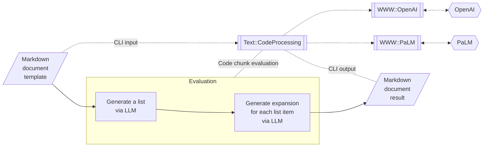

# 12 steps guide template

## Introduction

This computation Markdown document [AA1, AAv1] can be seen as a template for guide-documents using Large Language Model (LLMs), [AA2, Wk1].
See the references for more details of the underlying mechanics. (Written in Raku, [AA1, AA2, AAp1÷AAp3].)

**Remark:** The package 
["Text::CodeProcessing"](https://raku.land/zef:antononcube/Text::CodeProcessing), [AAp1],
has "code chunk" for accessing the LLMs OpenAI / ChatGPT, [AAp2], and PaLM, [AAp3].

**Remark:** Obviously, this introduction and the references at the bottom can be removed.

Here is a flowchart that summarizes the execution steps:

## Simply put

1. **Admit that you have a problem.** You are addicted to programming Python, and you need to quit.
2. **Come to terms with the fact that you cannot control your Python use.** You are not able to moderate your Python use, and you need to stop completely.
3. **Make a list of the reasons why you want to quit Python.** Write down all of the negative consequences of your Python use, and all of the benefits of quitting.
4. **Find a support group.** There are many support groups available for people who are addicted to technology, including Python. Find a group that you can attend regularly, and talk to other people who are struggling with the same problem.
5. **Set a quit date.** Decide on a date when you will stop using Python completely. Make this date a firm commitment, and do not allow yourself to make any exceptions.
6. **Tell your family and friends about your decision to quit Python.** Let them know that you are serious about quitting, and ask for their support.
7. **Get rid of all of your Python-related materials.** Throw away your Python books, delete your Python files, and uninstall Python from your computer.
8. **Make a plan for how you will cope with cravings.** When you feel the urge to use Python, come up with a list of things you can do to distract yourself. This could include exercising, reading, spending time with friends and family, or taking a nap.
9. **Expect to have setbacks.** Quitting Python is not easy, and you will likely have setbacks along the way. Don't beat yourself up if you slip up, just get back on track and keep moving forward.
10. **Be patient with yourself.** It takes time to break a habit, and quitting Python will take time. Don't expect to be perfect overnight. Just keep working at it, and you will eventually reach your goal.
11. **Celebrate your successes.** Every day that you go without using Python is a success. Celebrate your successes, big and small, and keep moving forward.
12. **Don't give up.** Quitting Python is hard, but it is possible. If you stay committed to your goal, you will eventually reach it.

-----

## Expansions generation script

------------------------------------------------------------------------------------------------------------------------
## 1. Admit that you have a problem

>...   You are addicted to programming Python, and you need to quit.

 I've been addicted to programming Python for as long as I can remember. I love the way it feels to write code, and I find it incredibly satisfying to see my programs come to life. But over the years, my addiction has started to take a toll on my life. I've become so focused on programming that I've neglected my other responsibilities, and I've started to feel isolated from my friends and family. I know that I need to quit, but I'm not sure how.

**Here are some of the things that have led me to believe that I am addicted to programming Python:**

* I spend all of my free time programming. I would rather stay in and code than go out and socialize with friends.
* I have difficulty focusing on anything other than programming. I can't even watch a movie or read a book without thinking about code.
* I get anxious and irritable when I can't program. I feel like I'm going crazy if I don't have access to a computer.
* My grades have been suffering because I'm spending so much time programming.
* I've lost touch with my friends and family because I'm always too busy programming.

**I know that I need to quit programming Python, but I'm not sure how.** I'm afraid that if I quit, I'll lose my sense of purpose and I'll be bored all the time. I'm also worried that I won't be able to find a job that I'm passionate about.

**I'm reaching out for help because I know that I can't do this on my own.** I need support from my family, friends, and therapist to help me through this process. I'm committed to quitting programming Python, and I know that I can do it with the help of others.

------------------------------------------------------------------------------------------------------------------------
## 2. Come to terms with the fact that you cannot control your Python use

>...   You are not able to moderate your Python use, and you need to stop completely.

 It can be difficult to admit that you have a problem with Python use. You may feel like you're not like other people, and that you can control your Python use if you just try harder. But the truth is, if you're struggling to control your Python use, you're not alone. Many people struggle with Python addiction, and it's a real problem.

If you're struggling with Python use, it's important to come to terms with the fact that you can't control it. You may not want to admit it, but it's the truth. You need to stop completely.

There are a few things you can do to help you come to terms with this fact. First, talk to someone you trust about your Python use. This could be a friend, family member, therapist, or addiction specialist. Talking about your problem can help you to see it more clearly and to start to accept that you need help.

Second, educate yourself about Python addiction. There are a lot of resources available online and in libraries that can help you to understand more about the problem. Learning about Python addiction can help you to understand why you're struggling and what you can do to get help.

Finally, reach out for help. There are many different types of help available for Python addiction. You can find support groups, therapy, and medication. Getting help is the best way to get your life back on track.

Coming to terms with the fact that you can't control your Python use is the first step to getting help. It's not easy, but it's necessary. If you're struggling with Python use, please reach out for help. There are people who can help you get your life back on track.

------------------------------------------------------------------------------------------------------------------------
## 3. Make a list of the reasons why you want to quit Python

>...   Write down all of the negative consequences of your Python use, and all of the benefits of quitting.

 **Negative consequences of Python use**

* **Loss of productivity:** Python is a very slow language, which can lead to decreased productivity.
* **Increased risk of errors:** Python is a dynamically typed language, which means that errors can be hard to find.
* **Difficulty in debugging:** Python's debugging tools are not as powerful as those of other languages, such as Java or C++.
* **Lack of performance:** Python is not a very performant language, which can lead to applications running slowly.
* **Difficulty in learning:** Python has a steep learning curve, which can make it difficult for new programmers to pick up.

**Benefits of quitting Python**

* **Increased productivity:** Switching to a faster language, such as Java or C++, can lead to increased productivity.
* **Reduced risk of errors:** Statically typed languages, such as Java or C++, are less error-prone than dynamically typed languages, such as Python.
* **Improved debugging:** The debugging tools for Java and C++ are more powerful than those for Python.
* **Improved performance:** Java and C++ are both more performant than Python.
* **Easier learning:** Java and C++ have a shallower learning curve than Python.

Overall, there are many benefits to quitting Python. If you are looking for a faster, more performant, and easier-to-learn language, then you should consider switching to Java or C++.

------------------------------------------------------------------------------------------------------------------------
## 4. Find a support group

>...   There are many support groups available for people who are addicted to technology, including Python. Find a group that you can attend regularly, and talk to other people who are struggling with the same problem.

 There are many support groups available for people who are addicted to technology, including Python. These groups can provide a safe and supportive environment where you can share your experiences with others who understand what you're going through. They can also offer helpful tips and strategies for overcoming your addiction.

Here are a few resources to help you find a support group:

* The National Association for Computer Addiction (NCA), which offers a free directory of support groups: https://www.ncanon.org/
* The Computer Addiction Recovery Center (CARC), which offers online and in-person support groups: https://www.computeraddictionrecoverycenter.com/
* The Center for Internet and Technology Addiction (CITA), which offers a variety of resources for people struggling with technology addiction, including support groups: https://www.citadel.org/

In addition to support groups, there are also a number of other resources available to help you overcome your technology addiction. These resources can include:

* Therapy
* Cognitive-behavioral therapy (CBT)
* Mindfulness-based stress reduction (MBSR)
* Medication

If you're struggling with a technology addiction, it's important to seek help. With the right support, you can overcome your addiction and live a healthy, fulfilling life.

------------------------------------------------------------------------------------------------------------------------
## 5. Set a quit date

>...   Decide on a date when you will stop using Python completely. Make this date a firm commitment, and do not allow yourself to make any exceptions.

 Setting a quit date is an important step in quitting Python. It gives you a deadline to work towards, and helps to keep you motivated. When you know that you have a date to stop using Python, it's easier to resist the temptation to use it in the meantime.

Here are some tips for setting a quit date:

* Choose a date that is realistic and achievable. Don't set yourself up for failure by choosing a date that is too soon.
* Make sure the date is far enough in the future that you have time to prepare.
* Share your quit date with someone you trust, such as a friend or family member. This will help you stay accountable and on track.

Once you have set a quit date, it's important to stick to it. Here are some tips for staying on track:

* Avoid triggers. Triggers are things that make you want to use Python. Avoid these triggers as much as possible.
* Find alternative activities. When you feel the urge to use Python, find something else to do. This could be anything from reading a book to going for a walk.
* Be patient. Quitting Python is not easy. There will be times when you want to give up. Just remember that you are stronger than your addiction, and you can do this.

If you are struggling to quit Python on your own, there are resources available to help you. You can find support groups and online forums where you can connect with other people who are trying to quit Python. You can also talk to a therapist or counselor who can help you develop coping mechanisms and strategies for staying on track.

------------------------------------------------------------------------------------------------------------------------
## 6. Tell your family and friends about your decision to quit Python

>...   Let them know that you are serious about quitting, and ask for their support.

 **Dear family and friends,**

I am writing to let you know that I have decided to quit Python. This was a difficult decision for me, but it is one that I have made after careful consideration.

I have been using Python for many years, and I have learned a lot from it. Python is a powerful and versatile language, and it has served me well in my career. However, I have come to the realization that Python is not the right language for me anymore.

I am making this change because I want to focus on other programming languages that are a better fit for my skills and interests. I am excited to learn new languages and explore new possibilities.

I know that this decision may come as a surprise to you, but I hope that you will support me. I am confident that this is the best decision for me, and I am grateful for your understanding.

Sincerely,
[Your name]

------------------------------------------------------------------------------------------------------------------------
## 7. Get rid of all of your Python-related materials

>...   Throw away your Python books, delete your Python files, and uninstall Python from your computer.

 **Get rid of all of your Python-related materials.**

* Throw away your Python books.
* Delete your Python files.
* Uninstall Python from your computer.

**Why?**

Getting rid of all of your Python-related materials can help you to break the habit of using Python and to focus on learning a new programming language. It can also help you to declutter your workspace and to free up space on your computer.

**How to do it**

To get rid of your Python-related materials, you can:

* Donate your Python books to a local library or bookstore.
* Delete your Python files from your computer.
* Uninstall Python from your computer.

**Tips**

* If you are having trouble getting rid of your Python-related materials, you can try setting a deadline for yourself. For example, you can tell yourself that you will get rid of all of your Python materials by the end of the week.
* You can also try asking a friend or family member to help you get rid of your Python materials.

**Benefits**

Getting rid of all of your Python-related materials can have a number of benefits, including:

* It can help you to break the habit of using Python.
* It can help you to focus on learning a new programming language.
* It can help you to declutter your workspace and to free up space on your computer.

------------------------------------------------------------------------------------------------------------------------
## 8. Make a plan for how you will cope with cravings

>...   When you feel the urge to use Python, come up with a list of things you can do to distract yourself. This could include exercising, reading, spending time with friends and family, or taking a nap.

 When you feel the urge to use Python, it can be helpful to have a plan in place for how you will cope with the craving. This could include:

* **Exercise:** Exercise is a great way to relieve stress and clear your head. When you feel the urge to use Python, go for a walk, run, or do some other form of exercise.
* **Read:** Reading can help to distract you from your cravings and provide you with new ideas. Find a book that you find interesting and read for a few minutes whenever you feel the urge to use Python.
* **Spend time with friends and family:** Spending time with loved ones can help to put your problems into perspective and remind you that you are not alone. Call a friend or family member, go out for coffee, or have dinner together.
* **Take a nap:** Sometimes, all you need is a little rest. If you are feeling overwhelmed, take a nap. When you wake up, you will feel refreshed and better able to resist the urge to use Python.

It is important to remember that cravings are temporary. If you can distract yourself and ride out the craving, it will eventually pass. With time and practice, you will be able to resist the urge to use Python more easily.

------------------------------------------------------------------------------------------------------------------------
## 9. Expect to have setbacks

>...   Quitting Python is not easy, and you will likely have setbacks along the way. Don't beat yourself up if you slip up, just get back on track and keep moving forward.

 It's important to be aware of the possibility of setbacks when you're trying to quit Python. This is a common experience, and it doesn't mean that you're failing. If you slip up, don't beat yourself up. Just get back on track and keep moving forward. Here are a few tips for dealing with setbacks:

* **Don't give up.** It's easy to get discouraged when you have a setback, but it's important to remember that everyone experiences them. The key is to not give up. Just keep moving forward and you will eventually reach your goal.
* **Learn from your mistakes.** Every setback is an opportunity to learn and grow. Take some time to reflect on what happened and what you can do differently next time. This will help you to avoid making the same mistakes in the future.
* **Be patient.** Quitting Python takes time and effort. There will be times when you feel like you're not making any progress. Just be patient and keep working towards your goal. Eventually, you will reach it.

Here are some additional resources that you may find helpful:

* [The No Excuses Rule](https://www.amazon.com/No-Excuses-Rule-Change-Your-Life/dp/0062270146)
* [The Power of Habit](https://www.amazon.com/Power-Habit-What-Life-Your/dp/081298160X)
* [The 7 Habits of Highly Effective People](https://www.amazon.com/7-Habits-Highly-Effective-People/dp/067862207X)

------------------------------------------------------------------------------------------------------------------------
## 10. Be patient with yourself

>...   It takes time to break a habit, and quitting Python will take time. Don't expect to be perfect overnight. Just keep working at it, and you will eventually reach your goal.

 **Be patient with yourself.** It takes time to break a habit, and quitting Python will take time. Don't expect to be perfect overnight. Just keep working at it, and you will eventually reach your goal.

Here are some tips to help you stay patient with yourself:

* **Set realistic goals.** Don't try to quit Python all at once. Instead, set small, achievable goals for yourself, such as "I will not write any Python code for one day" or "I will only use Python for work-related tasks."
* **Don't beat yourself up if you slip up.** Everyone makes mistakes. If you slip up and write some Python code, don't beat yourself up about it. Just get back on track and keep working towards your goal.
* **Reward yourself for your progress.** When you reach a goal, reward yourself for your progress. This will help you stay motivated and on track.

Quitting Python is not easy, but it is possible. Just be patient with yourself, set realistic goals, and don't give up.

------------------------------------------------------------------------------------------------------------------------
## 11. Celebrate your successes

>...   Every day that you go without using Python is a success. Celebrate your successes, big and small, and keep moving forward.

 **Celebrating your successes** is an important part of staying motivated and on track. When you achieve a goal, big or small, take some time to acknowledge your accomplishment. This could mean writing it down in a journal, telling a friend or family member, or simply taking a moment to appreciate your own hard work. Celebrating your successes will help you to stay positive and motivated, and it will also make it more likely that you'll continue to achieve your goals.

Here are some tips for celebrating your successes:

* **Be specific.** When you're celebrating your successes, be specific about what you've achieved. For example, instead of saying "I'm proud of myself for quitting smoking," you could say "I'm proud of myself for quitting smoking for two weeks." This will help you to focus on your progress and to stay motivated.
* **Find ways to share your success.** Sharing your success with others can help to make it even more meaningful. You could tell a friend or family member, post about it on social media, or write about it in a blog. This will help you to connect with others who are on the same journey, and it will also help you to remember your accomplishments.
* **Don't forget to reward yourself.** When you achieve a goal, it's important to reward yourself in some way. This could mean taking a day off, buying yourself a new book, or going out to dinner. This will help you to appreciate your own hard work and to stay motivated for future goals.

Celebrating your successes is an important part of staying motivated and on track. By taking the time to acknowledge your accomplishments, you'll be more likely to continue to achieve your goals.

------------------------------------------------------------------------------------------------------------------------
## 12. Don't give up

>...   Quitting Python is hard, but it is possible. If you stay committed to your goal, you will eventually reach it.

 **Don't give up.**

Learning a new programming language can be challenging, and it's easy to get discouraged when you're faced with difficult concepts or problems. However, it's important to remember that everyone who has ever learned a new skill has faced the same challenges. The key is to not give up.

If you're feeling stuck, take a step back and try to identify the root of the problem. Is there a concept that you're not understanding? Are you having trouble with a particular problem? Once you've identified the problem, you can start to look for solutions. There are many resources available to help you learn Python, including online tutorials, books, and forums. Don't be afraid to ask for help from others who are more experienced.

The most important thing is to stay committed to your goal. If you keep practicing and learning, you will eventually reach it. So don't give up!

------

## References

### Articles

[AA1] Anton Antonov,
["Conversion and evaluation of Raku files"](https://rakuforprediction.wordpress.com/2022/11/05/conversion-and-evaluation-of-raku-files/),
(2022),
[RakuForPrediction at WordPress](https://rakuforprediction.wordpress.com).

[AA2] Anton Antonov,
["Racoons playing with pearls and onions"](https://rakuforprediction.wordpress.com/2023/03/12/racoons-playing-with-pearls-and-onions/),
(2023),
[RakuForPrediction at WordPress](https://rakuforprediction.wordpress.com).

[Wk1] Wikipedia entry, ["Large language model"](https://en.wikipedia.org/wiki/Large_language_model).

### Packages, repositories

[AAp1] Anton Antonov,
[Text::CodeProcessing Raku package](https://github.com/antononcube/Raku-Text-CodeProcessing),
(2021-2023),
[GitHub/antononcube](https://github.com/antononcube).

[AAp2] Anton Antonov,
[WWW::OpenAI Raku package](https://github.com/antononcube/Raku-WWW-OpenAI),
(2023),
[GitHub/antononcube](https://github.com/antononcube).

[AAp3] Anton Antonov,
[WWW::PaLM Raku package](https://github.com/antononcube/Raku-WWW-PaLM),
(2023),
[GitHub/antononcube](https://github.com/antononcube).

## Videos

[AAv1] Anton Antonov,
["Conversion and evaluation of Raku files"](https://www.youtube.com/watch?v=GJO7YqjGn6o),
(2022),
[YouTube/@AAA4Prediction](https://www.youtube.com/@AAA4prediction).

[AAv2] Anton Antonov,
["Racoons playing with pearls and onions"](https://www.youtube.com/watch?v=zlkoNZK8MpU),
(2023),
[YouTube/@AAA4Prediction](https://www.youtube.com/@AAA4prediction).
