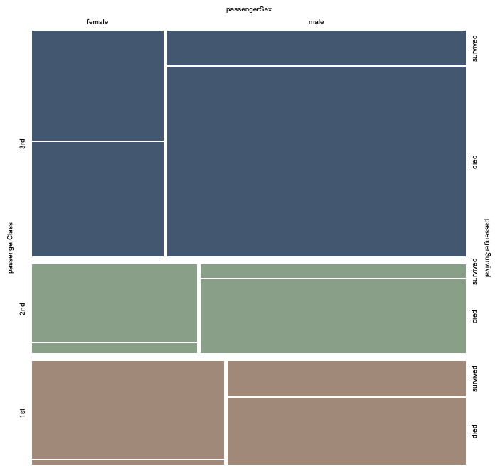
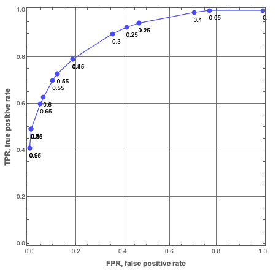

# Trie based classifiers evaluation

## Introduction

In this document we show how to evaluate TriesWithFrequencies, [AA5, AAp7], based classifiers created over well known
Machine Learning (ML) datasets. The computations are done with packages from [Raku's ecosystem](https://raku.land).

The classifiers based on TriesWithFrequencies can be seen as some sort of Naive Bayesian Classifiers (NBCs).

We use the workflow summarized in this flowchart:


For more details on classification workflows see the article 
["A monad for classification workflows"](https://mathematicaforprediction.wordpress.com/2018/05/15/a-monad-for-classification-workflows/).
[AA1].

### Document execution

This is a "computable Markdown document" -- the Raku cells are (context-consecutively) evaluated with the
["literate programming"](https://en.wikipedia.org/wiki/Literate_programming)
package
["Text::CodeProcessing"](https://raku.land/cpan:ANTONOV/Text::CodeProcessing), [AA2, AAp5].

**Remark:** This document *can be* also made using the Mathematica-and-Raku connector, [AA3], 
but by utilizing the package "Text::Plot", [AAp6, AA8], to produce (informative enough) graphs, that is "less needed."    

------

## Data

Here we get Titanic data using the package "Data::Reshapers", [AA3, AAp2]:

```perl6
use Data::Reshapers;
my @dsTitanic=get-titanic-dataset(headers=>'auto');
dimensions(@dsTitanic)
```

Here is data sample:

```perl6
to-pretty-table( @dsTitanic.pick(5), field-names => <passengerAge passengerClass passengerSex passengerSurvival>)
```

Here is a summary:

```perl6
use Data::Summarizers;
records-summary(@dsTitanic)
```

-------

## Trie creation

For demonstration purposes let us create a *shorter* trie and display it in tree form:

```perl6
use ML::TriesWithFrequencies;
my $trTitanicShort = 
  @dsTitanic.map({ $_<passengerClass passengerSex passengerSurvival> }).&trie-create
  .shrink;
say $trTitanicShort.form;  
```

Here is a mosaic plot that corresponds to the trie above:



(The plot is made with Mathematica.)

-------

## Trie classifier

In order to make certain reproducibility statements for the kind of experiments
shown here, we use random seeding (with `srand`) before any computations that use pseudo-random numbers.
Meaning, one would expect Raku code that starts with an `srand` statement (e.g. `srand(889)`)
to produce the same pseudo random numbers if it is executed multiple times (without changing it.)

**Remark:** Per [this comment](https://stackoverflow.com/a/71631427/14163984) it seems that 
a setting of `srand` guarantees the production of reproducible between runs random sequences 
on the particular combination of hardware-OS-software Raku is executed on.

```perl6
srand(889)
```

Here we split the data into training and testing data:

```perl6
my ($dsTraining, $dsTesting) = take-drop( @dsTitanic.pick(*), floor(0.8 * @dsTitanic.elems));
say $dsTraining.elems;
say $dsTesting.elems;
```

(The function `take-drop` is from "Data::Reshapers". It follows Mathematica's 
[`TakeDrop`](https://reference.wolfram.com/language/ref/TakeDrop.html), [WRI1].)

Alternatively, we can say that:

1. We get indices of dataset rows to make the training data
2. We obtain the testing data indices as the complement of the training indices

**Remark:** It is better to do stratified sampling, i.e. apply `take-drop` per each label. 

Here we make a trie with the training data:

```perl6
my $trTitanic = $dsTraining.map({ $_.<passengerClass passengerSex passengerAge passengerSurvival> }).Array.&trie-create;
$trTitanic.node-counts
```

Here is an example *decision*-classification:

```perl6
$trTitanic.classify(<1st female>)
```

Here is an example *probabilities*-classification:

```perl6
$trTitanic.classify(<2nd male>, prop=>'Probs')
```

We want to classify across all testing data, but not all testing data records might be present in the trie. 
Let us check that such testing records are few (or none):

```perl6
$dsTesting.grep({ !$trTitanic.is-key($_<passengerClass passengerSex passengerAge>) }).elems
```

Let us remove the records that cannot be classified:

```perl6
$dsTesting = $dsTesting.grep({ $trTitanic.is-key($_<passengerClass passengerSex passengerAge>) });
$dsTesting.elems
```

Here we classify all testing records (and show a few of the results):

```perl6
my @testingRecords = $dsTesting.map({ $_.<passengerClass passengerSex passengerAge> }).Array;
my @clRes = $trTitanic.classify(@testingRecords).Array;
@clRes.head(5)
```

Here is a tally of the classification results:

```perl6
tally(@clRes)
```

(The function `tally` is from "Data::Summarizers". It follows Mathematica's 
[`Tally`](https://reference.wolfram.com/language/ref/Tally.html), [WRI2].)

Here we make a Receiver Operating Characteristic (ROC) record, [AA5, AAp4]:

```perl6
use ML::ROCFunctions;
my %roc = to-roc-hash('survived', 'died', select-columns( $dsTesting, 'passengerSurvival')>>.values.flat, @clRes)
```

-------

## Trie classification with ROC plots

In the next code cell we classify all testing data records. For each record:

- Get probabilities hash
- Add to that hash the actual label
- Make sure the hash has both survival labels

```perl6
use Hash::Merge;
my @clRes = 
do for [|$dsTesting] -> $r {
    my $res = [|$trTitanic.classify( $r<passengerClass passengerSex passengerAge>,  prop => 'Probs' ), Actual => $r<passengerSurvival>].Hash;
    merge-hash( { died => 0, survived => 0}, $res)
}
```

Here we obtain the range of the label "survived":

```perl6
my @vals = flatten(select-columns(@clRes, 'survived')>>.values);
(min(@vals), max(@vals))
```

Here we make list of decision thresholds:

```perl6
my @thRange = min(@vals), min(@vals) + (max(@vals)-min(@vals))/30 ... max(@vals);
records-summary(@thRange)
```

In the following code cell for each threshold:

- For each classification hash decide on "survived" if the corresponding value is greater or equal to the threshold
- Make threshold's ROC-hash

```perl6
my @rocs = @thRange.map(-> $th { to-roc-hash('survived', 'died', 
                                                select-columns(@clRes, 'Actual')>>.values.flat, 
                                                select-columns(@clRes, 'survived')>>.values.flat.map({ $_ >= $th ?? 'survived' !! 'died' })) });
```

Here is the obtained ROC-hash table:

```perl6
to-pretty-table(@rocs)
```

Here is the corresponding ROC plot:

```perl6
use Text::Plot; 
text-list-plot(roc-functions('FPR')(@rocs), roc-functions('TPR')(@rocs),
                width => 70, height => 25, 
                x-label => 'FPR', y-label => 'TPR' )
```

We can see the Trie classifier has reasonable prediction abilities -- 
we get ≈ 75% True Positive Rate (TPR) with for relatively small False Positive Rate (FPR), ≈ 20%. 

Here is a ROC plot made with Mathematica (using a different Trie over Titanic data):




-------

## Improvements

For simplicity the workflow above was kept "naive." A better workflow would include:

- Stratified partitioning of training and testing data
- K-fold cross-validation
- Variable significance finding
- Specifically for Tries with frequencies: using different order of variables while constructing the trie

**Remark:** K-fold cross-validation can be "simply" achieved by running this document multiple times using
different random seeds.

-------

## References

### Articles

[AA1] Anton Antonov,
["A monad for classification workflows"](https://mathematicaforprediction.wordpress.com/2018/05/15/a-monad-for-classification-workflows/),
(2018),
[MathematicaForPrediction at WordPress](https://mathematicaforprediction.wordpress.com).

[AA2] Anton Antonov,
["Raku Text::CodeProcessing"](https://rakuforprediction.wordpress.com/2021/07/13/raku-textcodeprocessing/),
(2021),
[RakuForPrediction at WordPress](https://rakuforprediction.wordpress.com).

[AA3] Anton Antonov,
["Connecting Mathematica and Raku"](https://rakuforprediction.wordpress.com/2021/12/30/connecting-mathematica-and-raku/),
(2021),
[RakuForPrediction at WordPress](https://rakuforprediction.wordpress.com).

[AA4] Anton Antonov,
["Introduction to data wrangling with Raku"](https://rakuforprediction.wordpress.com/2021/12/31/introduction-to-data-wrangling-with-raku/),
(2021),
[RakuForPrediction at WordPress](https://rakuforprediction.wordpress.com).

[AA5] Anton Antonov,
["ML::TriesWithFrequencies"](https://rakuforprediction.wordpress.com/2022/06/22/mltrieswithfrequencies/),
(2022),
[RakuForPrediction at WordPress](https://rakuforprediction.wordpress.com).

[AA6] Anton Antonov,
["Data::Generators"](https://rakuforprediction.wordpress.com/2022/06/25/datagenerators/),
(2022),
[RakuForPrediction at WordPress](https://rakuforprediction.wordpress.com).

[AA7] Anton Antonov,
["ML::ROCFunctions"](https://rakuforprediction.wordpress.com/2022/06/30/mlrocfunctions/),
(2022),
[RakuForPrediction at WordPress](https://rakuforprediction.wordpress.com).

[AA8] Anton Antonov,
["Text::Plot"](https://rakuforprediction.wordpress.com/2022/07/05/textplot/),
(2022),
[RakuForPrediction at WordPress](https://rakuforprediction.wordpress.com).

[Wk1] Wikipedia
entry, ["Receiver operating characteristic"](https://en.wikipedia.org/wiki/Receiver_operating_characteristic).

### Packages

[AAp1] Anton Antonov,
[Data::Generators Raku package](https://github.com/antononcube/Raku-Data-Generators),
(2021),
[GitHub/antononcube](https://github.com/antononcube).

[AAp2] Anton Antonov,
[Data::Reshapers Raku package](https://github.com/antononcube/Raku-Data-Reshapers),
(2021),
[GitHub/antononcube](https://github.com/antononcube).

[AAp3] Anton Antonov,
[Data::Summarizers Raku package](https://github.com/antononcube/Raku-Data-Summarizers),
(2021),
[GitHub/antononcube](https://github.com/antononcube).

[AAp4] Anton Antonov,
[ML::ROCFunctions Raku package](https://github.com/antononcube/Raku-ML-ROCFunctions),
(2022),
[GitHub/antononcube](https://github.com/antononcube).

[AAp5] Anton Antonov,
[Text::CodeProcessing Raku package](https://github.com/antononcube/Raku-Text-CodeProcessing),
(2021),
[GitHub/antononcube](https://github.com/antononcube).

[AAp6] Anton Antonov,
[Text::Plot Raku package](https://github.com/antononcube/Raku-Text-Plot),
(2022),
[GitHub/antononcube](https://github.com/antononcube).

[AAp7] Anton Antonov,
[ML::TriesWithFrequencies Raku package](https://github.com/antononcube/Raku-ML-TriesWithFrequencies),
(2021),
[GitHub/antononcube](https://github.com/antononcube).

### Functions

[WRI1] Wolfram Research (2015), 
[TakeDrop](https://reference.wolfram.com/language/ref/TakeDrop.html), 
Wolfram Language function, (updated 2015).

[WRI2] Wolfram Research (2007), 
[Tally](https://reference.wolfram.com/language/ref/Tally.html), 
Wolfram Language function.


