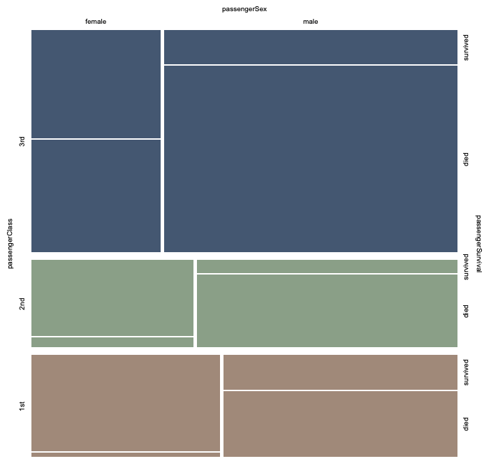
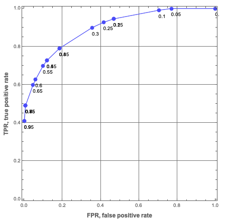

# Trie based classifiers evaluation

## Introduction

In this document we show how to evaluate TriesWithFrequencies, [AA5, AAp7], based classifiers created over well known
Machine Learning (ML) datasets. The computations are done with packages from [Raku's ecosystem](https://raku.land).

The classifiers based on TriesWithFrequencies can be seen as some sort of Naive Bayesian Classifiers (NBCs).

We use the workflow summarized in this flowchart:


For more details on classification workflows see the article 
["A monad for classification workflows"](https://mathematicaforprediction.wordpress.com/2018/05/15/a-monad-for-classification-workflows/).
[AA1].

### Document execution

This is a "computable Markdown document" -- the Raku cells are (context-consecutively) evaluated with the
["literate programming"](https://en.wikipedia.org/wiki/Literate_programming)
package
["Text::CodeProcessing"](https://raku.land/cpan:ANTONOV/Text::CodeProcessing), [AA2, AAp5].

**Remark:** This document *can be* also made using the Mathematica-and-Raku connector, [AA3], 
but by utilizing the package "Text::Plot", [AAp6, AA8], to produce (informative enough) graphs, that is "less needed."    

------

## Data

Here we get Titanic data using the package "Data::Reshapers", [AA3, AAp2]:

```perl6
use Data::Reshapers;
my @dsTitanic=get-titanic-dataset(headers=>'auto');
dimensions(@dsTitanic)
```
```
# (1309 5)
```

Here is data sample:

```perl6
to-pretty-table( @dsTitanic.pick(5), field-names => <passengerAge passengerClass passengerSex passengerSurvival>)
```
```
# +--------------+----------------+--------------+-------------------+
# | passengerAge | passengerClass | passengerSex | passengerSurvival |
# +--------------+----------------+--------------+-------------------+
# |      50      |      1st       |    female    |      survived     |
# |      20      |      3rd       |     male     |        died       |
# |      20      |      3rd       |     male     |        died       |
# |      -1      |      3rd       |     male     |        died       |
# |      70      |      1st       |     male     |        died       |
# +--------------+----------------+--------------+-------------------+
```

Here is a summary:

```perl6
use Data::Summarizers;
records-summary(@dsTitanic)
```
```
# +----------------+-------------------+----------------+-----------------+---------------+
# | passengerAge   | passengerSurvival | passengerClass | id              | passengerSex  |
# +----------------+-------------------+----------------+-----------------+---------------+
# | 20      => 334 | died     => 809   | 3rd => 709     | 977     => 1    | male   => 843 |
# | -1      => 263 | survived => 500   | 1st => 323     | 1286    => 1    | female => 466 |
# | 30      => 258 |                   | 2nd => 277     | 776     => 1    |               |
# | 40      => 190 |                   |                | 1166    => 1    |               |
# | 50      => 88  |                   |                | 202     => 1    |               |
# | 60      => 57  |                   |                | 878     => 1    |               |
# | 0       => 56  |                   |                | 735     => 1    |               |
# | (Other) => 63  |                   |                | (Other) => 1302 |               |
# +----------------+-------------------+----------------+-----------------+---------------+
```

-------

## Trie creation

For demonstration purposes let us create a *shorter* trie and display it in tree form:

```perl6
use ML::TriesWithFrequencies;
my $trTitanicShort = 
  @dsTitanic.map({ $_<passengerClass passengerSex passengerSurvival> }).&trie-create
  .shrink;
say $trTitanicShort.form;  
```
```
# TRIEROOT => 1309
# ├─1st => 323
# │ ├─female => 144
# │ │ ├─died => 5
# │ │ └─survived => 139
# │ └─male => 179
# │   ├─died => 118
# │   └─survived => 61
# ├─2nd => 277
# │ ├─female => 106
# │ │ ├─died => 12
# │ │ └─survived => 94
# │ └─male => 171
# │   ├─died => 146
# │   └─survived => 25
# └─3rd => 709
#   ├─female => 216
#   │ ├─died => 110
#   │ └─survived => 106
#   └─male => 493
#     ├─died => 418
#     └─survived => 75
```

Here is a mosaic plot that corresponds to the trie above:



(The plot is made with Mathematica.)

-------

## Trie classifier

In order to make certain reproducibility statements for the kind of experiments
shown here, we use random seeding (with `srand`) before any computations that use pseudo-random numbers.
Meaning, one would expect Raku code that starts with an `srand` statement (e.g. `srand(889)`)
to produce the same pseudo random numbers if it is executed multiple times (without changing it.)

**Remark:** Per [this comment](https://stackoverflow.com/a/71631427/14163984) it seems that 
a setting of `srand` guarantees the production of reproducible between runs random sequences 
on the particular combination of hardware-OS-software Raku is executed on.

```perl6
srand(889)
```
```
# 889
```

Here we split the data into training and testing data:

```perl6
my ($dsTraining, $dsTesting) = take-drop( @dsTitanic.pick(*), floor(0.8 * @dsTitanic.elems));
say $dsTraining.elems;
say $dsTesting.elems;
```
```
# 1047
# 262
```

(The function `take-drop` is from "Data::Reshapers". It follows Mathematica's 
[`TakeDrop`](https://reference.wolfram.com/language/ref/TakeDrop.html), [WRI1].)

Alternatively, we can say that:

1. We get indices of dataset rows to make the training data
2. We obtain the testing data indices as the complement of the training indices

**Remark:** It is better to do stratified sampling, i.e. apply `take-drop` per each label. 

Here we make a trie with the training data:

```perl6
my $trTitanic = $dsTraining.map({ $_.<passengerClass passengerSex passengerAge passengerSurvival> }).Array.&trie-create;
$trTitanic.node-counts
```
```
# {Internal => 63, Leaves => 85, Total => 148}
```

Here is an example *decision*-classification:

```perl6
$trTitanic.classify(<1st female>)
```
```
# survived
```

Here is an example *probabilities*-classification:

```perl6
$trTitanic.classify(<2nd male>, prop=>'Probs')
```
```
# {died => 0.851063829787234, survived => 0.14893617021276598}
```

We want to classify across all testing data, but not all testing data records might be present in the trie. 
Let us check that such testing records are few (or none):

```perl6
$dsTesting.grep({ !$trTitanic.is-key($_<passengerClass passengerSex passengerAge>) }).elems
```
```
# 0
```

Let us remove the records that cannot be classified:

```perl6
$dsTesting = $dsTesting.grep({ $trTitanic.is-key($_<passengerClass passengerSex passengerAge>) });
$dsTesting.elems
```
```
# 262
```

Here we classify all testing records (and show a few of the results):

```perl6
my @testingRecords = $dsTesting.map({ $_.<passengerClass passengerSex passengerAge> }).Array;
my @clRes = $trTitanic.classify(@testingRecords).Array;
@clRes.head(5)
```
```
# (died died died died died)
```

Here is a tally of the classification results:

```perl6
tally(@clRes)
```
```
# {died => 185, survived => 77}
```

(The function `tally` is from "Data::Summarizers". It follows Mathematica's 
[`Tally`](https://reference.wolfram.com/language/ref/Tally.html), [WRI2].)

Here we make a Receiver Operating Characteristic (ROC) record, [AA5, AAp4]:

```perl6
use ML::ROCFunctions;
my %roc = to-roc-hash('survived', 'died', select-columns( $dsTesting, 'passengerSurvival')>>.values.flat, @clRes)
```
```
# {FalseNegative => 45, FalsePositive => 16, TrueNegative => 140, TruePositive => 61}
```

-------

## Trie classification with ROC plots

In the next code cell we classify all testing data records. For each record:

- Get probabilities hash
- Add to that hash the actual label
- Make sure the hash has both survival labels

```perl6
use Hash::Merge;
my @clRes = 
do for [|$dsTesting] -> $r {
    my $res = [|$trTitanic.classify( $r<passengerClass passengerSex passengerAge>,  prop => 'Probs' ), Actual => $r<passengerSurvival>].Hash;
    merge-hash( { died => 0, survived => 0}, $res)
}
```
```
# [{Actual => died, died => 0.9024390243902439, survived => 0.0975609756097561} {Actual => died, died => 0.911504424778761, survived => 0.08849557522123894} {Actual => died, died => 0.6538461538461539, survived => 0.34615384615384615} {Actual => died, died => 0.5, survived => 0.5} {Actual => died, died => 0.75, survived => 0.25} {Actual => survived, died => 0.038461538461538464, survived => 0.9615384615384616} {Actual => survived, died => 0.5, survived => 0.5} {Actual => died, died => 0.911504424778761, survived => 0.08849557522123894} {Actual => died, died => 0.782051282051282, survived => 0.21794871794871795} {Actual => survived, died => 0.7, survived => 0.3} {Actual => died, died => 1, survived => 0} {Actual => died, died => 0.782051282051282, survived => 0.21794871794871795} {Actual => died, died => 0.6190476190476191, survived => 0.38095238095238093} {Actual => died, died => 0.911504424778761, survived => 0.08849557522123894} {Actual => died, died => 0, survived => 1} {Actual => died, died => 0.8571428571428571, survived => 0.14285714285714285} {Actual => died, died => 0.782051282051282, survived => 0.21794871794871795} {Actual => died, died => 0.911504424778761, survived => 0.08849557522123894} {Actual => survived, died => 0.125, survived => 0.875} {Actual => survived, died => 0.6538461538461539, survived => 0.34615384615384615} {Actual => died, died => 0.9545454545454546, survived => 0.045454545454545456} {Actual => survived, died => 0.41509433962264153, survived => 0.5849056603773585} {Actual => died, died => 0.9487179487179487, survived => 0.05128205128205128} {Actual => survived, died => 0.41509433962264153, survived => 0.5849056603773585} {Actual => survived, died => 0.034482758620689655, survived => 0.9655172413793104} {Actual => survived, died => 0.5, survived => 0.5} {Actual => survived, died => 0.034482758620689655, survived => 0.9655172413793104} {Actual => died, died => 0.9024390243902439, survived => 0.0975609756097561} {Actual => died, died => 0.5384615384615384, survived => 0.46153846153846156} {Actual => died, died => 1, survived => 0} {Actual => survived, died => 0.7037037037037037, survived => 0.2962962962962963} {Actual => survived, died => 0.11538461538461539, survived => 0.8846153846153846} {Actual => died, died => 0.8571428571428571, survived => 0.14285714285714285} {Actual => died, died => 0.782051282051282, survived => 0.21794871794871795} {Actual => died, died => 0.41509433962264153, survived => 0.5849056603773585} {Actual => died, died => 0.782051282051282, survived => 0.21794871794871795} {Actual => survived, died => 0.034482758620689655, survived => 0.9655172413793104} {Actual => died, died => 0.9024390243902439, survived => 0.0975609756097561} {Actual => survived, died => 0.125, survived => 0.875} {Actual => died, died => 0.911504424778761, survived => 0.08849557522123894} {Actual => survived, died => 0, survived => 1} {Actual => survived, died => 0.911504424778761, survived => 0.08849557522123894} {Actual => died, died => 0.9545454545454546, survived => 0.045454545454545456} {Actual => died, died => 0.6842105263157895, survived => 0.3157894736842105} {Actual => survived, died => 0, survived => 1} {Actual => died, died => 0.6842105263157895, survived => 0.3157894736842105} {Actual => survived, died => 0.782051282051282, survived => 0.21794871794871795} {Actual => died, died => 0.7619047619047619, survived => 0.23809523809523808} {Actual => died, died => 0.8467741935483871, survived => 0.1532258064516129} {Actual => died, died => 0.5, survived => 0.5} {Actual => died, died => 0.9487179487179487, survived => 0.05128205128205128} {Actual => died, died => 0.9024390243902439, survived => 0.0975609756097561} {Actual => died, died => 0.8467741935483871, survived => 0.1532258064516129} {Actual => died, died => 0.8467741935483871, survived => 0.1532258064516129} {Actual => died, died => 0.5, survived => 0.5} {Actual => died, died => 0, survived => 1} {Actual => died, died => 0.75, survived => 0.25} {Actual => survived, died => 0.6842105263157895, survived => 0.3157894736842105} {Actual => died, died => 0.8571428571428571, survived => 0.14285714285714285} {Actual => survived, died => 0, survived => 1} {Actual => survived, died => 0.6538461538461539, survived => 0.34615384615384615} {Actual => died, died => 0.782051282051282, survived => 0.21794871794871795} {Actual => survived, died => 0.15384615384615385, survived => 0.8461538461538461} {Actual => died, died => 0.911504424778761, survived => 0.08849557522123894} {Actual => died, died => 0.782051282051282, survived => 0.21794871794871795} {Actual => died, died => 0.8467741935483871, survived => 0.1532258064516129} {Actual => died, died => 0.911504424778761, survived => 0.08849557522123894} {Actual => survived, died => 0.5384615384615384, survived => 0.46153846153846156} {Actual => died, died => 0.5, survived => 0.5} {Actual => died, died => 0.9545454545454546, survived => 0.045454545454545456} {Actual => survived, died => 0.5, survived => 0.5} {Actual => survived, died => 0.6538461538461539, survived => 0.34615384615384615} {Actual => died, died => 0.9487179487179487, survived => 0.05128205128205128} {Actual => survived, died => 0.8467741935483871, survived => 0.1532258064516129} {Actual => died, died => 0.7037037037037037, survived => 0.2962962962962963} {Actual => survived, died => 0.034482758620689655, survived => 0.9655172413793104} {Actual => died, died => 0.911504424778761, survived => 0.08849557522123894} {Actual => died, died => 0.7619047619047619, survived => 0.23809523809523808} {Actual => died, died => 0.782051282051282, survived => 0.21794871794871795} {Actual => died, died => 0.6428571428571429, survived => 0.35714285714285715} {Actual => died, died => 0.7, survived => 0.3} {Actual => died, died => 0.9545454545454546, survived => 0.045454545454545456} {Actual => survived, died => 0.038461538461538464, survived => 0.9615384615384616} {Actual => died, died => 0.911504424778761, survived => 0.08849557522123894} {Actual => died, died => 0.8467741935483871, survived => 0.1532258064516129} {Actual => survived, died => 0.6538461538461539, survived => 0.34615384615384615} {Actual => survived, died => 0.038461538461538464, survived => 0.9615384615384616} {Actual => died, died => 0.9024390243902439, survived => 0.0975609756097561} {Actual => survived, died => 0.5, survived => 0.5} {Actual => died, died => 0.911504424778761, survived => 0.08849557522123894} {Actual => died, died => 0.5, survived => 0.5} {Actual => died, died => 1, survived => 0} {Actual => died, died => 1, survived => 0} {Actual => died, died => 0.8467741935483871, survived => 0.1532258064516129} {Actual => survived, died => 0.038461538461538464, survived => 0.9615384615384616} {Actual => died, died => 0.8888888888888888, survived => 0.1111111111111111} {Actual => died, died => 0.911504424778761, survived => 0.08849557522123894} {Actual => died, died => 0.9487179487179487, survived => 0.05128205128205128} {Actual => survived, died => 0.125, survived => 0.875} {Actual => survived, died => 0.5, survived => 0.5} ...]
```

Here we obtain the range of the label "survived":

```perl6
my @vals = flatten(select-columns(@clRes, 'survived')>>.values);
(min(@vals), max(@vals))
```
```
# (0 1)
```

Here we make list of decision thresholds:

```perl6
my @thRange = min(@vals), min(@vals) + (max(@vals)-min(@vals))/30 ... max(@vals);
records-summary(@thRange)
```
```
# +-------------------------------+
# | numerical                     |
# +-------------------------------+
# | Median => 0.49999999999999994 |
# | Max    => 0.9999999999999999  |
# | 3rd-Qu => 0.7666666666666666  |
# | Mean   => 0.5000000000000001  |
# | Min    => 0                   |
# | 1st-Qu => 0.2333333333333333  |
# +-------------------------------+
```

In the following code cell for each threshold:

- For each classification hash decide on "survived" if the corresponding value is greater or equal to the threshold
- Make threshold's ROC-hash

```perl6
my @rocs = @thRange.map(-> $th { to-roc-hash('survived', 'died', 
                                                select-columns(@clRes, 'Actual')>>.values.flat, 
                                                select-columns(@clRes, 'survived')>>.values.flat.map({ $_ >= $th ?? 'survived' !! 'died' })) });
```
```
# [{FalseNegative => 0, FalsePositive => 156, TrueNegative => 0, TruePositive => 106} {FalseNegative => 0, FalsePositive => 148, TrueNegative => 8, TruePositive => 106} {FalseNegative => 2, FalsePositive => 137, TrueNegative => 19, TruePositive => 104} {FalseNegative => 9, FalsePositive => 104, TrueNegative => 52, TruePositive => 97} {FalseNegative => 10, FalsePositive => 97, TrueNegative => 59, TruePositive => 96} {FalseNegative => 13, FalsePositive => 72, TrueNegative => 84, TruePositive => 93} {FalseNegative => 13, FalsePositive => 72, TrueNegative => 84, TruePositive => 93} {FalseNegative => 15, FalsePositive => 55, TrueNegative => 101, TruePositive => 91} {FalseNegative => 19, FalsePositive => 46, TrueNegative => 110, TruePositive => 87} {FalseNegative => 23, FalsePositive => 42, TrueNegative => 114, TruePositive => 83} {FalseNegative => 28, FalsePositive => 33, TrueNegative => 123, TruePositive => 78} {FalseNegative => 36, FalsePositive => 25, TrueNegative => 131, TruePositive => 70} {FalseNegative => 39, FalsePositive => 22, TrueNegative => 134, TruePositive => 67} {FalseNegative => 39, FalsePositive => 22, TrueNegative => 134, TruePositive => 67} {FalseNegative => 40, FalsePositive => 18, TrueNegative => 138, TruePositive => 66} {FalseNegative => 40, FalsePositive => 18, TrueNegative => 138, TruePositive => 66} {FalseNegative => 51, FalsePositive => 10, TrueNegative => 146, TruePositive => 55} {FalseNegative => 51, FalsePositive => 10, TrueNegative => 146, TruePositive => 55} {FalseNegative => 54, FalsePositive => 4, TrueNegative => 152, TruePositive => 52} {FalseNegative => 57, FalsePositive => 3, TrueNegative => 153, TruePositive => 49} {FalseNegative => 57, FalsePositive => 3, TrueNegative => 153, TruePositive => 49} {FalseNegative => 57, FalsePositive => 3, TrueNegative => 153, TruePositive => 49} {FalseNegative => 57, FalsePositive => 3, TrueNegative => 153, TruePositive => 49} {FalseNegative => 57, FalsePositive => 3, TrueNegative => 153, TruePositive => 49} {FalseNegative => 57, FalsePositive => 3, TrueNegative => 153, TruePositive => 49} {FalseNegative => 57, FalsePositive => 3, TrueNegative => 153, TruePositive => 49} {FalseNegative => 60, FalsePositive => 3, TrueNegative => 153, TruePositive => 46} {FalseNegative => 72, FalsePositive => 2, TrueNegative => 154, TruePositive => 34} {FalseNegative => 72, FalsePositive => 2, TrueNegative => 154, TruePositive => 34} {FalseNegative => 89, FalsePositive => 2, TrueNegative => 154, TruePositive => 17} {FalseNegative => 89, FalsePositive => 2, TrueNegative => 154, TruePositive => 17}]
```

Here is the obtained ROC-hash table:

```perl6
to-pretty-table(@rocs)
```
```
# +---------------+---------------+--------------+--------------+
# | FalsePositive | FalseNegative | TrueNegative | TruePositive |
# +---------------+---------------+--------------+--------------+
# |      156      |       0       |      0       |     106      |
# |      148      |       0       |      8       |     106      |
# |      137      |       2       |      19      |     104      |
# |      104      |       9       |      52      |      97      |
# |       97      |       10      |      59      |      96      |
# |       72      |       13      |      84      |      93      |
# |       72      |       13      |      84      |      93      |
# |       55      |       15      |     101      |      91      |
# |       46      |       19      |     110      |      87      |
# |       42      |       23      |     114      |      83      |
# |       33      |       28      |     123      |      78      |
# |       25      |       36      |     131      |      70      |
# |       22      |       39      |     134      |      67      |
# |       22      |       39      |     134      |      67      |
# |       18      |       40      |     138      |      66      |
# |       18      |       40      |     138      |      66      |
# |       10      |       51      |     146      |      55      |
# |       10      |       51      |     146      |      55      |
# |       4       |       54      |     152      |      52      |
# |       3       |       57      |     153      |      49      |
# |       3       |       57      |     153      |      49      |
# |       3       |       57      |     153      |      49      |
# |       3       |       57      |     153      |      49      |
# |       3       |       57      |     153      |      49      |
# |       3       |       57      |     153      |      49      |
# |       3       |       57      |     153      |      49      |
# |       3       |       60      |     153      |      46      |
# |       2       |       72      |     154      |      34      |
# |       2       |       72      |     154      |      34      |
# |       2       |       89      |     154      |      17      |
# |       2       |       89      |     154      |      17      |
# +---------------+---------------+--------------+--------------+
```

Here is the corresponding ROC plot:

```perl6
use Text::Plot; 
text-list-plot(roc-functions('FPR')(@rocs), roc-functions('TPR')(@rocs),
                width => 70, height => 25, 
                x-label => 'FPR', y-label => 'TPR' )
```
```
# +--+------------+-----------+-----------+-----------+------------+---+        
# |                                                                    |        
# +                                                        *    *  *   +  1.00  
# |                                                                    |        
# |                                         * *                        |        
# |                        *      *                                    |        
# |                    *                                               |        
# +                   *                                                +  0.80  
# |               *                                                    |        
# |                                                                    |        
# |            *                                                       |        
# |         * *                                                        |       T
# +                                                                    +  0.60 P
# |      *                                                             |       R
# |    *                                                               |        
# |   *                                                                |        
# +   *                                                                +  0.40  
# |                                                                    |        
# |   *                                                                |        
# |                                                                    |        
# |                                                                    |        
# +                                                                    +  0.20  
# |   *                                                                |        
# |                                                                    |        
# +--+------------+-----------+-----------+-----------+------------+---+        
#    0.00         0.20        0.40        0.60        0.80         1.00       
#                                  FPR
```

We can see the Trie classifier has reasonable prediction abilities -- 
we get ≈ 75% True Positive Rate (TPR) with for relatively small False Positive Rate (FPR), ≈ 20%. 

Here is a ROC plot made with Mathematica (using a different Trie over Titanic data):




-------

## Improvements

For simplicity the workflow above was kept "naive." A better workflow would include:

- Stratified partitioning of training and testing data
- K-fold cross-validation
- Variable significance finding
- Specifically for Tries with frequencies: using different order of variables while constructing the trie

**Remark:** K-fold cross-validation can be "simply" achieved by running this document multiple times using
different random seeds.

-------

## References

### Articles

[AA1] Anton Antonov,
["A monad for classification workflows"](https://mathematicaforprediction.wordpress.com/2018/05/15/a-monad-for-classification-workflows/),
(2018),
[MathematicaForPrediction at WordPress](https://mathematicaforprediction.wordpress.com).

[AA2] Anton Antonov,
["Raku Text::CodeProcessing"](https://rakuforprediction.wordpress.com/2021/07/13/raku-textcodeprocessing/),
(2021),
[RakuForPrediction at WordPress](https://rakuforprediction.wordpress.com).

[AA3] Anton Antonov,
["Connecting Mathematica and Raku"](https://rakuforprediction.wordpress.com/2021/12/30/connecting-mathematica-and-raku/),
(2021),
[RakuForPrediction at WordPress](https://rakuforprediction.wordpress.com).

[AA4] Anton Antonov,
["Introduction to data wrangling with Raku"](https://rakuforprediction.wordpress.com/2021/12/31/introduction-to-data-wrangling-with-raku/),
(2021),
[RakuForPrediction at WordPress](https://rakuforprediction.wordpress.com).

[AA5] Anton Antonov,
["ML::TriesWithFrequencies"](https://rakuforprediction.wordpress.com/2022/06/22/mltrieswithfrequencies/),
(2022),
[RakuForPrediction at WordPress](https://rakuforprediction.wordpress.com).

[AA6] Anton Antonov,
["Data::Generators"](https://rakuforprediction.wordpress.com/2022/06/25/datagenerators/),
(2022),
[RakuForPrediction at WordPress](https://rakuforprediction.wordpress.com).

[AA7] Anton Antonov,
["ML::ROCFunctions"](https://rakuforprediction.wordpress.com/2022/06/30/mlrocfunctions/),
(2022),
[RakuForPrediction at WordPress](https://rakuforprediction.wordpress.com).

[AA8] Anton Antonov,
["Text::Plot"](https://rakuforprediction.wordpress.com/2022/07/05/textplot/),
(2022),
[RakuForPrediction at WordPress](https://rakuforprediction.wordpress.com).

[Wk1] Wikipedia
entry, ["Receiver operating characteristic"](https://en.wikipedia.org/wiki/Receiver_operating_characteristic).

### Packages

[AAp1] Anton Antonov,
[Data::Generators Raku package](https://github.com/antononcube/Raku-Data-Generators),
(2021),
[GitHub/antononcube](https://github.com/antononcube).

[AAp2] Anton Antonov,
[Data::Reshapers Raku package](https://github.com/antononcube/Raku-Data-Reshapers),
(2021),
[GitHub/antononcube](https://github.com/antononcube).

[AAp3] Anton Antonov,
[Data::Summarizers Raku package](https://github.com/antononcube/Raku-Data-Summarizers),
(2021),
[GitHub/antononcube](https://github.com/antononcube).

[AAp4] Anton Antonov,
[ML::ROCFunctions Raku package](https://github.com/antononcube/Raku-ML-ROCFunctions),
(2022),
[GitHub/antononcube](https://github.com/antononcube).

[AAp5] Anton Antonov,
[Text::CodeProcessing Raku package](https://github.com/antononcube/Raku-Text-CodeProcessing),
(2021),
[GitHub/antononcube](https://github.com/antononcube).

[AAp6] Anton Antonov,
[Text::Plot Raku package](https://github.com/antononcube/Raku-Text-Plot),
(2022),
[GitHub/antononcube](https://github.com/antononcube).

[AAp7] Anton Antonov,
[ML::TriesWithFrequencies Raku package](https://github.com/antononcube/Raku-ML-TriesWithFrequencies),
(2021),
[GitHub/antononcube](https://github.com/antononcube).

### Functions

[WRI1] Wolfram Research (2015), 
[TakeDrop](https://reference.wolfram.com/language/ref/TakeDrop.html), 
Wolfram Language function, (updated 2015).

[WRI2] Wolfram Research (2007), 
[Tally](https://reference.wolfram.com/language/ref/Tally.html), 
Wolfram Language function.


