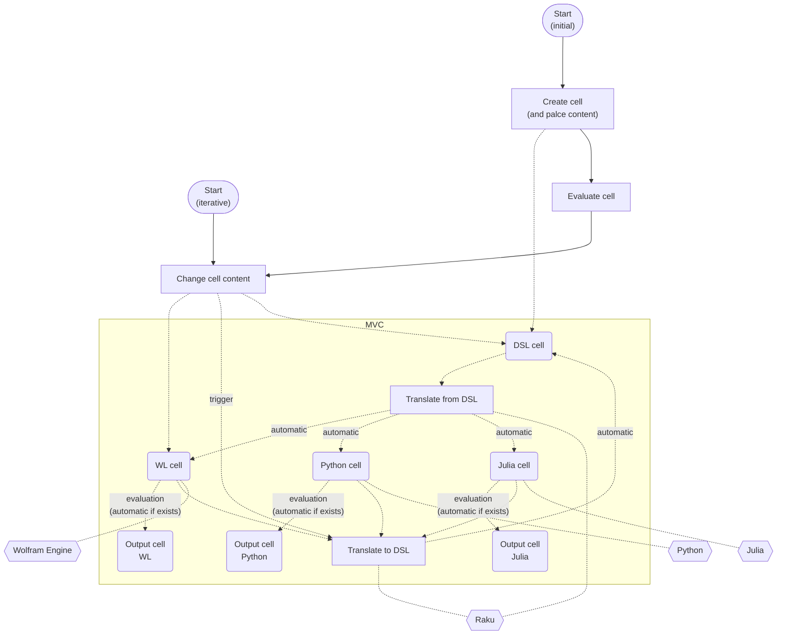

```mermaid
graph TD
WE{{Wolfram Engine}}
Raku{{Raku}}
Python{{Python}}
Julia{{Julia}}
SInit(["Start<br>(initial)"])
SIter(["Start<br>(iterative)"])
DSLCell(DSL cell)
PyCell(Python cell)
WLCell(WL cell)
JuliaCell(Julia cell)
WLOutCell(Output cell<br>WL)
PyOutCell(Output cell<br>Python)
JuliaOutCell(Output cell<br>Julia)
ChgCellCnt[Change cell content]
CreateCell["Create cell<br>(and palce content)"]
EvalCell["Evaluate cell"]
ToDSL["Translate to DSL"]
FromDSL["Translate from DSL"]
SInit ---> CreateCell 
CreateCell -.-> DSLCell
CreateCell ---> EvalCell
DSLCell -.-> FromDSL
FromDSL -.-> |automatic|WLCell
FromDSL -.-> |automatic|PyCell
FromDSL -.-> |automatic|JuliaCell
WLCell -.-> |"evaluation<br>(automatic if exists)"|WLOutCell
PyCell -.-> |"evaluation<br>(automatic if exists)"|PyOutCell
JuliaCell -.-> |"evaluation<br>(automatic if exists)"|JuliaOutCell
SIter ---> ChgCellCnt
EvalCell ---> ChgCellCnt 
ChgCellCnt -.-> WLCell
ChgCellCnt -.-> |trigger|ToDSL
ToDSL -.-> |automatic|DSLCell
ChgCellCnt -.-> DSLCell
WLCell -.-> ToDSL
PyCell -.-> ToDSL
JuliaCell -.-> ToDSL
subgraph MVC
    DSLCell
    WLCell
    PyCell
    JuliaCell
    WLOutCell
    PyOutCell
    JuliaOutCell
    ToDSL
    FromDSL
end
JuliaCell -.- Julia
WLCell -.- WE
PyCell -.- Python
ToDSL -.- Raku
FromDSL -.- Raku
```