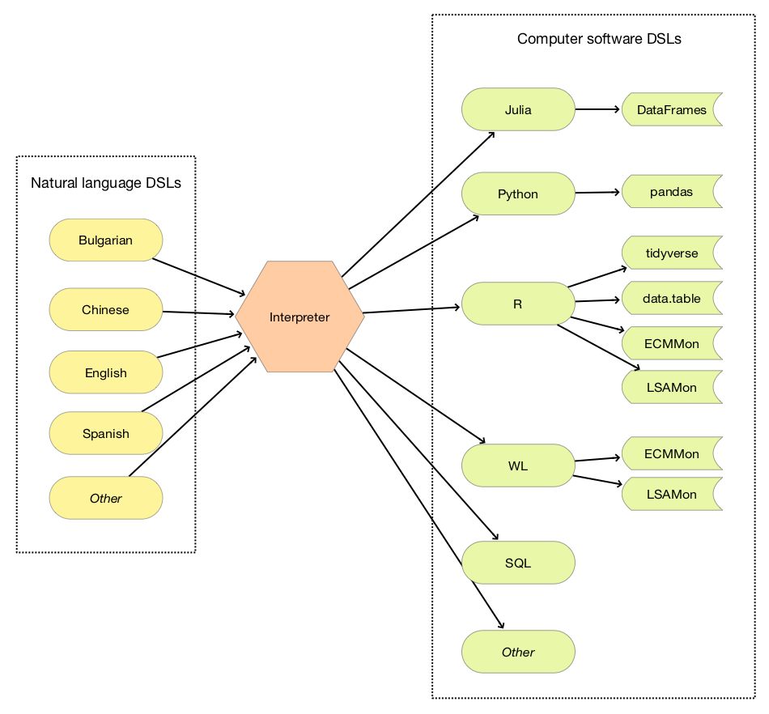

# Introduction

This book discusses the architectural design and implementation of a software system 
for the specification, navigation, and utilization of computational workflows in the fields of 
data science, machine learning, and scientific computing.

The programming language [Raku](https://raku.org) is used for the implementation and its features
has heavily influenced many details of the architectural design.

More specifically the book has two primary goals:

1. The introduction of a simple, operational, and extendable system of natural language commands
   for computational workflows.
  
2. The description of a software architecture and its Raku implementation of a system that
   interprets natural language commands into executable programming code of computational workflows.
   
The system described in the book is ***multi-language*** from both natural language and programming language
perspectives. (See Figure "DSLs-Interpreter-Simple".)

[](./Diagrams/DSLs-Interpreter-Simple.pdf)

From a software engineering perspective we want the designed system to be lightweight, immediately useful,
easy to extend and maintain, with transparent implementation, and built-in transparency of the application results. 

Here is an example of converting a data wrangling computational workflow specification into R code:

```perl6
use DSL::Shared::Utilities::ComprehensiveTranslation;
ToDSLCode("
DSL TARGET R-tidyverse;
use mtcars;
group by cyl;
counts", 
        format => "JSON")
```
```
# {
#   "DSL": "DSL::English::DataQueryWorkflows",
#   "DSLTARGET": "R-tidyverse",
#   "DSLFUNCTION": "proto sub ToDataQueryWorkflowCode (Str $command, Str $target = \"tidyverse\") {*}",
#   "CODE": "mtcars %>%\ndplyr::group_by(cyl) %>%\ndplyr::count()",
#   "USERID": ""
# }
```

In the code above the function `ToDSLCode`:

- Guessed the appropriate Domain Specific Language (DSL),
- Generated R code for RStudio's library
  [tidyverse](https://www.tidyverse.org), 
- Gave the result in
  [JSON](https://www.json.org/json-en.html),
  dictionary form

The result dictionary has entries for:
- The Raku DSL package that fits the sequence of commands 
  ([`DSL::English::DataQueryWorkflows`](https://github.com/antononcube/Raku-DSL-English-DataQueryWorkflows)) 
- DSL target, a string that combines a programming language name and a package name (`R-tidyverse`)
- The DSL function used to generate the code (`ToDataQueryWorkflowCode`)
- Generated code that corresponds to the commands and DSL target
- User ID (empty above)

We assume that it is sufficient to read the Part 1, "General Strategy and Architecture" and of the chapters in 
Part 2, "Core Computational Workflows".

