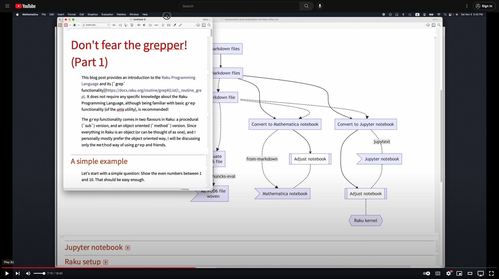
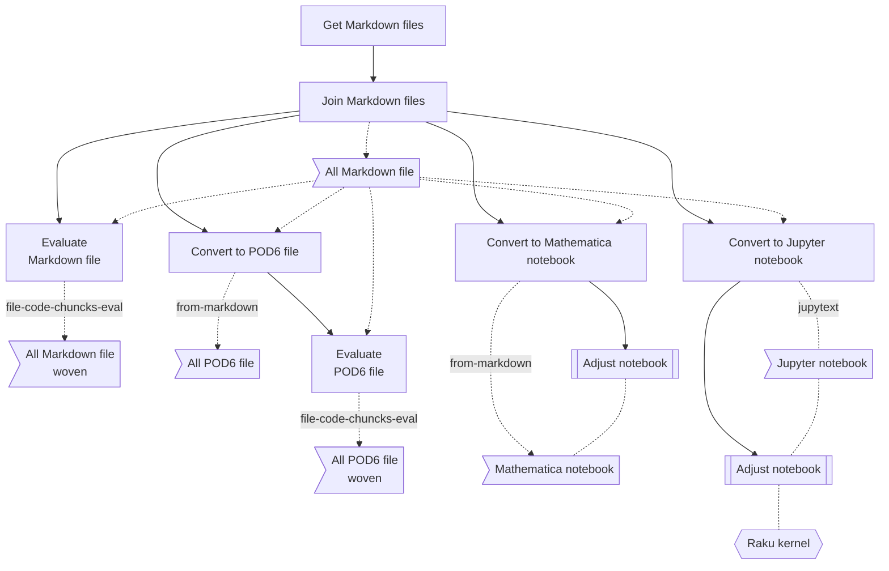
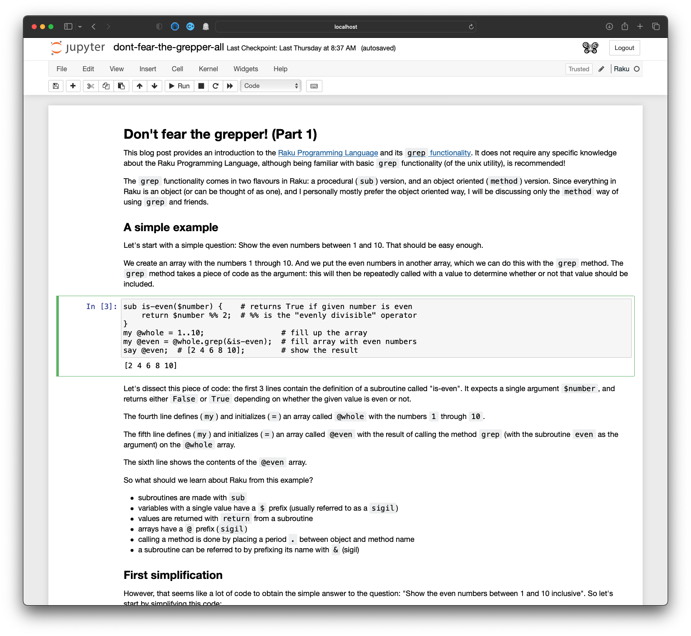

# Conversion and evaluation of Raku files

Anton Antonov   
[RakuForPrediction at WordPress](https://rakuforprediction.wordpress.com)   
[RakuForPrediction-book at GitHub](https://github.com/antononcube/RakuForPrediction-book)   
November 2022


------

[](https://www.youtube.com/watch?v=GJO7YqjGn6o)

This document has the slides of a presentation in which we do Raku files conversion and evaluation. 
Those procedures allow doing literate programming with Raku.

------

## Presentation plan

- Main message

    - Facilitation of [Literate programming](https://en.wikipedia.org/wiki/Literate_programming) with Raku.

- [Get Markdown files](https://dev.to/lizmat/dont-fear-the-grepper-6-4i), [EM1]

    - Join Markdown files

- [Convert to POD6 file](https://raku.land/zef:antononcube/Markdown::Grammar)

    - [Evaluate](https://raku.land/zef:antononcube/Text::CodeProcessing)

- [Convert to Mathematica notebook](https://raku.land/zef:antononcube/Markdown::Grammar)

    - Evaluate

    - Adjust

- [Convert to Jupyter notebook](https://jupytext.readthedocs.io/en/latest/)

    - [Evaluate](https://raku.land/cpan:BDUGGAN/Jupyter::Kernel)

    - Adjust

------

## Mermaid Diagram



--------

## Jupyter notebook

```mathematica
SystemOpen["http://localhost:8888/tree/GitHub/lizmat/articles"]
```



-------

## Raku setup

In order to use Raku in Mathematica we have to:

- Load a "Raku mode" package

- Covert the notebook into "Raku mode"

- Start a Raku session. 

**Remark:** If no Raku session is started then every Raku cell evaluation is "on its own", i.e. independent from the rest.

```mathematica
Import["https://raw.githubusercontent.com/antononcube/ConversationalAgents/master/Packages/WL/RakuMode.m"]
```

```mathematica
StartRakuProcess["Raku" -> $HomeDirectory <> "/.rakubrew/shims/raku"]
```

```mathematica
(* KillRakuProcess[]
   KillRakuSockets[] *) 
```

Here convert the "hosting" notebook into "Raku mode";

```mathematica
RakuMode[]
```

Raku cell example:

```raku
1+1_000
```

```
(*"1001"*)
```

------

## All shell commands

```shell
 1048  git pull
 1049  cat dont-fear-the-grepper-* > dont-fear-the-grepper-all.md
 1050  open dont-fear-the-grepper-all.md
 1051  file-code-chunks-eval dont-fear-the-grepper-all.md
 1052  open dont-fear-the-grepper-all_woven.md
 1053  from-markdown dont-fear-the-grepper-all.md
 1054  from-markdown dont-fear-the-grepper-all.md -t=pod6 -o=dont-fear-the-grepper-all.pod6
 1055  open dont-fear-the-grepper-all.pod6
 1056  file-code-chunks-eval dont-fear-the-grepper-all.pod6
 1057  open dont-fear-the-grepper-all_woven.pod6
 1058  from-markdown dont-fear-the-grepper-all.md | pbcopy
 1059  open dont-fear-the-grepper-all_woven.md
 1060  from-markdown --help
 1061  from-markdown dont-fear-the-grepper-all.md --raku-code-cell-name=RakuInputExecute --l=raku | pbcopy
 1064  jupytext --help
 1066  jupytext --from=md --to=ipynb dont-fear-the-grepper-all.md -o=dont-fear-the-grepper-all.ipynb
 1067  open dont-fear-the-grepper-all.ipynb
 1068  open dont-fear-the-grepper-all.md
 1069  jupytext --from=md --to=ipynb dont-fear-the-grepper-all.md -o=dont-fear-the-grepper-all.ipynb
 1070  open http://localhost:8888/tree/GitHub/lizmat/articles 
```

------

## References

### Articles

[AA1] Anton Antonov, ["Raku Text::CodeProcessing"](https://rakuforprediction.wordpress.com/2021/07/13/raku-textcodeprocessing/), (2021), [RakuForPrediction at WordPress](https://rakuforprediction.wordpress.com/2021/07/13/raku-textcodeprocessing/).

[AA2] Anton Antonov, "Connecting Mathematica and Raku", (2021), [RakuForPrediction at WordPress](https://rakuforprediction.wordpress.com/2021/07/13/raku-textcodeprocessing/).

[EM1] Elizabeth Mattijsen,  ["Don't fear the grepper" series of articles](https://dev.to/lizmat/series/20328)  at Dev.to.

### Packages and programs

[AAp1] Anton Antonov, ["Text::CodeProcessing"](https://raku.land/zef:antononcube/Text::CodeProcessing) Raku package, (2021), [GitHub/antononcube](https://github.com/antononcube).

[AAp2] Anton Antonov, ["Markdown::Grammar"](https://raku.land/zef:antononcube/Markdown::Grammar) Raku package, (2022), [GitHub/antononcube](https://github.com/antononcube).

[BDp1] Brian Duggan, ["Jupyter::Kernel"](https://raku.land/cpan:BDUGGAN/Jupyter::Kernel) Raku package, (2017), [GitHub/bduggan](https://github.com/bduggan).

[JTp1] [jupytext](https://jupytext.readthedocs.io/en/latest/) , "Jupyter Notebooks as Markdown Documents, Julia, Python or R Scripts", [jupytext.readthedocs.io](https://jupytext.readthedocs.io/en/latest/).