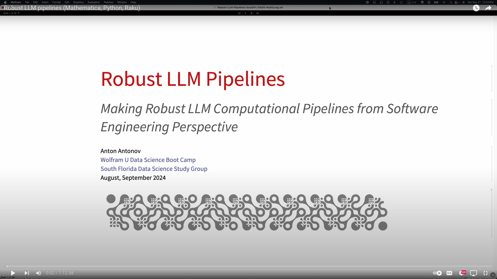
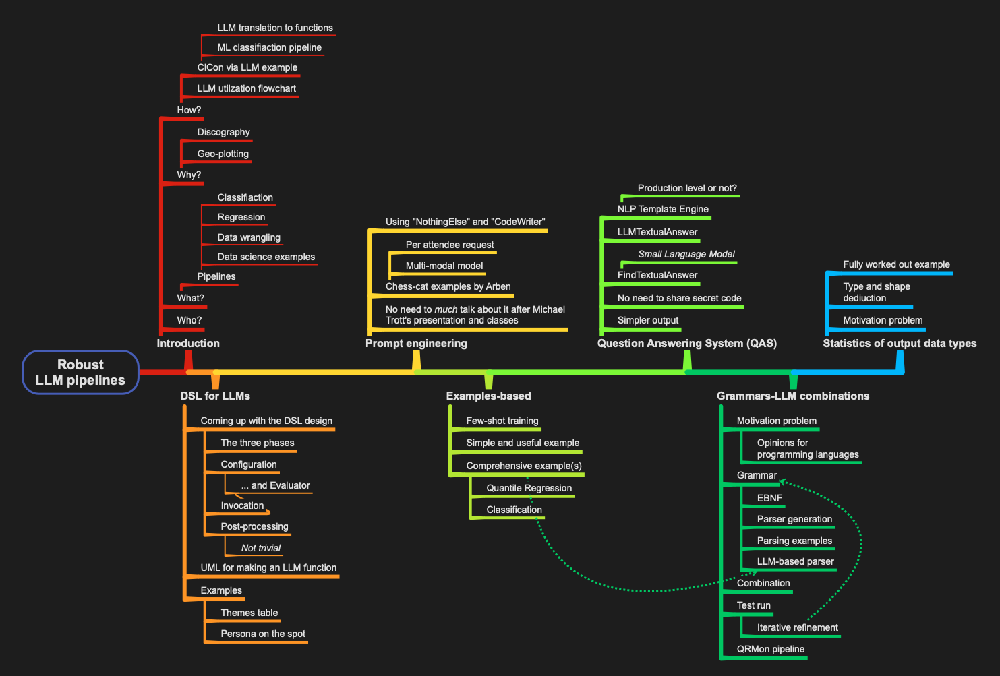
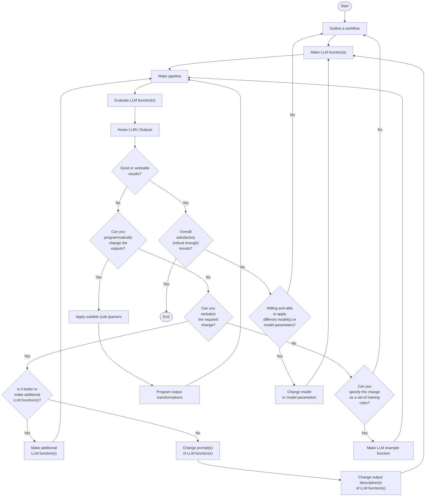

# Making of robust LLM pipelines

##### ... or "Making Robust LLM Computational Pipelines from Software Engineering Perspective"

## Abstract 

Large Language Models (LLMs) are powerful tools with diverse capabilities, but from Software Engineering (SE) Point Of View (POV) 
they are unpredictable and slow. In this presentation we consider five ways to make more robust SE pipelines that include LLMs.
We also consider a general methodological workflow for utilizing LLMs in "every day practice."  

Here are the five approaches we consider: 

1. DSL for configuration-execution-conversion
   - Infrastructural, language-design level solution
2. Detailed, well crafted prompts
   - AKA "Prompt engineering"
3. Few-shot training with examples
4. Via a Question Answering System (QAS) and code templates
5. Grammar-LLM chain of responsibility
6. Testings with data types and shapes over multiple LLM results

Compared to constructing SE pipelines,
[Literate Programming (LP)](https://en.wikipedia.org/wiki/Literate_programming) 
offers a dual or alternative way to use LLMs. 
For that it needs support and facilitation of:

- Convenient LLM interaction (or chatting)
- Document execution (weaving and tangling)

The discussed LLM workflows methodology is supported in Python, Raku, Wolfram Language (WL).
The support in R is done via Python (with ["reticulate"](https://rstudio.github.io/reticulate/), [TKp1].)   

The presentation includes multiple examples and showcases. 

Modeling of the LLM utilization process is *hinted* but not discussed.

Here is a mind-map of the presentation:

Here are the notebook used in the presentation:

- [Robust-LLM-Pipelines-SouthFL-DSSG-Python.ipynb](./notebooks/Robust-LLM-Pipelines-SouthFL-DSSG-Python.ipynb)
- [Robust-LLM-Pipelines-SouthFL-DSSG-Raku.ipynb](./notebooks/Robust-LLM-Pipelines-SouthFL-DSSG-Raku.ipynb)

-----

## General structure of LLM-based workflows

All systematic approaches of unfolding and refining workflows based on LLM functions, will include several decision points and iterations to ensure satisfactory results.

This flowchart outlines such a systematic approach:

-----

## References

### Articles, blog posts

[AA1] Anton Antonov,
["Workflows with LLM functions"](https://rakuforprediction.wordpress.com/2023/08/01/workflows-with-llm-functions/),
(2023),
[RakuForPrediction at WordPress](https://rakuforprediction.wordpress.com).

### Notebooks

[AAn1] Anton Antonov,
["Workflows with LLM functions (in Raku)"](https://community.wolfram.com/groups/-/m/t/2982320),
(2023),
[Wolfram Community](https://community.wolfram.com).

[AAn2] Anton Antonov,
["Workflows with LLM functions (in Python)"](https://community.wolfram.com/groups/-/m/t/3027081),
(2023),
[Wolfram Community](https://community.wolfram.com).

[AAn3] Anton Antonov,
["Workflows with LLM functions (in WL)"](https://community.wolfram.com/groups/-/m/t/3027081),
(2023),
[Wolfram Community](https://community.wolfram.com).

### Packages

#### Raku

[AAp1] Anton Antonov,
[LLM::Functions Raku package](https://github.com/antononcube/Raku-LLM-Functions),
(2023-2024),
[GitHub/antononcube](https://github.com/antononcube).
([raku.land](https://raku.land/zef:antononcube/LLM::Functions))

[AAp2] Anton Antonov,
[LLM::Prompts Raku package](https://github.com/antononcube/Raku-LLM-Prompts),
(2023-2024),
[GitHub/antononcube](https://github.com/antononcube).
([raku.land](https://raku.land/zef:antononcube/LLM::Prompts))

[AAp3] Anton Antonov,
[Jupyter::Chatbook Raku package](https://github.com/antononcube/Raku-Jupyter-Chatbook),
(2023-2024),
[GitHub/antononcube](https://github.com/antononcube).
([raku.land](https://raku.land/zef:antononcube/Jupyter::Chatbook))

#### Python

[AAp4] Anton Antonov,
[LLMFunctionObjects Python package](https://pypi.org/project/LLMFunctionObjects/),
(2023-2024),
[PyPI.org/antononcube](https://pypi.org/user/antononcube).

[AAp5] Anton Antonov,
[LLMPrompts Python package](https://pypi.org/project/LLMPrompts/),
(2023-2024),
[GitHub/antononcube](https://pypi.org/user/antononcube/).

[AAp6] Anton Antonov,
[JupyterChatbook Python package](https://pypi.org/project/JupyterChatbook/),
(2023-2024),
[GitHub/antononcube](https://pypi.org/user/antononcube/).

[MWp1] Marc Wouts,
[jupytext Python package](https://github.com/mwouts/jupytext),
(2021-2024),
[GitHub/mwouts](https://github.com/mwouts).

#### R

[TKp1] Tomasz Kalinowski, Kevin Ushey, JJ Allaire, RStudio, Yuan Tang,
[reticulate R package](https://rstudio.github.io/reticulate/),
(2016-2024)

### Videos

[AAv1] Anton Antonov,
["Robust LLM pipelines (Mathematica, Python, Raku)"](https://youtu.be/QOsVTCQZq_s),
(2024),
[YouTube/@AAA4Predictions](https://www.youtube.com/@AAA4Predictions).

[AAv2] Anton Antonov,
["Integrating Large Language Models with Raku"](https://www.youtube.com/watch?v=-OxKqRrQvh0),
(2023),
[The Raku Conference 2023 at YouTube](https://www.youtube.com/@therakuconference6823).