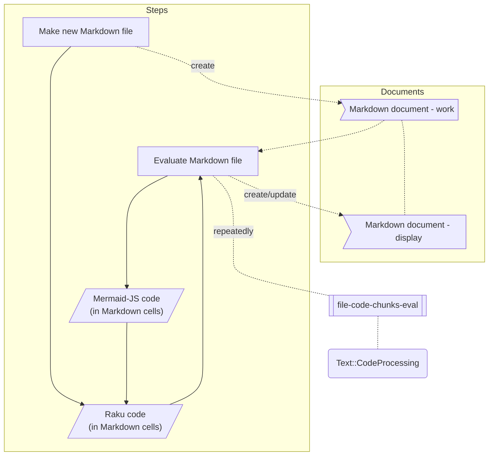
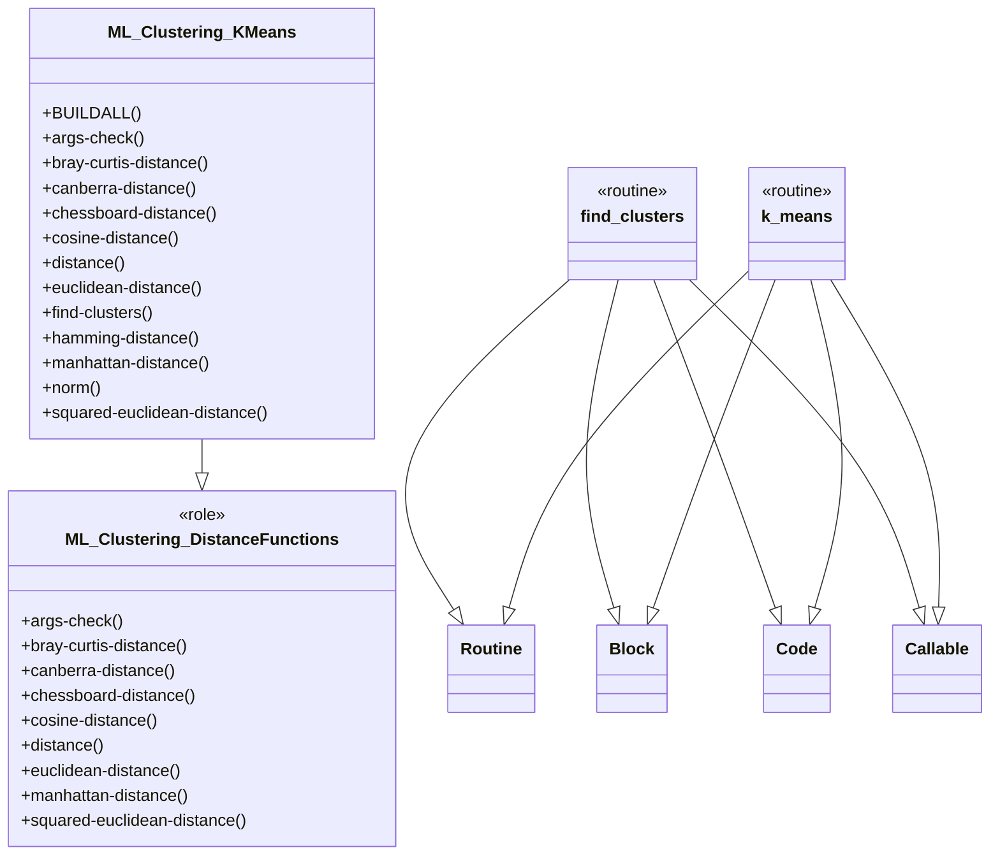
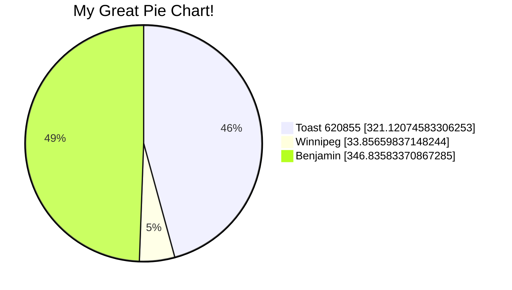
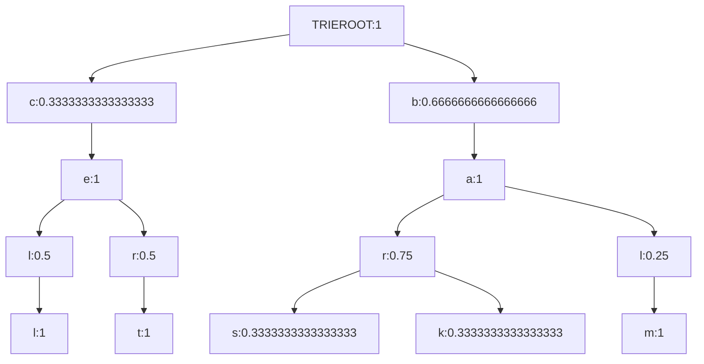

# Interactive Mermaid diagrams generation via Markdown evaluation

## Introduction 

In this document (and related presentation) we discuss the interactive making of
[Mermaid-JS](https://mermaid-js.github.io/mermaid/) diagrams
via evaluation of code cells in Markdown documents.

The "interactive" changes are possible because of the following package updates:

- Markdown cells processed by ["Text::CodeProcessing"](https://raku.land/zef:antononcube/Text::CodeProcessing), [AAp1],
  can have an argument that specifies the language of the output cells.
  - E.g. `output-lang=mermaid`.

- ["UML::Translators"](https://raku.land/zef:antononcube/UML::Translators), [AAp2], can generate
  Mermaid-JS specs.
  - (In addition to [PlantUML](https://plantuml.com) and WL specs.)

Further, the "interactivity" relies on the automatic re-rendering of the used
Integrate Development Environments (IDEs), like, 
[IntelliJ IDEA](https://www.jetbrains.com/idea/), 
[Commaide](https://commaide.com), or 
Visual Studio Code.

**Remark:** The preparation of this document and in the presentation, we use Command Line Interface (CLI) script
`file-code-chunks-eval` provided by
["Text::CodeProcessing"](https://raku.land/zef:antononcube/Text::CodeProcessing).

**Remark:** ["Text::CodeProcessing"](https://raku.land/zef:antononcube/Text::CodeProcessing)
also provides the script `cronify` that facilitates periodic execution of a shell command (with parameters.)
It heavily borrows ideas and code from the chapter "Silent Cron, a Cron Wrapper" of the book,
"Raku Fundamentals" by Moritz Lenz, [ML1]. 

**Remark:** After some experimentation the script `cronify` was *not* found to
be that useful for the "interactive" effect.  

-------

## Presentation plan

Here is a flowchart of the presentation:



-------

## UML diagram

Here we load the package 
["UML::Translators"](https://raku.land/zef:antononcube/UML::Translators), [AAp2],
and derive the Mermaid-JS spec for "ML::Clustering":

```perl6
use UML::Translators;
to-uml-spec('ML::Clustering', format => 'mermaid')
```
```
# classDiagram
# class ML_Clustering_DistanceFunctions {
#   <<role>>
#   +args-check()
#   +bray-curtis-distance()
#   +canberra-distance()
#   +chessboard-distance()
#   +cosine-distance()
#   +distance()
#   +euclidean-distance()
#   +manhattan-distance()
#   +squared-euclidean-distance()
# }
# 
# 
# class ML_Clustering_KMeans {
#   +BUILDALL()
#   +args-check()
#   +bray-curtis-distance()
#   +canberra-distance()
#   +chessboard-distance()
#   +cosine-distance()
#   +distance()
#   +euclidean-distance()
#   +find-clusters()
#   +hamming-distance()
#   +manhattan-distance()
#   +norm()
#   +squared-euclidean-distance()
# }
# ML_Clustering_KMeans --|> ML_Clustering_DistanceFunctions
# 
# 
# class find_clusters {
#   <<routine>>
# }
# find_clusters --|> Routine
# find_clusters --|> Block
# find_clusters --|> Code
# find_clusters --|> Callable
# 
# 
# class k_means {
#   <<routine>>
# }
# k_means --|> Routine
# k_means --|> Block
# k_means --|> Code
# k_means --|> Callable
```

Here we create **directly** a Mermaid cell into the Markdown file:

```perl6, outputLang=mermaid, outputPrompt=NONE
use UML::Translators;
to-uml-spec('ML::Clustering', format => 'mermaid')
```


**Remark:** We use above the Markdown cell arguments `perl6, outputLang=mermaid, outputPrompt=NONE`. 

------

## Pie chart

Here we generate a dataset with random numerical columns

```perl6
use Data::Generators;
use Data::Reshapers;
my @tbl = random-tabular-dataset(12, 3, 
        column-names-generator => &random-pet-name, 
        generators => [
            { random-variate(NormalDistribution.new( µ => 10, σ => 20), $_ ) },
            { random-variate(NormalDistribution.new( µ => 2, σ => 2), $_ ) },
            { random-variate(NormalDistribution.new( µ => 32, σ => 10), $_ ) }]);
say to-pretty-table(@tbl);
```
```
# +-----------+--------------+-----------+
# |  Benjamin | Toast 620855 |  Winnipeg |
# +-----------+--------------+-----------+
# | 38.687303 |  36.800622   | -1.703471 |
# | 45.010285 |  24.808628   |  3.625238 |
# | 33.474977 |  12.742349   |  7.985687 |
# | 33.221726 |   6.886901   |  4.680690 |
# | 37.911967 |  17.395599   |  0.939818 |
# | 32.213583 |  -4.709242   |  1.993813 |
# |  8.570701 |  23.532404   |  2.102780 |
# | 41.673241 |  56.593960   |  2.947320 |
# | 10.017131 |  39.715424   |  0.543017 |
# | 16.476380 |  55.146798   |  2.722294 |
# | 33.031580 |  13.924922   |  4.207806 |
# | 16.546961 |  38.282381   |  3.811605 |
# +-----------+--------------+-----------+
```

Here sum the columns:

```perl6
@tbl.&transpose.map({ $_.key => [+] $_.value })
```
```
# (Winnipeg => 33.85659837148244 Benjamin => 346.83583370867285 Toast 620855 => 321.12074583306253)
```

Plot the sums with a Mermaid pie chart:

```perl6, outputLang=mermaid, outputPrompt=NONE
say 'pie showData';
say ' title My Great Pie Chart!';
@tbl.&transpose.map({ $_.key => [+] $_.value }).map({ say " {$_.key.raku} : {$_.value}" })
```


------

## Make trie 

Here we make a prefix tree (trie):

```perl6
use ML::TriesWithFrequencies;
my $tr = trie-create-by-split( <bar bark bars balm cert cell> );
trie-say($tr);
```
```
# TRIEROOT => 6
# ├─b => 4
# │ └─a => 4
# │   ├─l => 1
# │   │ └─m => 1
# │   └─r => 3
# │     ├─k => 1
# │     └─s => 1
# └─c => 2
#   └─e => 2
#     ├─l => 1
#     │ └─l => 1
#     └─r => 1
#       └─t => 1
```

Here we just get nodes:

```perl6, outputPrompt=NONE
say 'mindmap';
say $tr.form.subst( / '├' | '─' | '└' | '│' | '└' /, ' '):g
```
```
mindmap
TRIEROOT => 6
  b => 4
    a => 4
      l => 1
        m => 1
      r => 3
        k => 1
        s => 1
  c => 2
    e => 2
      l => 1
        l => 1
      r => 1
        t => 1
```

Here we plot it with Mermaid-JS as a **mindmap** (requires version 9.2.2+):

```perl6, outputLang=mermaid, outputPrompt=NONE, eval=FALSE
say 'mindmap';
say $tr.form.subst( / '├' | '─' | '└' | '│' | '└' /, ' '):g;
```

Here we transform the trie into list of edges:

```perl6
my @edges = $tr.node-probabilities.root-to-leaf-paths>>.map({ "{$_.key}:{$_.value.Str}" }).map({ $_.rotor(2 => -1).map({ "{$_[0]} --> {$_[1]}" }) }).&flatten;
.say for @edges.unique; 
```
```
# TRIEROOT:1 --> c:0.3333333333333333
# c:0.3333333333333333 --> e:1
# e:1 --> l:0.5
# l:0.5 --> l:1
# e:1 --> r:0.5
# r:0.5 --> t:1
# TRIEROOT:1 --> b:0.6666666666666666
# b:0.6666666666666666 --> a:1
# a:1 --> r:0.75
# r:0.75 --> s:0.3333333333333333
# r:0.75 --> k:0.3333333333333333
# a:1 --> l:0.25
# l:0.25 --> m:1
```

Here we plot it with Mermaid-JS as a **graph**:

```perl6, outputLang=mermaid, outputPrompt=NONE
say 'graph TD';
.say for @edges.unique; 
```


------

## References

### Articles

[AA1] Anton Antonov
["Text::CodeProcessing"](https://rakuforprediction.wordpress.com/2021/07/13/raku-textcodeprocessing/),
(2021),
[RakuForPrediction at WordPress](https://rakuforprediction.wordpress.com/2022/11/05/conversion-and-evaluation-of-raku-files/).

[AA2] Anton Antonov
["Conversion and evaluation of Raku files"](https://rakuforprediction.wordpress.com/2022/11/05/conversion-and-evaluation-of-raku-files/),
(2022),
[RakuForPrediction at WordPress](https://rakuforprediction.wordpress.com/2022/11/05/conversion-and-evaluation-of-raku-files/).

[AA3] Anton Antonov,
["Generating UML diagrams for Raku namespaces](https://rakuforprediction.wordpress.com/2022/06/12/generating-uml-diagrams-for-raku-namespaces/),
(2022),
[RakuForPrediction at WordPress](https://rakuforprediction.wordpress.com/2022/11/05/conversion-and-evaluation-of-raku-files/).

### Books

[ML1] Moritz Lenz,
["Raku Fundamentals: A Primer with Examples, Projects, and Case Studies"](https://www.google.com/books/edition/Raku_Fundamentals/MvyRzQEACAAJ?hl=en),
2nd ed.
(2020),
Apress.

### Packages

[AAp1] Anton Antonov,
[Text::CodeProcessing Raku package](https://raku.land/zef:antononcube/Text::CodeProcessing),
(2021-2022),
[Zef ecosystem](https://raku.land/zef:antononcube).

[AAp2] Anton Antonov,
[UML::Translators Raku package](https://raku.land/zef:antononcube/UML::Translators),
(2021-2022),
[Zef ecosystem](https://raku.land/zef:antononcube).

### Videos

[AAv1] Anton Antonov
["Conversion and evaluation of Raku files"](https://www.youtube.com/watch?v=GJO7YqjGn6o),
(2022),
[Anton Antonov's channel at YouTube](https://www.youtube.com/@AAA4prediction).