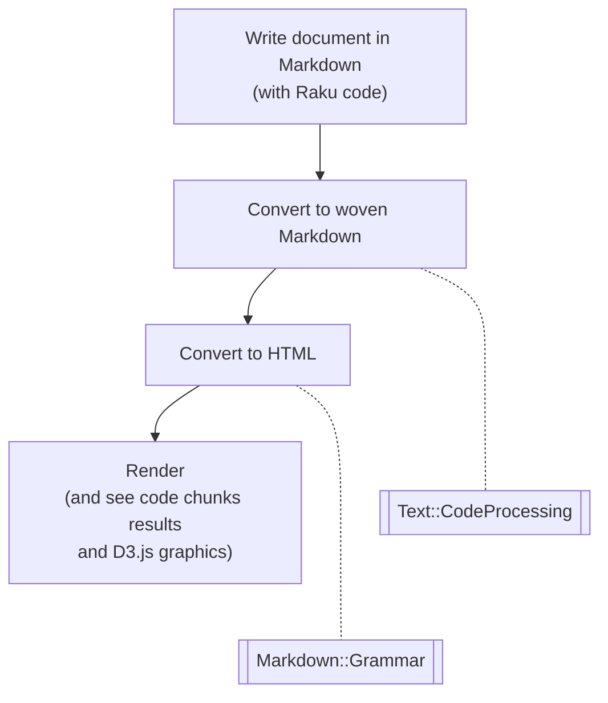

# Literate programming via CLI

In this presentation we demonstrate how to do 
["Literate programming"](https://en.wikipedia.org/wiki/Literate_programming)
in Raku via the command line.

**Anton Antonov   
[RakuForPrediction at WordPress](https://rakuforprediction.wordpress.com)   
[RakuForPrediction-book at GitHub](https://github.com/antononcube/RakuForPrediction-book)   
March 2023**

-------

## Components



-------

## The conversions

The we use the document
["Cryptocurrencies-explorations.md"](./Documents/Cryptocurrencies-explorations.md)
(with Raku code over cryptocurrencies data.)

Here is the shell command:

```
file-code-chunks-eval Cryptocurrencies-explorations.md && 
  from-markdown Cryptocurrencies-explorations_woven.md -t html -o out.html && 
  open out.html
```

**Remark:** It is instructive to examine 
["Cryptocurrencies-explorations_woven.md"](./Documents/Cryptocurrencies-explorations_woven.md)
and compare it with
["Cryptocurrencies-explorations.md"](./Documents/Cryptocurrencies-explorations.md).

-------

## References

### Articles

[AA1] Anton Antonov
["Raku Text::CodeProcessing"](https://rakuforprediction.wordpress.com/2021/07/13/raku-textcodeprocessing/),
(2021),
[RakuForPrediction at WordPress](https://rakuforprediction.wordpress.com).

[AA2] Anton Antonov
["JavaScript::D3"](https://rakuforprediction.wordpress.com/2022/12/15/javascriptd3/),
(2022),
[RakuForPrediction at WordPress](https://rakuforprediction.wordpress.com).

[AA3] Anton Antonov
["Further work on the Raku-D3.js translation"](https://rakuforprediction.wordpress.com/2022/12/22/further-work-on-the-raku-to-d3-js-translation/),
(2022),
[RakuForPrediction at WordPress](https://rakuforprediction.wordpress.com).
 
### Packages

[AAp1] Anton Antonov,
[Data::Cryptocurrencies Raku package](https://github.com/antononcube/Raku-Data-Cryptocurrencies),
(2023).
[GitHub/antononcube](https://github.com/antononcube).

[AAp2] Anton Antonov,
[JavaScript::D3 Raku package](https://github.com/antononcube/Raku-JavaScript-D3),
(2022).
[GitHub/antononcube](https://github.com/antononcube).

[AAp3] Anton Antonov,
[Text::CodeProcessing Raku package](https://github.com/antononcube/Raku-Text-CodeProcessing),
(2021).
[GitHub/antononcube](https://github.com/antononcube).

[AAp4] Anton Antonov,
[Markdown::Grammar](https://github.com/antononcube/Raku-Markdown-Grammar),
(2022).
[GitHub/antononcube](https://github.com/antononcube).


