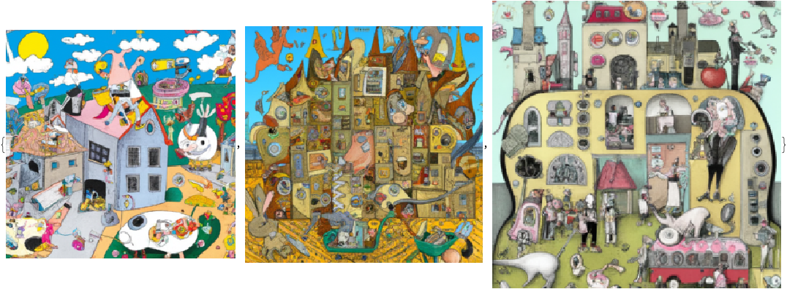

# Racoons playing with pearls and onions

**Image generation with [OpenAI](https://platform.openai.com)**

... using the Raku module ["WWW::OpenAI"](https://raku.land/zef:antononcube/WWW::OpenAI)

Anton Antonov
[RakuForPrediction-book at GitHub](https://github.com/antononcube/RakuForPrediction-book)
March 2023

---

## Presentation plan

### Warm-up with text generation

#### *ChatGPT*

### Image generations

#### URLs

#### Base64s

### Using Comma IDE and CLI

### Other examples

---

## Setup

### Load the package

```perl6
use WWW::OpenAI;

(*"(Any)"*)
```

### Get the authorization key

```mathematica
RakuInputExecute["my $auth-key='" <> AUTHKEY <> "'"];
```

---

## Warm up (completions)

```perl6
my @txtRes = |openai-completion(
	'which is the most successful programming language', 
	n=>3, 
	temperature=>1.3, 
	max-tokens=>120, 
	format=>'values',	
	:$auth-key);
	
@txtRes.elems

(*"3"*)
```

```mathematica
RakuInputExecute["@txtRes==>encode-to-wl"] // ResourceFunction["GridTableForm"]
```


---

## Image generation (URLs)

```perl6
my @imgRes = |openai-create-image(
	'Racoon with pearls in the style Raphael', 
	 n=>3,  
	 response-format=>'url',
	 format=>'values',
	 :$auth-key);
	
@imgRes.elems;

(*"3"*)
```

```mathematica
Magnify[Import[#], 2.5] & /@ RakuInputExecute["@imgRes==>encode-to-wl"]
```


```perl6
@imgRes
```

---

## Image generation (Base64s)

```perl6
my @imgRes2 = |openai-create-image(
	'Racoon and sliced onion in the style Rene Magritte',  
	n=>3,
	response-format=>'b64_json', 
	format=>'values',	
	:$auth-key);
	
@imgRes2.elems;

(*"3"*)
```

```mathematica
Magnify[ImportByteArray[BaseDecode[#]], 2.5] & /@ RakuInputExecute["@imgRes2==>encode-to-wl"]
```


```perl6
@imgRes2
```

```mathematica
WebImageSearch["Son of Man Magritte", 3]
```


---

## Using the Comma and CLI

["Text::CodeProcessing"](https://raku.land/zef:antononcube/Text::CodeProcessing) used in Mathematica ***and*** executable Markdown

---

## Some more

### Monet

```perl6
my @imgRes3 = |openai-create-image('Racoons playing onions and perls in the style Hannah Wilke', n=>3, size => 'medium', format=>'values', response-format=>'b64_json', :$auth-key);
@imgRes3.elems;

(*"3"*)
```

```mathematica
Magnify[ImportByteArray[BaseDecode[#]], 1.5] & /@ RakuInputExecute["@imgRes3==>encode-to-wl"]
```


```perl6
openai-create-image('Racoons playing onions and perls in the style Monet', n=>3, size => 'largers')

(*"#ERROR: The argument $size is expected to be Whatever or one of '1024x1024, 256x256, 512x512, large, medium, small'.Nil"*)
```

### [Helmut Newton](https://en.wikipedia.org/wiki/Helmut_Newton)

```perl6
my @imgRes3 = |openai-create-image('Racoon in the style Helmut Newton', n=>3, size => 'small', format=>'values', response-format=>'b64_json', :$auth-key);
@imgRes3.elems;

(*"3"*)
```

```mathematica
Magnify[ImportByteArray[BaseDecode[#]], 1.5] & /@ RakuInputExecute["@imgRes3==>encode-to-wl"]
```


### [Hieronymus Bosch](https://en.wikipedia.org/wiki/Hieronymus_Bosch)

```perl6
my @imgRes3 = |openai-create-image('how we live now in the style of Hieronymus Bosch', n=>3, size => 'small', format=>'values', response-format=>'b64_json', :$auth-key);
@imgRes3.elems;

(*"3"*)
```

```mathematica
Magnify[ImportByteArray[BaseDecode[#]], 1.5] & /@ RakuInputExecute["@imgRes3==>encode-to-wl"]
```



---

## Inkblots

```perl6
my @imgRes4 = |openai-create-image('Racoon in the style Roschach inkblot', :$auth-key,  n=>6,  format=>'values');
@imgRes4.elems;

(*"6"*)
```

```mathematica
Magnify[Import[#], 1.5] & /@ RakuInputExecute["@imgRes4==>encode-to-wl"]
```


#### Saved


### Alternative

```mathematica
Table[ResourceFunction["RandomRorschach"]["NumberOfStrokes" -> RandomChoice[{8, 12, 20}, RandomInteger[{1, 4}]], ColorFunction -> (GrayLevel[RandomReal[{0.1, 0.2}]] &), "ImageEffects" -> {{"Jitter", 16}, {"OilPainting", 6}}], 12]
```


---

## Goldberg machines

```perl6
my @imgRes5 = |openai-create-image('Camels in a Rube Goldberg machine', :$auth-key,  n=>6,  format=>'values');
@imgRes5.elems;

(*"6"*)
```

```mathematica
Magnify[Import[#], 1.5] & /@ RakuInputExecute["@imgRes5==>encode-to-wl"]
```


---

## Setup

### Load RakuMode, and Raku encoder and decoder

```mathematica
Import["https://raw.githubusercontent.com/antononcube/ConversationalAgents/master/Packages/WL/RakuMode.m"];
Import["https://raw.githubusercontent.com/antononcube/ConversationalAgents/master/Packages/WL/RakuDecoder.m"];
Import["https://raw.githubusercontent.com/antononcube/ConversationalAgents/master/Packages/WL/RakuEncoder.m"];
SetOptions[RakuInputExecute, Epilog -> FromRakuCode];
SetOptions[Dataset, MaxItems -> {Automatic, 40}];
```

### UML diagrams package

```mathematica
Import["https://raw.githubusercontent.com/antononcube/MathematicaForPrediction/master/Misc/UMLDiagramGeneration.m"]
SetOptions[JavaPlantUML, "ExportDirectory" -> "/tmp"];
```

### Raku mode

```mathematica
RakuMode[]
```

### Raku process

```mathematica
(*KillRakuSockets[]*)
```

```mathematica
KillRakuProcess[]
KillRakuSockets[]
StartRakuProcess["Raku" -> $HomeDirectory <> "/.rakubrew/shims/raku"]

(*"42712 ??         0:00.00 grep -i raku.*zmq"*)
```


### Raku packages

```perl6
use Mathematica::Serializer;

(*"(Any)"*)
```
