# Raku for Prediction

***Anton Antonov***   
***Accendo Data LLC***         

[**The Raku Conference, August 7, 2021**](https://conf.raku.org)   

---

## ABSTRACT

In this presentation we discuss the architectural design and implementation of a software system for the specification, navigation, and utilization of computational workflows in the fields of data science, machine learning, and scientific computing.

More specifically in the presentation we are going to:

1. Introduce a simple, operational, and extendable system of natural Domain Specific Languages (DSLs) for the specification of computational workflows

1. Outline a general strategy and a software architecture of a system that translates sequences of sentences of those natural DSLs into executable code for different programming languages (and packages in them)   

1. Discuss and demonstrate Raku implementation of such software system and how Raku can be used to utilize it

The system we describe in the presentation is multi-language from both natural language and programming language perspectives. We give a large number of illustrating examples of its functionalities, scope, and principles. Current state and feature plans are given at the end.

---

## Motivation

### In brief

- Rapid specification of prediction workflows using natural language commands.

    - Data science, Machine learning, Scientific computing

- Too many packages and languages for doing prediction computations.

- Same workflows, but different syntax and “small” details.

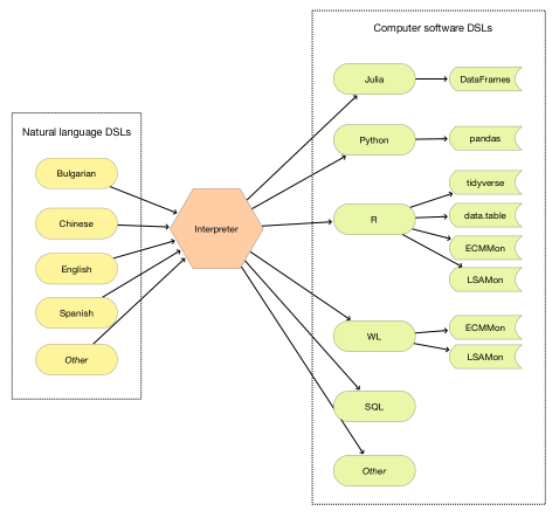

---

## Motivation 2

### Longer description

Here are our primary motivation points:

- Often we have to apply the same prediction workflows within different programming languages and/or packages. 

- Although the high-level computational workflows are the same, it might be time consuming to express those workflows in the logic and syntax of concrete programming languages or packages.

- It would be nice to have software solutions that speed-up the processes for multi-language expression of computational workflows.

Further, assume that:

We want to create conversation agents that help Data Science (DS) and ML practitioners to quickly create first, initial versions of different prediction workflows for different programming languages and related packages. 

We expect that the initial versions of programming code are tweaked further. (In order to produce desired outcomes in the application area of interest.)

---

## The ideal end result

Maybe it is more effective to show it in another notebook...

### Less than ideal (but still good)

Consider the natural language commands:

```mathematica
myCommand = "
use dfTitanic; 
filter by passengerSex is 'female' and passengerSurvival is 'died'; 
group by passengerClass and passengerSurvival;
count;
take value";
```

#### Julia

```mathematica
ToDataQueryWorkflowCode[myCommand, "Target" -> "Julia-DataFrames"]

(*"obj = dfTitanicobj = obj[ ((obj.passengerSex .== \"female\") .& (obj.passengerSurvival .== \"died\")), :]obj = groupby( obj, [:passengerClass, :passengerSurvival] )obj = combine(obj, nrow)obj"*)
```

```mathematica
CellPrintAndRunJulia[%]
```

```julia
obj = dfTitanic
obj = obj[ ((obj.passengerSex .== "female") .& (obj.passengerSurvival .== "died")), :]
obj = groupby( obj, [:passengerClass, :passengerSurvival] )
obj = combine(obj, nrow)
obj
```

#### Python

```mathematica
ToDataQueryWorkflowCode[myCommand, "Target" -> "Python-pandas"]

(*"obj = dfTitanic.copy()obj = obj[((obj[\"passengerSex\"]== \"female\") & (obj[\"passengerSurvival\"]== \"died\"))]obj = obj.groupby([\"passengerClass\", \"passengerSurvival\"])obj = obj.size()obj"*)
```

```mathematica
CellPrintAndRunPython[%]
```

```python
obj = dfTitanic.copy()
obj = obj[((obj["passengerSex"]== "female") & (obj["passengerSurvival"]== "died"))]
obj = obj.groupby(["passengerClass", "passengerSurvival"])
obj = obj.size()
obj
```

---

## The translation execution loop

In this notebook we use the following translation (parser-interpreter) execution loop:

```mathematica
Import["https://github.com/antononcube/RakuForPrediction-book/raw/main/Part-0-Introduction/Diagrams/Raku-execution-in-Mathematica-notebook.jpg"]
```

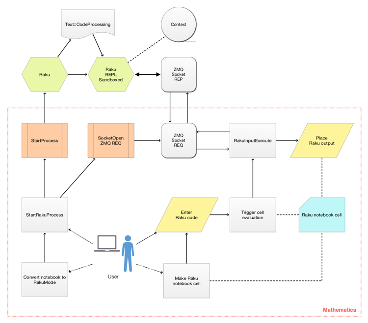

---

## Connecting Raku to notebooks

Raku cells in DSLMode or RakuMode use an OS process of sandboxed Raku through the library [ZeroMQ](https://zeromq.org).

Here is an infographic that summarizes my “journey” of implementing Raku connections to Mathematica and RStudio notebooks:

```mathematica
Import["https://github.com/antononcube/RakuForPrediction-book/raw/main/Part-0-Introduction/Diagrams/Raku-hook-up-to-notebooks-journey.jpg"]
```

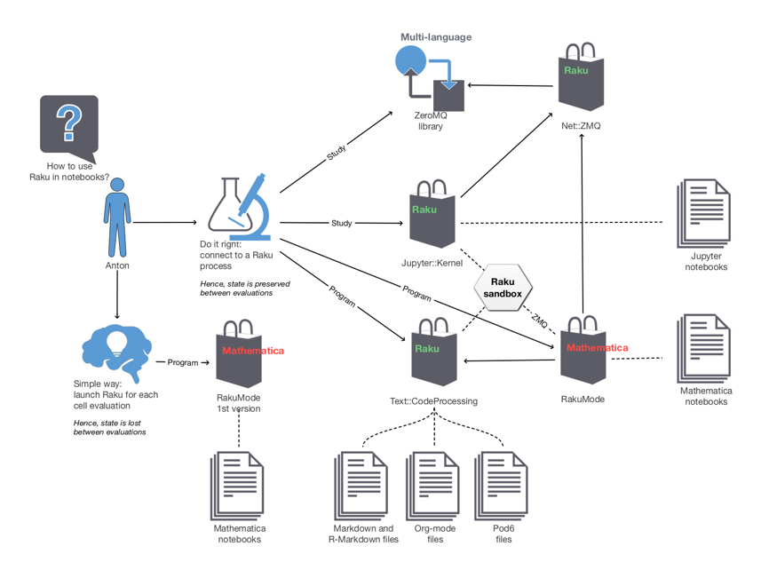

---

## “Storm in a teacup”  Raku package

Almost all of the points bellow are reflected in the design, implementation, and functionalities of the package [Lingua::NumericWordForms](https://modules.raku.org/dist/Lingua::NumericWordForms):

```perl6
use Lingua::NumericWordForms;
from-numeric-word-form("two hundred and seven thousand and thirty five")
```

```
(*"207035"*)
```

Here are word forms of the number above in different languages:

```mathematica
Association[# -> IntegerName[207035, #] & /@ {"Bulgarian", "Japanese"}]

(*<|"Bulgarian" -> "двеста седем хиляди тридесет и пет", "Japanese" -> "二十万七千三十五"|>*)
```

Here is an example of automatic language recognition and word form interpretation:

```perl6
from-numeric-word-form(["двеста седем хиляди тридесет и пет","二十万七千三十五"]):p
```

```
(*"(bulgarian => 207035 japanese => 207035)"*)
```

---

## Workflow considerations

### Simplifications are required

As in any software framework design certain assumptions, simplifications, and invariants are required.

### Pipelines

We concentrate on using (monadic) pipelines.

### Data acquisition and data wrangling are big parts of prediction workflows

Both data acquisition and data wrangling have to be included in the system we consider

---

## The participating Raku DSL packages 

Here are graphs showing the dependencies between the Raku DSL packages:

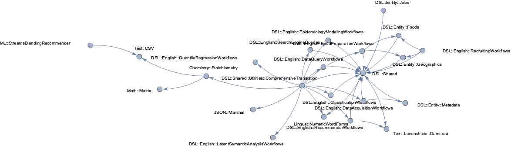

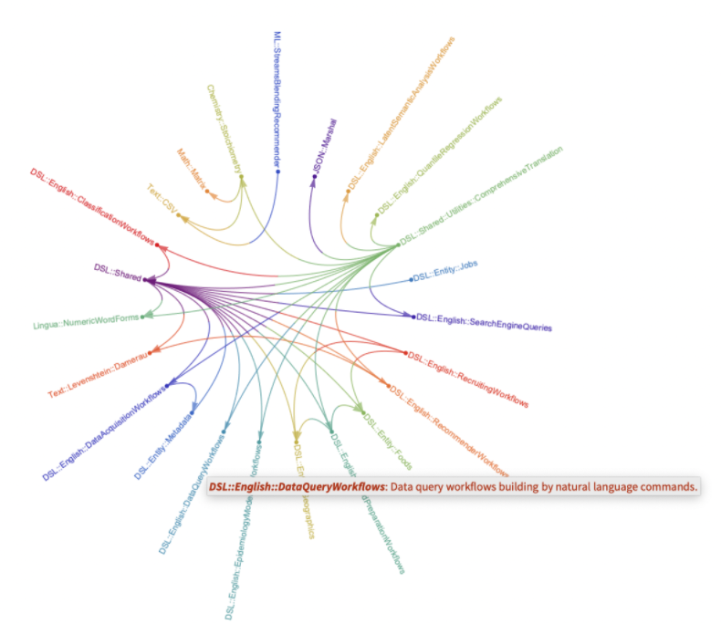

---

## Example DSL: Tabular data transformation workflows

Here is a flow chart that shows the targeted workflows:

```mathematica
plWorkflows = ImageCrop@Import["https://github.com/antononcube/ConversationalAgents/raw/master/ConceptualDiagrams/Tabular-data-transformation-workflows.jpg"]
```


Only the data loading and summary analysis are not optional. (The left-most diagram elements.)

All other steps are optional.

**Remark:** The Split-Transform-Combine pattern (orange blocks) is implemented in [ParallelCombine](http://reference.wolfram.com/mathematica/ref/ParallelCombine.html).

Also, see the article ["The Split-Apply-Combine Strategy for Data Analysis"](https://www.jstatsoft.org/article/view/v040i01) by Hadley Wickham, [[HW1](https://www.jstatsoft.org/article/view/v040i01)].

---

## Example DSL: Tabular data transformation workflows 2

Here is a corresponding workflow translation:

```mathematica
dfTitanic = ResourceFunction["ExampleDataset"][{"MachineLearning", "Titanic"}];
dfTitanic[[1 ;; 6]]
```

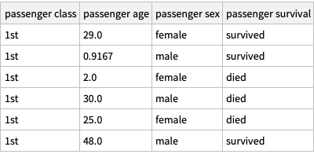

```raku-dsl
use dfTitanic;
delete missing;
filter with 'passenger sex' is 'male' and 'passenger survival' equals 'died' or 'passenger survival' is 'survived';
cross tabulate 'passenger class', 'passenger survival' over 'passenger age';
```

```mathematica
obj = dfTitanic;
obj = DeleteMissing[obj, 1, 2];
obj = Select[ obj, #["passenger sex"] == "male" && #["passenger survival"] == "died" || #["passenger survival"] == "survived" & ];
obj = ResourceFunction["CrossTabulate"][ { #["passenger class"], #["passenger survival"], #["passenger age"] }& /@ obj ]
```

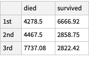

---

## Latent Semantic Analysis workflow example

The same methodology is applied to Machine Learning and Scientific Computing workflows.

Here is an example with a Latent Semantic Analysis workflow:

```mathematica
ToDSLCode["create from aAbstracts;
make document term matrix with stemming FALSE and automatic stop words;
apply LSI functions glbal weight function IDF, local term weight function TermFrequency, normalizer function Cosine;
extract 12 topics using method NNMF and max steps 16 and 20 min number of documents per term;
show topics table with 12 terms;
show tesaurus table for science, symbolic, system;"];
```


```mathematica
LSAMonUnit[aAbstracts] ⟹
LSAMonMakeDocumentTermMatrix[ "StemmingRules" -> False, "StopWords" -> Automatic] ⟹
LSAMonApplyTermWeightFunctions["GlobalWeightFunction" -> "IDF", "LocalWeightFunction" -> "None", "NormalizerFunction" -> "Cosine"] ⟹
LSAMonExtractTopics["NumberOfTopics" -> 12, Method -> "NNMF", "MaxSteps" -> 16, "MinNumberOfDocumentsPerTerm" -> 20] ⟹
LSAMonEchoTopicsTable["NumberOfTerms" -> 12] ⟹
LSAMonEchoStatisticalThesaurus[ "Words" -> {"science", "symbolic", "system"}];
```

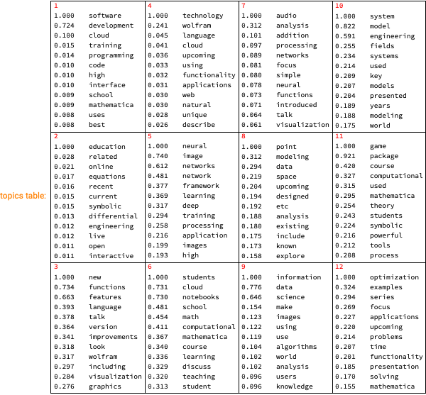

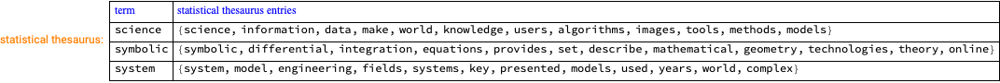

---

## Scientific computing workflows

Obviously this approach can be used for any type of computational workflows.   
For more details and examples see the *useR! 2020 Conference* presentation [AA1, AA2]. 

Here is an example of an Epidemiology Modeling workflow:

```raku-dsl
create with the model susceptible exposed infected two hospitalized recovered;
assign 100000 to the susceptible population;
set infected normally symptomatic population to be 0;
set infected severely symptomatic population to be 1;
assign 0.56 to contact rate of infected normally symptomatic population;
assign 0.58 to contact rate of infected severely symptomatic population;
assign 0.1 to contact rate of the hospitalized population;
simulate for 240 days;
plot populations results;
```

```mathematica
ECMMonUnit[SEI2HRModel[t]] ⟹
ECMMonAssignInitialConditions[<|SP[0] -> 100000|>] ⟹
ECMMonAssignInitialConditions[<|INSP[0] -> 0|>] ⟹
ECMMonAssignInitialConditions[<|ISSP[0] -> 1|>] ⟹
ECMMonAssignRateRules[<|β[INSP] -> 0.56|>] ⟹
ECMMonAssignRateRules[<|β[ISSP] -> 0.58|>] ⟹
ECMMonAssignRateRules[<|β[HP] -> 0.1|>] ⟹
ECMMonSimulate["MaxTime" -> 240] ⟹
ECMMonPlotSolutions[ "Stocks" -> __ ~~ "Population"];
```

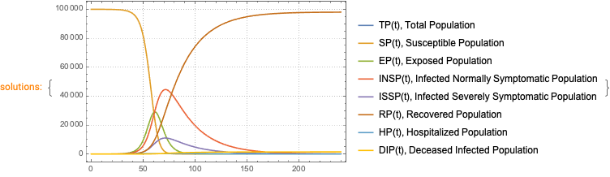

---

## How it is done?

We two types of Domain Specific Languages (DSL’s) for data wrangling:

1. a software package for data transformations and 

1. a data wrangling DSL that is a subset of a spoken language.

These two DSL's are combined: the natural language commands of the latter are translated into the former.

By executing those translations we interpret commands of spoken DSL's into data transformation computational results.

Note, that we assume that there is a separate system that converts speech into text.

---

## Development cycle

Here is a clarification diagram:

```mathematica
Import["https://github.com/antononcube/ConversationalAgents/raw/master/ConceptualDiagrams/Monadic-making-of-ML-conversational-agents.jpg"]
```


---

## Monadic pipelines

The code generated follows the “monadic pipeline” pattern.

Here is a comparison:

```mathematica
commands = "use dfStarwars; group by species; counts;";
```

```mathematica
aRes = Association@Map[# -> ToDataQueryWorkflowCode[commands, "Target" -> #, "Execute" -> False, "StringResult" -> True] &, {"Julia-DataFrames", "R-tidyverse", "Python-pandas", "WL-System"}];
```

```mathematica
ResourceFunction["GridTableForm"][List @@@ Normal[aRes]]
```

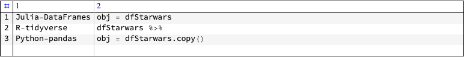

### Executable cells

```mathematica
(*ToDSLCode["DSL TARGET "<># <>";"<>commands,Method->"Print"]&/@{"Julia-DataFrames","R-tidyverse","Python-pandas","WL-System"}*)
```

---

## Grammars and parsers

For each natural language is developed a specialized DSL translation [Raku](https://raku.org) module.

Each Raku module:

1. Has grammars for parsing a sequence of natural commands of a certain DSL

1. Translates the parsing results into corresponding programming code

Different programming languages and packages can be the targets of the DSL translation.

(At this point are implemented DSL-translators to Julia, Python, R, and Wolfram Language.)

Here is an [example grammar](https://github.com/antononcube/Raku-DSL-English-DataQueryWorkflows/blob/master/lib/DSL/English/DataQueryWorkflows/Grammar.rakumod). 

---

## Rigorous testing

Rigorous, multi-faceted, multi-level testing is required in order this whole machinery to work.

- Of course, certain level of testing is required in order to advance with the development. 

- Advanced testing is definitely required for any kind of "product release."   

    - That includes "minimal viable product" too.

### Types of tests

Parsing and translation tests:

- [Raku tests](https://github.com/antononcube/Raku-DSL-English-DataQueryWorkflows/tree/master/t)

- Execution and correctness tests:

    - [R-base and R-tidyverse testing package](https://github.com/antononcube/R-packages/tree/master/DataQueryWorkflowsTests) 

    - [Python-pandas test file](https://github.com/antononcube/ConversationalAgents/blob/master/UnitTests/Python/DataQueryWorkflows-Unit-Tests.py)

    - [WL test file](https://github.com/antononcube/ConversationalAgents/blob/master/UnitTests/WL/DataQueryWorkflows-Unit-Tests.wlt)

Much of the tests design and programming is not finished yet.

---

## Server solution

Instead of installing the packages for every user we can have a “web service”. 

Here are examples getting DSL interpretations served with the [Raku library Cro](https://cro.services) from a server hosted at Digital Ocean:

Here is an example with data query commands:

```mathematica
command = "DSL TARGET Julia-DataFrames; use data dfMeals; inner join with dfFinelyFoodName over FOODID; group by 'Cuisine';find counts";
```

Here we construct an URL with the commands above:

```mathematica
DSLInterpretationURL[command] // InputForm
```

```mathematica
"http://159.65.42.241:5040/translate/'DSL%20TARGET%20Julia-DataFrames%3B%20%0Ause%20data\
%20dfMeals%3B%20%0Ainner%20join%20with%20dfFinelyFoodName%20over%20FOODID%3B%20%0Agroup%\
20by%20%27Cuisine%27%3B%0Afind%20counts'"
```

Here we get the interpretation and tabulate it:

```mathematica
res = DSLInterpret[command];
ResourceFunction["GridTableForm"][List @@@ Normal[KeySort[res]], TableHeadings -> {"Key", "Value"}]
```


---

## Concise commands that produce lots of code

Here is an example of a simple specification that can produce disproportionally larger code:

```mathematica
ToDSLCode["use dfStarwars;rename species as VAR1;show pipeline value", Method -> "Print"]
```

```mathematica
obj = dfStarwars;
obj = Map[ Join[ KeyDrop[ #, {"species"} ], <|"VAR1" -> #["species"]|> ]&, obj];
Echo[obj]
```

---

## “My data wrangling is too complicated for this approach”

It seems that I have to convince some data wrangling practitioners that the proposed workflows can be useful to them.

Two reasons for those doubts:

- [The LISP curse](http://winestockwebdesign.com/Essays/Lisp_Curse.html)

- WL targeting deeply hierarchical data

My response is:

- For tabular data (collections) we can streamline your complicated data wrangling to a large degree.  

---

## Why not use GPT-3, BERT, etc.?

Let us answer this question with questions:

- At what point we can guarantee "solid" results from a GPT-based system?

- What is the training data for such statistical approach?

- How exactly a GPT-based system is going to generate correct code for, say, the following quantile regression sequence of commands:

use dfOrlandoTemperature;
echo data summary;
compute quantile regression with 16 knots and interpolation order 3;
show date list plot;
plot relative errors;

```mathematica
QRMonUnit[dfOrlandoTemperature] ⟹
QRMonEchoDataSummary[] ⟹
QRMonQuantileRegression["Knots" -> 16, "InterpolationOrder" -> 3] ⟹
QRMonDateListPlot[] ⟹
QRMonErrorPlots[ "RelativeErrors" -> True];
```

---

## How do you make these conversational agents “stochastic”?

R4P is extendable to include stochastic natural language semantic interpretation. 

We can draw analogy with the terminators from the [Terminator franchise](https://en.wikipedia.org/wiki/Terminator_(franchise)):

-  T-800 (Arnold Schwarzenegger) -- hard skeleton;

- T-1000 (Robert Patrick) -- liquid metal;

- T-X (Kristanna Loken) -- liquid metal over hard skeleton.

Here is the correspondence:

- The Raku-grammar approach corresponds to T-800

- The GPT-3 approach corresponds to T-1000

- Endowing the Raku-grammars to have GPT-3 features corresponds to T-X

---

## Handling misspellings

The fuzzy, stochastic matching is currently used at “word level.” 

It is important to handle misspellings:

- We make mistakes while typing

- Speech recognition systems mishear

Here is an example:

```mathematica
ToDataQueryWorkflowCode["use dfTitanic;flter by passengerSex is 'female';cross tablate passengerClass, passengerSurvival over passengerAge;"]
```


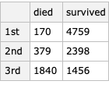

---

## Other human languages

Obviously we can translate a DSL based on English into DSL’s based on other natural languages.

Here is another example (EnglishSpanish):

```mathematica
ToDSLCode["DSL TARGET Spanish;use dfTitanic;filter by passengerSex == 'male';echo text grouping by variables;group by passengerClass, passengerSurvival;count;ungroup;"]["CODE"]

(*"utilizar la tabla: dfTitanicfiltrar con la condicion: ((passengerSex es igual \"male\"))mensaje impreso: \"grouping by variables\"agrupar con columnas: \"passengerClass\", \"passengerSurvival\"encontrar recuentosdesagrupar"*)
```

Here is another example (EnglishBulgarian):

```mathematica
ToDSLCode["DSL TARGET Bulgarian;use dfTitanic;filter by passengerSex == 'male';echo text grouping by variables;group by passengerClass, passengerSurvival;count;ungroup;"]["CODE"]

(*"използвай таблицата: dfTitanicфилтрирай с предиката: ((passengerSex се равнява на \"male\"))отпечатай съобщението: \"grouping by variables\"групирай с колоните: passengerClass, passengerSurvivalнамери брояраз-групирай"*)
```

---

## Complete feature set and development state

The complete feature set and development state can be seen this ...

[Raku DSL package design](https://github.com/antononcube/ConversationalAgents/raw/master/ConceptualDiagrams/Raku-DSL-package-design.png):

```mathematica
Import["https://github.com/antononcube/ConversationalAgents/raw/master/ConceptualDiagrams/Raku-DSL-package-design.png"]
```

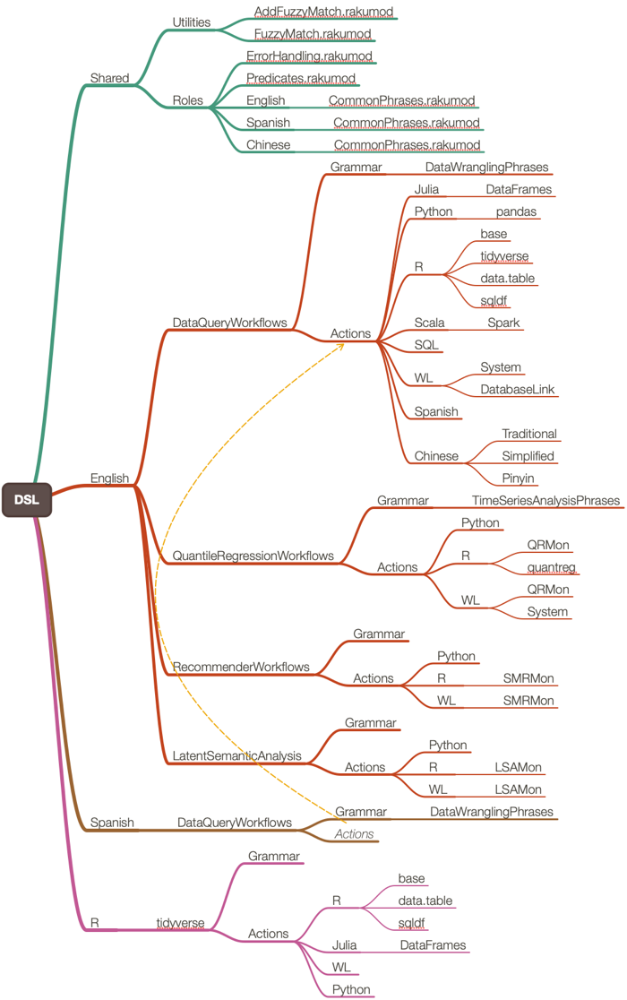

---

## Future plans

### ["Raku for Prediction" book](https://github.com/antononcube/RakuForPrediction-book)

### Finishing the implementations

### More “server solutions”

Shiny interfaces showing DSL commands being translated and corresponding execution results

---

## References

### Articles, movies

[AA1] Anton Antonov, ["How to simplify Machine learning workflows specifications? (useR! 2020)"](https://mathematicaforprediction.wordpress.com/2020/06/28/how-to-simplify-machine-learning-workflows-specifications-user-2020/), (2020), [MathematicaForPrediction at WordPress](https://mathematicaforprediction.wordpress.com).

[AA2] Anton Antonov, ["useR! 2020: How to simplify Machine Learning workflows specifications (A. Antonov), lightning"](https://www.youtube.com/watch?v=b9Uu7gRF5KY), (2020), R Consortium at YouTube.

[HW1] Hadley Wickham, ["The Split-Apply-Combine Strategy for Data Analysis"](https://www.jstatsoft.org/article/view/v040i01), (2011), [Journal of Statistical Software](https://www.jstatsoft.org).

### Repositories

[AAr1] Anton Antonov, [DSL::English::DataQueryWorkflows Raku package](https://github.com/antononcube/Raku-DSL-English-DataQueryWorkflows), (2020), [GitHub/antononcube](https://github.com/antononcube).

[AAr2] Anton Antonov, [DSL::English::EpidemiologyModelingWorkflows Raku package](https://github.com/antononcube/Raku-DSL-English-EpidemiologyModelingWorkflows), (2020), [GitHub/antononcube](https://github.com/antononcube).

[AAr3] Anton Antonov, [Epidemiology Compartmental Modeling Monad in R](https://github.com/antononcube/ECMMon-R), (2020), [GitHub/antononcube](https://github.com/antononcube).

[AAr4] Anton Antonov, ["Raku for Prediction" book](https://github.com/antononcube/RakuForPrediction-book), (2021), [GitHub/antononcube](https://github.com/antononcube).

[AAp1] Anton Antonov, [Monadic Epidemiology Compartmental Modeling Mathematica package](https://github.com/antononcube/SystemModeling/blob/master/Projects/Coronavirus-propagation-dynamics/WL/MonadicEpidemiologyCompartmentalModeling.m), (2020), [SystemModeling at GitHub/antononcube](https://github.com/antononcube/SystemModeling).

[RS1] RStudio, [https://www.tidyverse.org](https://www.tidyverse.org).

[RS2] RStudio, [https://github.com/tidyverse](https://github.com/tidyverse).