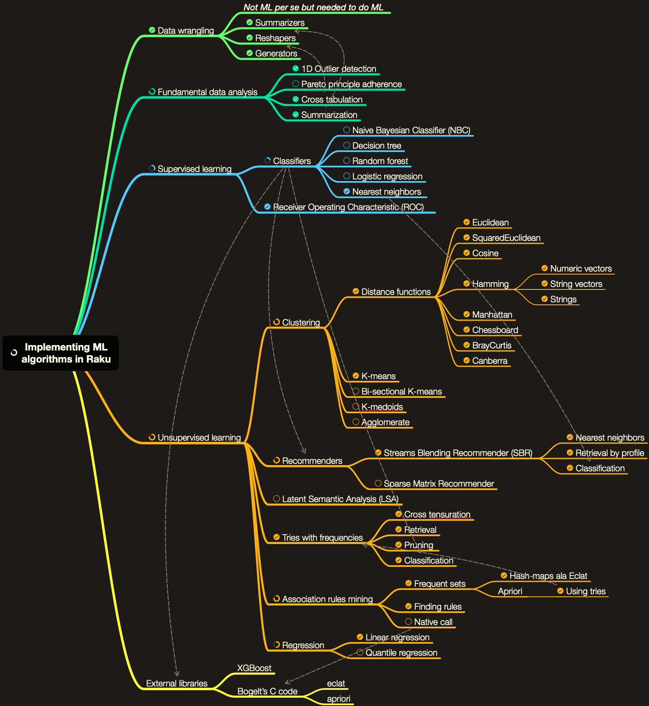

# Implementing Machine Learning algorithms in Raku

## Abstract

In this presentation we discuss the implementations different Machine Learning (ML) 
algorithms in Raku. Their main workflows are also demonstrated. 
We concentrate on the software engineering elements of behind the corresponding packages
and how ML algorithms can be utilized with Raku's unique features. 

Here is a list of the ML algorithms that are outlined and demonstrated:

- Fundamental data analysis
  - Outlier identifiers ("ML::OutlierIdentifiers")
  - Cross tabulation ("Data::Reshapers")
  - Summarization ("Data::Summarizers")
  - Pareto principle adherence
- Supervised learning
  - Classifiers
  - Receiver Operating Characteristics (ROCs) ("ML::ROCFunctions")
- Unsupervised learning
  - Clustering
  - Tries with frequencies ("ML::TriesWithFrequencies")
  - Streams Blending Recommender (SBR) ("ML::StreamsBlendingRecommender")
  - Association Rule Learning (ARL) ("ML::AssociationRuleLearning")
  - Regression
  - Latent Semantic Analysis (LSA)
  
Here is the corresponding mind-map: 

The document 
["Trie based classifiers evaluation"](../../Articles/Trie-based-classifiers-evaluation.md)
provides an example for application of the Raku packages mentioned above 

-------

## References

*TBD...*
