# Implementing Machine Learning algorithms in Raku

**Anton Antonov   
Accendo Data LLC**

### ***TRC 2022***

---

## ABSTRACT

In this presentation we discuss the implementations of different Machine Learning (ML) algorithms in Raku. 

The main themes of the presentation are: 

- ML workflows demonstration 

- Software engineering perspective on ML implementations 

- ML algorithms utilization with Raku's unique features 

Here is a list of the considered ML algorithms: 

1. Fundamental data analysis 

    1. Outlier identifiers ("ML::OutlierIdentifiers") 

    1. Cross tabulation ("Data::Reshapers") 

    1. Summarization ("Data::Summarizers") 

    1. Pareto principle adherence 

1. Supervised learning 

    1. Classifiers 

    1. Receiver Operating Characteristics (ROCs) ("ML::ROCFunctions") 

1. Unsupervised learning

    1. Clustering 

    1. Tries with frequencies ("ML::TriesWithFrequencies") 

    1. Streams Blending Recommender (SBR) ("ML::StreamsBlendingRecommender") 

    1. Association Rule Learning (ARL) ("ML::AssociationRuleLearning") 

    1. Regression 

    1. Latent Semantic Analysis (LSA) 

(See the corresponding mind-map.) 

(The document "Trie based classifiers evaluation" provides an example application of the Raku packages mentioned above.)

[TRC-2022 talk link](https://conf.raku.org/talk/170)

---

## Load Raku packages

In order to make the document computable we load the Raku packages here:

```{perl6, eval=TRUE}
use Text::Plot;

use ML::AssociationRuleLearning;
use ML::Clustering;
use ML::StreamsBlendingRecommender;
use ML::ROCFunctions;
use ML::TriesWithFrequencies;
use Statistics::OutlierIdentifiers;

use Data::ExampleDatasets;
use Data::Generators;
use Data::Reshapers;
use Data::Summarizers;

use Mathematica::Serializer;
use UML::Translators;

use DSL::Shared::Utilities::ComprehensiveTranslation;
```

---

## Mind-map of ML algorithms

In this presentation I want to describe my efforts to implement a complete system of ML functionalities in Raku.

```mathematica
mmMLinRaku = Import["https://github.com/antononcube/RakuForPrediction-book/raw/main/Presentations/TRC-2022/org/Implementing-ML-algorithms-in-Raku-mind-map-Personal.pdf", "PageGraphics"][[1]]
```

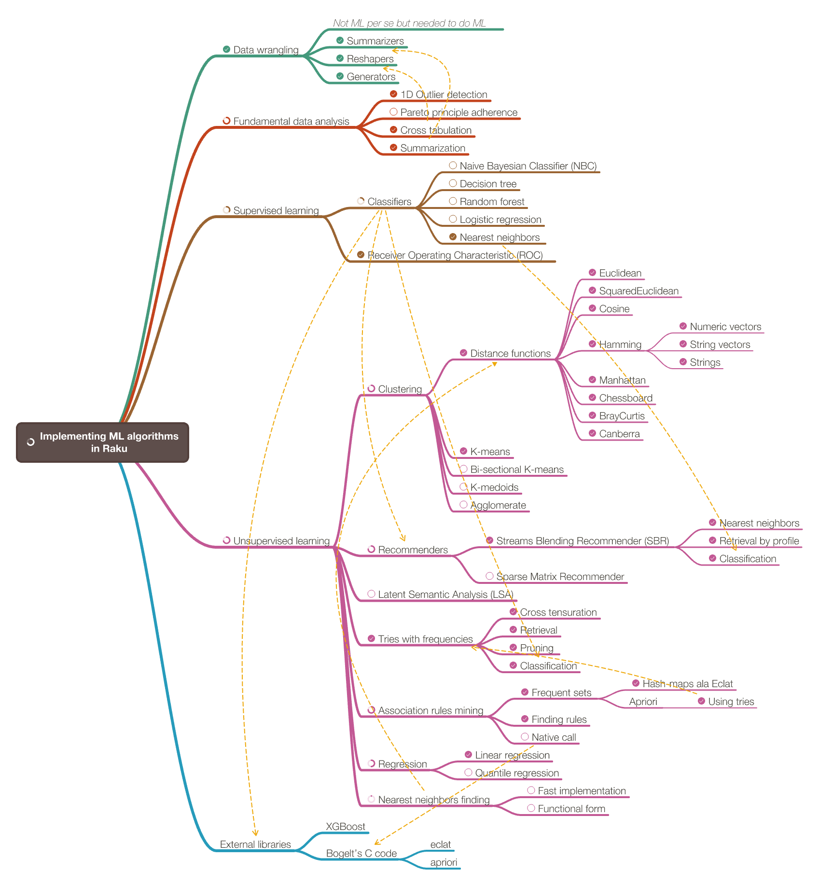

---

## Presentation plan

### Inverted exposition

#### Most interesting examples first

#### Zef-ecosystem packages recommender

#### DSL grammars classifiers

### Audience assumptions

Interested in software engineering (85%+)

Not many are interested in ML (<10%)

Know at least some ML (≤40%)

Familiar with ML applications (95%+)

---

## Presentation mind-map

```mathematica
mmPresentation = Import["https://github.com/antononcube/RakuForPrediction-book/raw/main/Presentations/TRC-2022/org/TRC-2022-presentation-mind-map-Personal.pdf", "PageGraphics"][[1]]
```

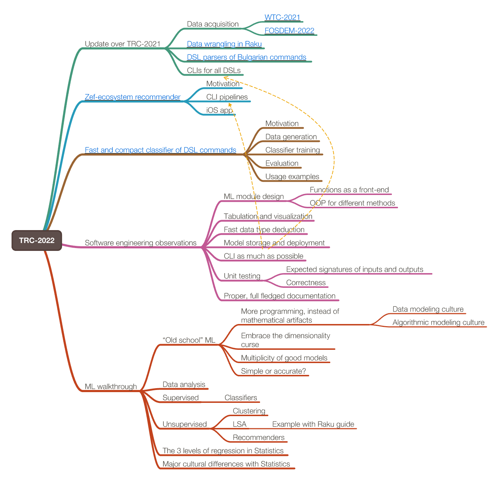

---

## Zef ecosystem recommender

Proper location and environment:

```shell
cdMc; cd Scalable-Recommender-Framework-project/Python; conda activate SciPyCentric
```

Pipeline with Siri Shortcuts:

```shell
 shortcuts run "Photo Text Extractor" -o ~/Desktop/Extracted-CLI.md && ./invoke-smr.py --file ~/Desktop/Extracted-CLI.md
```

Pipeline with Raku DSL interpreter:

```shell
ToSearchEngineQueryCode CLI '+"Word:pandas" "Word:data" "Word:science"' | ./invoke-smr.py --pipe
```

### Pipeline flow-chart

```mathematica
plSMRsAccessByCLIs = Import["https://github.com/antononcube/Scalable-Recommender-Framework-project/raw/main/Diagrams/ML-and-SMRs-access-by-CLIs.pdf", "PageGraphics"][[1]]
```

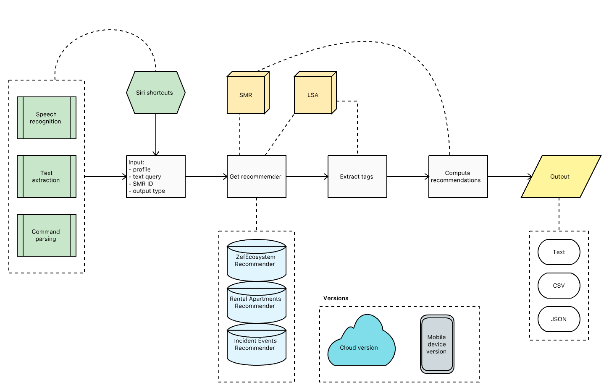

### Scalable recommender system

```mathematica
Import["https://github.com/antononcube/Scalable-Recommender-Framework-project/raw/main/Diagrams/Scalable-Recommender-Framework-mind-map-Personal.pdf", "PageGraphics"][[1]]
```

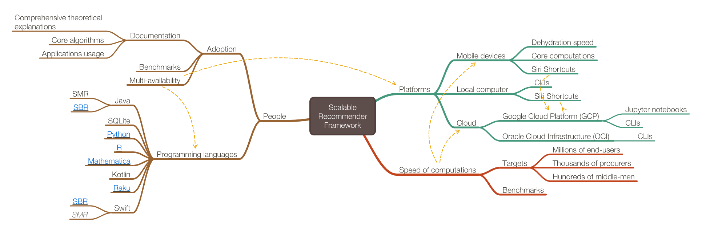

---

## Fast and compact classifier of DSL commands

Full description is given the article ["Fast and compact classifier of DSL commands"](https://github.com/antononcube/RakuForPrediction-book/blob/main/Articles/Fast-and-compact-classifier-of-DSL-commands.md) ([WordPress](https://rakuforprediction.wordpress.com/2022/07/31/fast-and-compact-classifier-of-dsl-commands/)).

Similar classifier is used by [NLP Template Engine](https://github.com/antononcube/NLP-Template-Engine).

### Motivation

Note the shell execution timings.

```shell
time ToDSLCode Python "
DSL MODULE LatentSemanticAnalysis;
use aDocs;
create document-term matrix;
apply LSI functions IDF, Frequency, and Cosine;
extract 36 topics with the method NNMF and max steps 12;
show topics table 
"

(*"LatentSemanticAnalyzer(aDocs).make_document_term_matrix( ).apply_term_weight_functions(global_weight_func ="IDF\", local_weight_func = \"None\", normalizer_func = \"Cosine\").extract_topics(number_of_topics = 36, method = \"NNMF\", max_steps = 12).echo_topics_table( )"*)
```


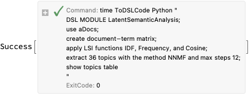

```shell
time ToDSLCode Python "
use aDocs;
create document-term matrix;
apply LSI functions IDF, Frequency, and Cosine;
extract 36 topics with the method NNMF and max steps 12;
show topics table 
"

(*"LatentSemanticAnalyzer(aDocs).make_document_term_matrix( ).apply_term_weight_functions(global_weight_func = \"IDF\", local_weight_func = \"None\", normalizer_func = \"Cosine\").extract_topics(number_of_topics = 36, method = \"NNMF\", max_steps = 12).echo_topics_table( )"*)
```


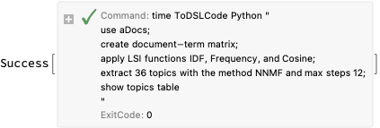

### Flowchart

```mathematica
plDSLClassifierMaking = ImageCrop@Import["https://github.com/antononcube/NLP-Template-Engine/raw/main/Documents/Diagrams/General/Computation-workflow-type-classifier-making.png"]
```

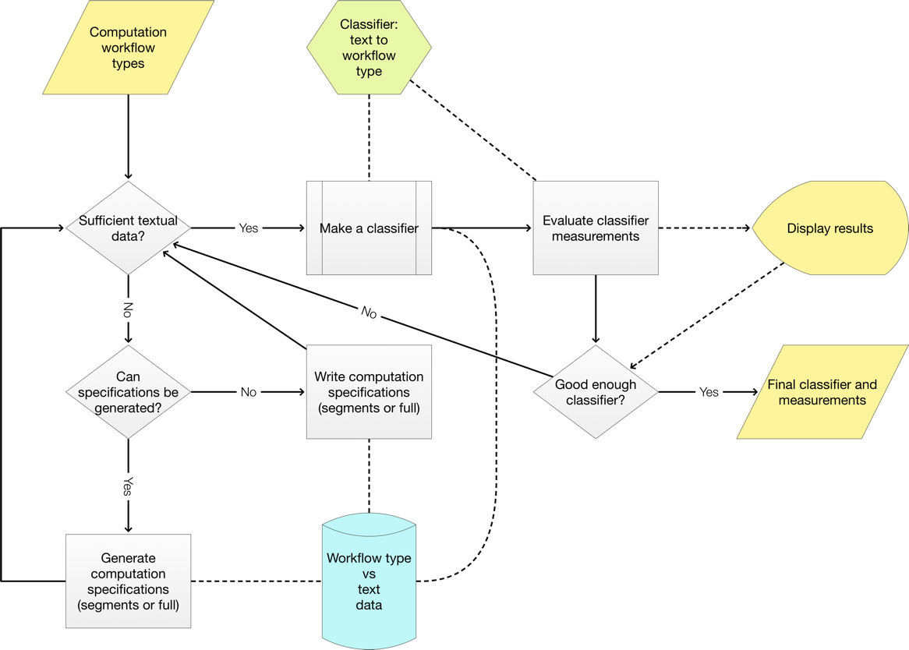

### Recommender-based classifier

See .

### Trie based classifier

```mathematica
StringRiffle[{StringTake[#, 550], "\n\[VerticalEllipsis]\n", StringTake[#, 44900 ;; 45600], "\n\[VerticalEllipsis]\n"}, "\n"] &@Import[FileNameJoin[{NotebookDirectory[], "dsl-trie-classifier.txt"}]]
```

### Random sentences

See .

---

## Software engineering observations

- ML module design

    - Functions as front-end

    - OOP for different methods

- Facilitation of tabulation and visualization of results

    - Notebook solutions

    - Text tables

    - Text plots

- Fast data type deduction facilitation

- Model storage and deployment facilitation

    - Currently Raku is too slow

- Unit tests and correctness tests

- Proper documentation with worked out examples

- CLIs as much as possible

- Facilitation with code generation

```mathematica
plSMRsAccessByCLIs
```


---

## Data wrangling

Although data acquisition and data transformations are not formally part ML, most of the time data scientists and ML practitioners do various "data wrangling" tasks.

### Explaining Data Science with trucks

```mathematica
lsPages = Import["https://github.com/antononcube/HowToBeADataScientistImpostor-book/raw/master/Presentations/OMLDS-Oct-2019/Illustrating-DS-approaches-with-trucks.pdf"];
TabView[lsPages]
```


---

## Data wrangling systems (in Raku)

- Minimalistic dataset ("Data::Reshapers" et al. by antononcube)

    - ["Introduction to data wrangling with Raku"](https://rakuforprediction.wordpress.com/2021/12/31/introduction-to-data-wrangling-with-raku/)

- Data-frame object based ("Dan" et al. by p6steve)

    - ["Is raku Dan RubberSonic?"](https://p6steve.wordpress.com/2022/07/24/is-raku-dan-rubbersonic/)

- Object Relational Mapping ("Red" by FCO)

    - ["Red"](https://fco.github.io/Red/)

---

## Minimalistic data wrangling implementation

### Minimalistic perspective

I do not want to make a special type (class) for datasets or data frames – I want to use the standard Raku data structures. (At least at this point of my Raku data wrangling efforts.)

My reasons are:

1. The data can be picked up and transformed with typical, built-in commands.

    - Meaning, without the adherence to a certain data transformation methodology or dedicated packages.

1. Using standard, built-in structures is a type of “user interface” decision.

1. The “user experience” can be achieved with- or provided by other transformation paradigms and packages.

---

## Data wrangling code generation

```shell
ToDataQueryWorkflowCode Python::pandas "use dfIris; group by Species;show counts"

(*"obj = dfIris.copy()"*)
(*"obj = obj.groupby([\"Species\"])"*)
(*"print(obj.size())"*)
```

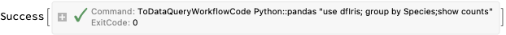

```shell
ToDataQueryWorkflowCode Raku "use dfIris; group by Species; show counts"

(*"$obj = dfIris ;"*)
(*"$obj = group-by( $obj, \"Species\") ;"*)
(*"say \"counts: \", $obj>>.elems"*)
```

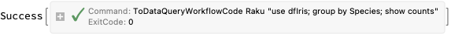

```shell
ToDataQueryWorkflowCode --language=Bulgarian Raku "използвай таблицата dfIris; групирай с колонита Species; покажи размерите"

(*"$obj = dfIris ;"*)
(*"$obj = group-by( $obj, \"Species\") ;"*)
(*"say \"counts: \", $obj>>.elems"*)
```

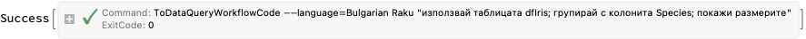

```shell
ToDataQueryWorkflowCode --language=Bulgarian English "използвай таблицата dfIris; групирай с колонита Species; покажи размерите"

(*"use the data table: dfIris"*)
(*"group by the columns: Species"*)
(*"show the count(s)"*)
```

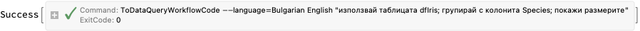

### Implementation state

```mathematica
ImageCrop@Import["https://github.com/antononcube/RakuForPrediction-book/raw/main/Diagrams/DSLs-Interpreter-for-Data-Wrangling%20-August-2022-state.jpg"]
```

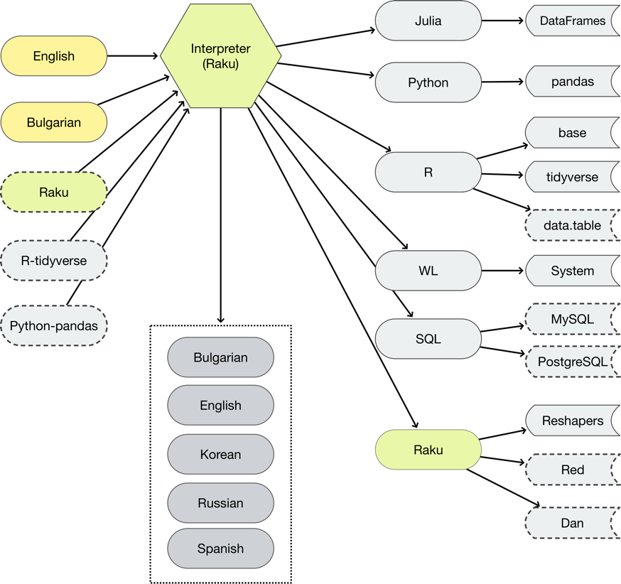

---

## Data wrangling examples

All steps shown in the examples below are done often in ML data preparation.

### Get dataset

```{perl6, eval=TRUE}
my @dsTitanic = get-titanic-dataset();
records-summary(@dsTitanic);
```

```{perl6, eval=TRUE}
@dsTitanic.head(3)
```

Data frame version:

```{perl6, eval=TRUE}
transpose(@dsTitanic.head(3))
```

### Code generation

```{perl6, eval=TRUE}
my $command = '
use @dsTitanic; 
group by passengerSex and passengerClass; 
show counts'
```

```{perl6, eval=TRUE}
.say for ToDSLCode($command, defaultTargetsSpec=>'Raku', format=>'code')
```

```{perl6, eval=TRUE}
ToDSLCode($command, format=>'code'):ast
```

### Grouping and counting

```{perl6, eval=TRUE}
my $obj = @dsTitanic ;
$obj = group-by( $obj, ("passengerSex", "passengerClass")) ;
say "counts: ", $obj>>.elems
```

### Cross-tabulation

```{perl6, eval=TRUE}
cross-tabulate(@dsTitanic, 'passengerSex', 'passengerClass')==>to-pretty-table
```

```{perl6, eval=TRUE}
cross-tabulate(@dsTitanic, 'passengerSex', 'passengerClass')==>to-pretty-table
```

### Long format data

```{perl6, eval=TRUE}
to-long-format(@dsTitanic).head(12)==>to-pretty-table
```

### Filter

```{perl6, eval=TRUE}
ToDSLCode('
DSL MODULE DataQuery; 
use @dsTitanic; 
filter by passengerSex is "male" and passengerClass is "1st" and passengerSurvival is not "survived"
', 
defaultTargetsSpec=>'Raku', format=>'code')
```

```{perl6, eval=TRUE}
$obj = @dsTitanic ;
$obj = $obj.grep({ $_{"passengerSex"} eq "male" and $_{"passengerClass"} eq "1st" and $_{"passengerSurvival"} !eq "survived" }).Array;
$obj.elems
```

### Deduce type

```{perl6, eval=TRUE}
dimensions(@dsTitanic)
```

```{perl6, eval=TRUE}
deduce-type(@dsTitanic)
```

```{perl6, eval=TRUE}
my @dsTitanic2 = @dsTitanic.deepmap(*.clone).map({ $_.<passengerAge> = $_<passengerAge>.Numeric; $_});
@dsTitanic2.&dimensions
```

```{perl6, eval=TRUE}
deduce-type(@dsTitanic2)
```

---

## Data wrangling orthogonal approaches

See ["Introduction to data wrangling with Raku"](https://rakuforprediction.wordpress.com/2021/12/31/introduction-to-data-wrangling-with-raku/).

```mathematica
Dataset[{
     {Row[{"Minimalistic", Spacer[3], Style["(Biggest selling point.)", FontSize -> 9]}], "Deceptively simplistic"}, 
     {"Dataset based", "Data frame based"}, 
     {Row[{"MVP motivation", Spacer[3], "\n", Style["(You don't have to know it in order to use the results.)", FontSize -> 9]}], "Performance motivation"}, 
     {"Easy to use with built-in commands", "Requires interfacing with built-in structures"}, 
     {"Has manipulating functions", "Has special types and methods"}, 
     {"Inspired by Mathematica", "Inspired by Python"}, 
     {SpanFromAbove, SpanFromAbove} 
    }][All, AssociationThread[{"Reshapers et al.", "Dan et al."}, #] &] // Magnify[#, 2] &
```

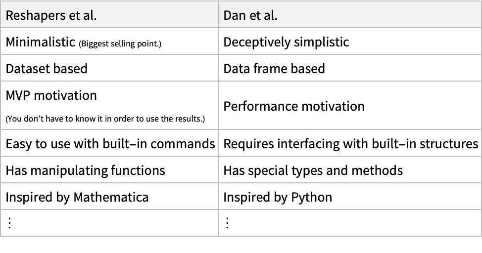

---

## Tries with frequencies

Tries (prefix trees) with frequencies can be used for:

- Data analysis and study

- Ad-hoc, unsupervised learning

- Classification (of Bayesian type)

```{perl6, eval=TRUE}
my @words = ['bar' xx 3].append('bark' xx 2).append('car' xx 4).append('custard' xx 2)
```

```{perl6, eval=TRUE}
@words.&trie-create-by-split.shrink.form
```

```{perl6, eval=TRUE}
trie-create-by-split @words
```

```shell
to-uml-spec --plot ML::TriesWithFrequencies
```


---

## Tries with frequencies -- data analysis

I used tries with frequencies to do:

- Generalized cross tabulation

- Sequence mining

```{perl6, eval=TRUE}
deduce-type(@dsTitanic)
```

```{perl6, eval=TRUE}
@dsTitanic.map({$_.<passengerSex passengerClass passengerSurvival>})>>.List.&trie-create.form
```

```mathematica
MosaicPlot[RakuInputExecute["@dsTitanic==>encode-to-wl"][All, {"passengerSex", "passengerClass", "passengerSurvival"}]]
```

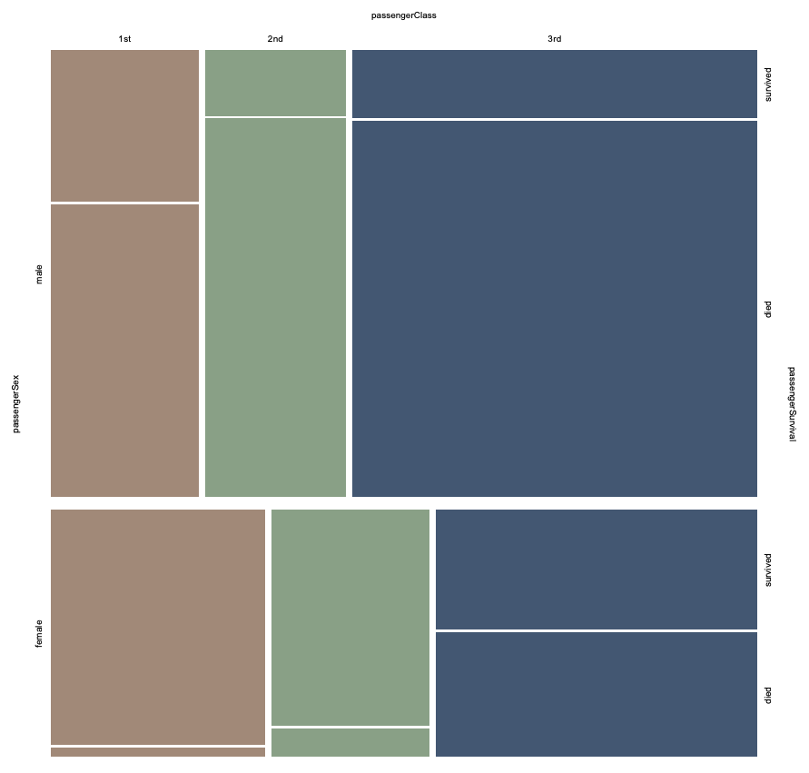

---

## Tries with frequencies -- classification

Tries with frequencies provide conditional probabilities and can be used as (more elaborated) Naive Bayesian Classifiers.

```{perl6, eval=TRUE}
my $trTitanic = @dsTitanic2.map({$_.<passengerSex passengerClass passengerSurvival>})>>.List.&trie-create.node-probabilities;
$trTitanic.form
```

```mathematica
MosaicPlot[RakuInputExecute["@dsTitanic==>encode-to-wl"][All, {"passengerSex", "passengerClass", "passengerSurvival"}]]
```

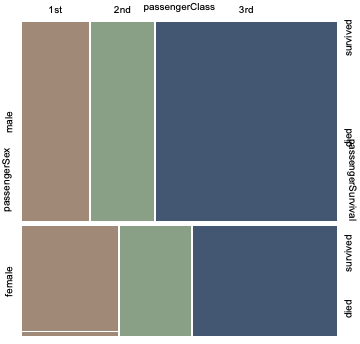

```{perl6, eval=TRUE}
$trTitanic.classify(<male 1st>)
```

```{perl6, eval=TRUE}
.say for $trTitanic.classify([<male 1st>, <male 2nd>, <male 1st>], prop=>'Probabilities')
```

---

## Classification workflow

### Mind-map

```mathematica
mmClassifaction = Import["https://github.com/antononcube/SimplifiedMachineLearningWorkflows-book/raw/master/Diagrams/Making-competitions-classifiers-mind-map.pdf", "PageGraphics"][[1]]
```

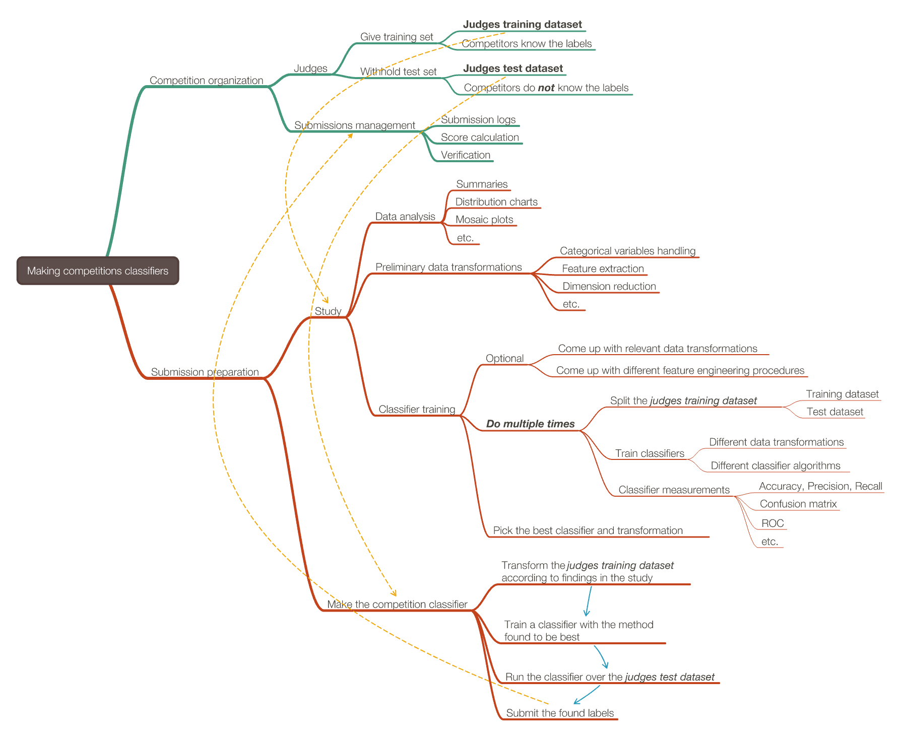

### Flowchart (simple)

```mathematica
plClassificationSimple = Import["https://github.com/antononcube/SimplifiedMachineLearningWorkflows-book/raw/master/Part-2-Monadic-Workflows/Diagrams/A-monad-for-Classification-workflows/Classification-workflow-horizontal-layout.jpg"]
```

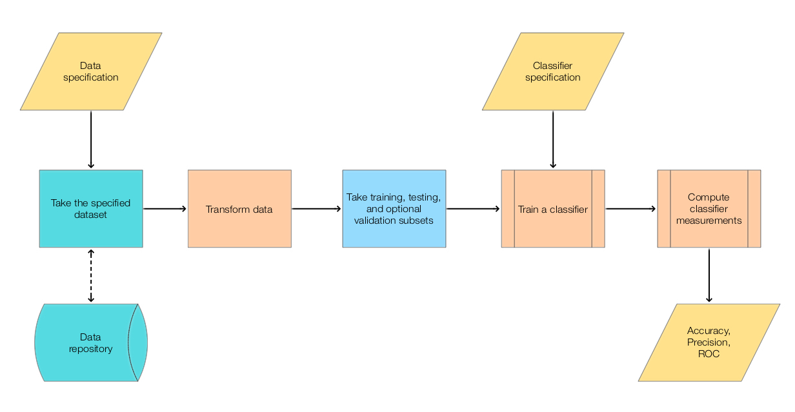

### Flowchart (full)

```mathematica
plClassificationFull = Import["https://github.com/antononcube/SimplifiedMachineLearningWorkflows-book/raw/master/Part-2-Monadic-Workflows/Diagrams/A-monad-for-Classification-workflows/Classification-workflow-extended.jpg"]
```

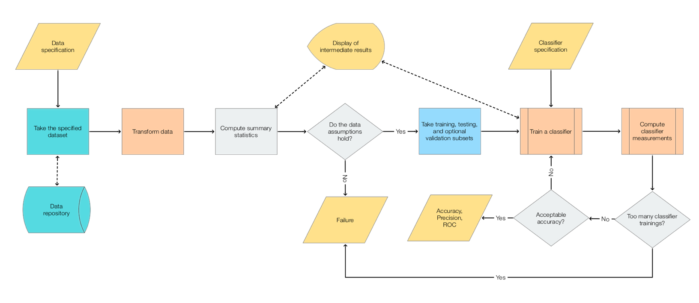

---

## ROC functions

Detailed example in the notebook "Raku-Trie-based-classifier-example.nb".

Detailed descriptions in the blog post ["Trie based classifiers evaluation"](https://rakuforprediction.wordpress.com/2022/07/07/trie-based-classifiers-evaluation/).

See ["Receiver Operating Characteristic"](https://en.wikipedia.org/wiki/Receiver_operating_characteristic) Wikipedia article.

Here are the obtained ROC-hash and corresponding etable:

```{perl6, eval=TRUE}
my @rocs = |[{:FalseNegative(0), :FalsePositive(202), :TrueNegative(0), :TruePositive(125)}, {:FalseNegative(1), :FalsePositive(191), :TrueNegative(11), :TruePositive(124)}, {:FalseNegative(2), :FalsePositive(179), :TrueNegative(23), :TruePositive(123)}, {:FalseNegative(4), :FalsePositive(165), :TrueNegative(37), :TruePositive(121)}, {:FalseNegative(6), :FalsePositive(123), :TrueNegative(79), :TruePositive(119)}, {:FalseNegative(10), :FalsePositive(84), :TrueNegative(118), :TruePositive(115)}, {:FalseNegative(14), :FalsePositive(63), :TrueNegative(139), :TruePositive(111)}, {:FalseNegative(18), :FalsePositive(58), :TrueNegative(144), :TruePositive(107)}, {:FalseNegative(18), :FalsePositive(58), :TrueNegative(144), :TruePositive(107)}, {:FalseNegative(23), :FalsePositive(51), :TrueNegative(151), :TruePositive(102)}, {:FalseNegative(30), :FalsePositive(36), :TrueNegative(166), :TruePositive(95)}, {:FalseNegative(31), :FalsePositive(35), :TrueNegative(167), :TruePositive(94)}, {:FalseNegative(31), :FalsePositive(35), :TrueNegative(167), :TruePositive(94)}, {:FalseNegative(32), :FalsePositive(32), :TrueNegative(170), :TruePositive(93)}, {:FalseNegative(36), :FalsePositive(22), :TrueNegative(180), :TruePositive(89)}, {:FalseNegative(36), :FalsePositive(22), :TrueNegative(180), :TruePositive(89)}, {:FalseNegative(36), :FalsePositive(22), :TrueNegative(180), :TruePositive(89)}, {:FalseNegative(44), :FalsePositive(14), :TrueNegative(188), :TruePositive(81)}, {:FalseNegative(48), :FalsePositive(5), :TrueNegative(197), :TruePositive(77)}, {:FalseNegative(48), :FalsePositive(5), :TrueNegative(197), :TruePositive(77)}, {:FalseNegative(48), :FalsePositive(5), :TrueNegative(197), :TruePositive(77)}, {:FalseNegative(48), :FalsePositive(5), :TrueNegative(197), :TruePositive(77)}, {:FalseNegative(48), :FalsePositive(3), :TrueNegative(199), :TruePositive(77)}, {:FalseNegative(48), :FalsePositive(3), :TrueNegative(199), :TruePositive(77)}, {:FalseNegative(48), :FalsePositive(3), :TrueNegative(199), :TruePositive(77)}, {:FalseNegative(48), :FalsePositive(3), :TrueNegative(199), :TruePositive(77)}, {:FalseNegative(65), :FalsePositive(3), :TrueNegative(199), :TruePositive(60)}, {:FalseNegative(65), :FalsePositive(3), :TrueNegative(199), :TruePositive(60)}, {:FalseNegative(82), :FalsePositive(2), :TrueNegative(200), :TruePositive(43)}, {:FalseNegative(95), :FalsePositive(2), :TrueNegative(200), :TruePositive(30)}, {:FalseNegative(95), :FalsePositive(2), :TrueNegative(200), :TruePositive(30)}];
to-pretty-table(@rocs)
```

Here is the corresponding ROC plot:

```{perl6, eval=TRUE}
use Text::Plot; 
text-list-plot(roc-functions('FPR')(@rocs), roc-functions('TPR')(@rocs),
                width => 70, height => 25, 
                x-label => 'FPR', y-label => 'TPR' )
```

Here is the same ROC plot made with Mathematica:

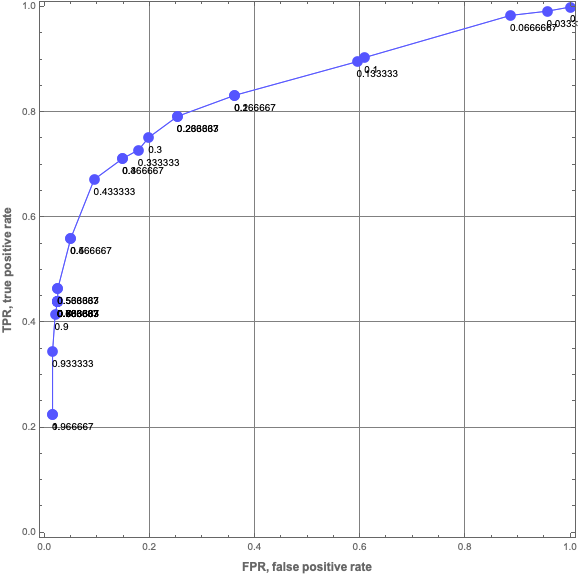

---

## ROC functions dictionary

The nomenclature ROC functions is somewhat large, hence dictionaries.

```{perl6, eval=TRUE}
say roc-functions('properties');
```

```{perl6, eval=TRUE}
roc-functions('FunctionInterpretations')
```

```{perl6, eval=TRUE}
say roc-functions('FPR');
```

---

## K-means Clustering

Clustering is a fundamental ML, Unsupervised learning, procedure.

More details on K-means clustering method are given the document: ["k-means function page"](https://github.com/antononcube/Raku-ML-Clustering/blob/main/doc/K-means-function-page.md).

```mathematica
mmMLinRaku
```

### Make data points

```{perl6, eval=TRUE}
my $pointsPerCluster = 200;
my @data2D5 = [[10,20,4],[20,60,6],[40,10,6],[-30,0,4],[100,100,8]].map({ 
    random-variate(NormalDistribution.new($_[0], $_[2]), $pointsPerCluster) Z random-variate(NormalDistribution.new($_[1], $_[2]), $pointsPerCluster)
   }).Array;
@data2D5 = flatten(@data2D5, max-level=>1).pick(*);
@data2D5.elems
```

```{perl6, eval=TRUE}
text-list-plot(@data2D5, width=>80)
```

```mathematica
ListPlot[RakuInputExecute["@data2D5==>encode-to-wl"], PlotTheme -> "Detailed"]
```

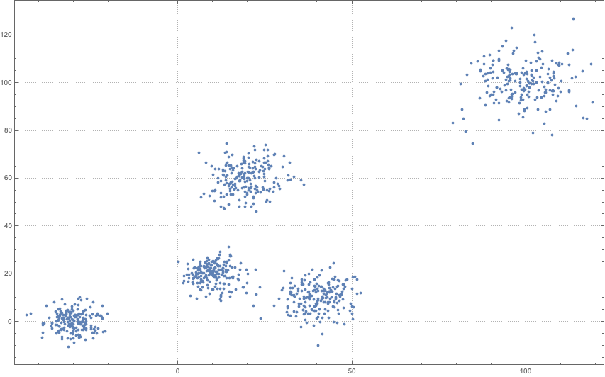

### Cluster

```{perl6, eval=TRUE}
my %clRes = find-clusters(@data2D5, 5, prop=>'All', distance-function=>'euclidean');
%clRes<Clusters>>>.elems
```

### Visualize

```{perl6, eval=TRUE}
text-list-plot([|%clRes<Clusters>, %clRes<MeanPoints>], point-char=><1 2 3 4 5 ●>, width=>100)
```

```mathematica
Block[{
   cls = RakuInputExecute["%clRes<Clusters>==>encode-to-wl"], 
   mps = RakuInputExecute["%clRes<MeanPoints>==>encode-to-wl"]}, 
  Show[{
    ListPlot[cls, PlotStyle -> PointSize[0.015], PlotTheme -> "Scientific"], 
    ListPlot[mps, PlotStyle -> {PointSize[0.03], Black}]}, ImageSize -> 1000] 
 ]
```

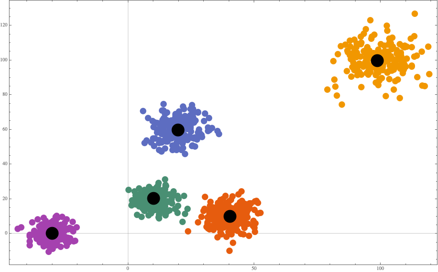

---

## K-means clustering - distance functions

Using different distance functions would, generally, produce different results:

```{perl6, eval=TRUE}
<Euclidean Cosine>.map({ say find-clusters(@data2D5, 3, distance-function => $_).&text-list-plot(
        title => 'distance function: ' ~ $_, point-char => <* ® o>, width=>80), "\n" });
```

More details on K-means clustering method are given the document: ["k-means function page"](https://github.com/antononcube/Raku-ML-Clustering/blob/main/doc/K-means-function-page.md).

---

## Outlier detection

Here we generate random, normally distributed points and summarize them:

```{perl6, eval=TRUE}
my @points = random-variate(NormalDistribution.new(mean=>12, ds=>6), 50);
records-summary(@points)
```

Here we find outliers:

```{perl6, eval=TRUE}
outlier-identifier(@points):values
```

Here we find the outlier positions for each identifier:

```{perl6, eval=TRUE}
(&hampel-identifier-parameters, &splus-quartile-identifier-parameters, &quartile-identifier-parameters).map({ $_.name => outlier-identifier(@points, identifier=>$_) }).Hash==>encode-to-wl()
```

Here we plot the ***sorted*** data and the outliers:

```{perl6, eval=TRUE}
my @points2D = |(^@points.elems Z @points.sort);
text-list-plot([@points2D, @points2D[|outlier-identifier(@points2D.map(*[1]), identifier=>&quartile-identifier-parameters)]], point-char=><* ®>, width=>80)
```

More complete exposition: .

**Remark:** Having 1D outlier identifiers is the basis for developing certain (very powerful) nD outlier identifier algorithms.

---

## Latent Semantic Analysis (LSA)

- Currently it is hard to do LSA with Raku.

- Nevertheless, "ML::StreamsBlendingRecommender" uses LSA-made artifacts.

Here is an example of LSA application using Raku guide documents: .

---

## Using a recommender system

See .

---

## Association rule learning

```{perl6, eval=TRUE}
use Text::CSV;
my @dsAdult=csv(in=>"$*HOME/Datasets/adult/dfAdultTest.csv",headers=>'auto');
dimensions(@dsAdult)
```

```mathematica
RakuInputExecute["@dsAdult==>encode-to-wl"]
```

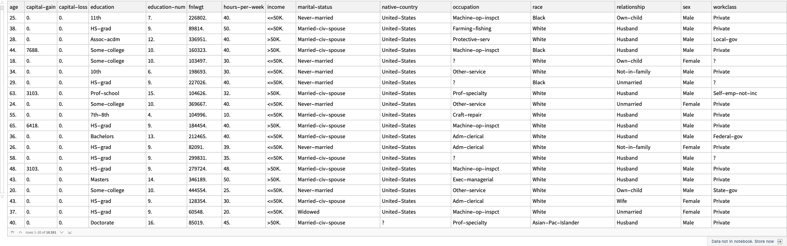

```{perl6, eval=TRUE}
deduce-type(@dsAdult)
```

Summarize the data:

```mathematica
ResourceFunction["RecordsSummary"][RakuInputExecute["@dsAdult==>encode-to-wl"]]
```

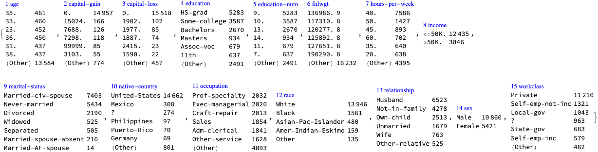

```{perl6, eval=TRUE}
my @baskets=@dsAdult.map({ $_<education marital-status education-num occupation income>});
dimensions(@baskets)
```

```{perl6, eval=TRUE}
to-pretty-table(@baskets.pick(12))
```

Find frequent sets:

```{perl6, eval=TRUE}
my $startTime=now; 
my @frSets = frequent-sets(@baskets, 0.05);
my $endTime=now;
"Time to find frequent sets: {$endTime - $startTime}"
```

Show sample:

```{perl6, eval=TRUE}
.say for @frSets.pick(5)
```

Pick frequent sets that have more than three elements and contain ">50K.":

```{perl6, eval=TRUE}
my @frSets2 = @frSets.grep({ $_.key.elems ≥ 3 && '>50K.' (elem) $_.key});
.say for @frSets2
```

---

## Check the CLI mate!

Having CLIs has to be considered fairly early in the design and implementation of the ML functionalities.

#### Visual aid


---

## Conclusion

Software engineering observations (again)

- ML module design

    - Functions as front-end

    - OOP for different methods

- Facilitation of tabulation and visualization of results

    - Notebook solutions

    - Text tables

    - Text plots

- Fast data type deduction facilitation

- Model storage and deployment facilitation

    - Currently Raku is too slow

- Unit tests and correctness tests

- Proper documentation with worked out examples

- CLIs as much as possible

- Facilitation with code generation

---

## Future plans / engagement

"Becoming the best Python programmer I know"

"Making of a CoC Compliance Classifier"

---

## References

### Articles

[AA1] Anton Antonov, "A monad for classification workflows", (2018), MathematicaForPrediction at WordPress.

[AA2] Anton Antonov, "Raku Text::CodeProcessing", (2021), RakuForPrediction at WordPress.

[AA3] Anton Antonov, "Connecting Mathematica and Raku", (2021), RakuForPrediction at WordPress.

[AA4] Anton Antonov, "Introduction to data wrangling with Raku", (2021), RakuForPrediction at WordPress.

[AA5] Anton Antonov, "ML::TriesWithFrequencies", (2022), RakuForPrediction at WordPress.

[AA6] Anton Antonov, "Data::Generators", (2022), RakuForPrediction at WordPress.

[AA7] Anton Antonov, "ML::ROCFunctions", (2022), RakuForPrediction at WordPress.

[AA8] Anton Antonov, "Text::Plot", (2022), RakuForPrediction at WordPress.

[Wk1] Wikipedia entry, ["Receiver operating characteristic"](https://en.wikipedia.org/wiki/Receiver_operating_characteristic).

[Wk2] Wikipedia entry, ["K-means clustering"](https://en.wikipedia.org/wiki/K-means_clustering).

### Packages

[AAp1] Anton Antonov, Data::Generators Raku package, (2021), GitHub/antononcube.

[AAp2] Anton Antonov, Data::ExampleDatasets Raku package, (2022), GitHub/antononcube.

[AAp3] Anton Antonov, Data::Reshapers Raku package, (2021), GitHub/antononcube.

[AAp4] Anton Antonov, Data::Summarizers Raku package, (2021), GitHub/antononcube.

[AAp5] Anton Antonov, DSL::Bulgarian Raku package, (2022), GitHub/antononcube.

[AAp5] Anton Antonov, DSL::English::DataQueryWorkflows Raku package, (2020-2022), GitHub/antononcube.

[AAp5] Anton Antonov, DSL::Shared::Utilities::ComprehensiveTranslation Raku package, (2020-2022), GitHub/antononcube.

[AAp7] Anton Antonov, ML::AssociationRuleLearning Raku package, (2022), GitHub/antononcube.

[AAp8] Anton Antonov, ML::ROCFunctions Raku package, (2022), GitHub/antononcube.

[AAp7] Anton Antonov, ML::StreamsBlendingRecommender Raku package, (2022), GitHub/antononcube.

[AAp9] Anton Antonov, ML::TriesWithFrequencies Raku package, (2021), GitHub/antononcube.

[AAp10] Anton Antonov, Text::CodeProcessing Raku package, (2021), GitHub/antononcube.

[AAp10] Anton Antonov, Text::Plot Raku package, (2022), GitHub/antononcube.

### Functions

[WRI1] Wolfram Research (2014), Dataset, Wolfram Language function.

[WRI2] Wolfram Research (2007), FindClusters, Wolfram Language function.

[WRI3] Wolfram Research (2015), TakeDrop, Wolfram Language function, (updated 2015).

[WRI4] Wolfram Research (2007), Tally, Wolfram Language function.

---

## Code

### NLP Template Engine

```mathematica
Import["https://raw.githubusercontent.com/antononcube/NLP-Template-Engine/main/Packages/WL/NLPTemplateEngine.m"]
```

### DSLMode

```mathematica
Import["https://raw.githubusercontent.com/antononcube/ConversationalAgents/master/Packages/WL/RakuMode.m"]
Import["https://raw.githubusercontent.com/antononcube/ConversationalAgents/master/Packages/WL/DSLMode.m"]
```


```mathematica
DSLMode[]
```

### Serializers

```mathematica
Import["https://raw.githubusercontent.com/antononcube/ConversationalAgents/master/Packages/WL/RakuDecoder.m"]
SetOptions[RakuInputExecute, Epilog -> FromRakuCode];
SetOptions[Dataset, MaxItems -> {Automatic, 40}];
```

### SplitWordsByCapitalLetters

```mathematica
Clear[SplitWordsByCapitalLetters];
SplitWordsByCapitalLetters[word_String] := StringCases[word, CharacterRange["A", "Z"] ~~ (Except[CharacterRange["A", "Z"]] ...)];
SplitWordsByCapitalLetters[words : {_String ..}] := Map[SplitWordsByCapitalLetters, words];
```

### SplitWordAndNumber

```mathematica
Clear[SplitWordAndNumber];
SplitWordAndNumber[word_String] := If[StringMatchQ[word, (LetterCharacter ..) ~~ (DigitCharacter ..)], StringCases[word, x : (LetterCharacter ..) ~~ n : (DigitCharacter ..) :> x <> " " <> n], word];
```

### Raku mode

```mathematica
RakuMode[]
```

### Raku process

```mathematica
(*KillRakuSockets[]*)
```

```mathematica
KillRakuProcess[]
StartRakuProcess["Raku" -> $HomeDirectory <> "/.rakubrew/shims/raku"]
```

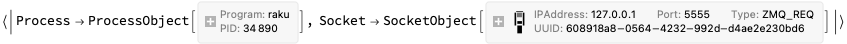

### Load Raku packages

```{perl6, eval=FALSE}
use Text::Plot;

use ML::AssociationRuleLearning;
use ML::Clustering;
use ML::StreamsBlendingRecommender;
use ML::ROCFunctions;
use ML::TriesWithFrequencies;
use Statistics::OutlierIdentifiers;

use Data::ExampleDatasets;
use Data::Generators;
use Data::Reshapers;
use Data::Summarizers;

use Mathematica::Serializer;
use UML::Translators;

use DSL::Shared::Utilities::ComprehensiveTranslation;

(*"(Any)"*)
```

### Shell

```shell
source ~/.zshrc
```

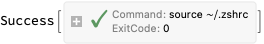

### Python

```python
import pandas
from ExampleDatasets import *
from RandomDataGenerators import *
```
