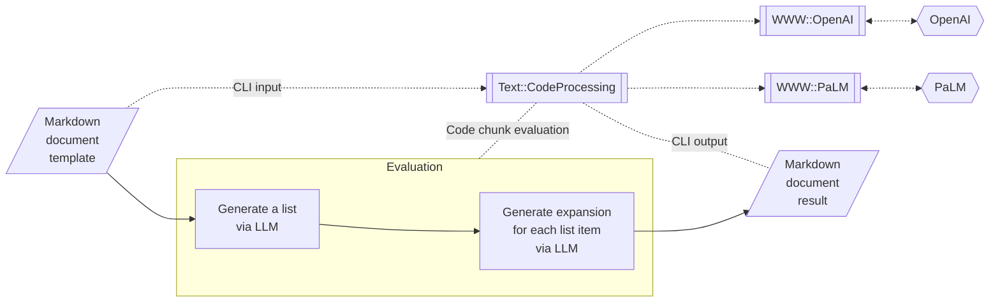
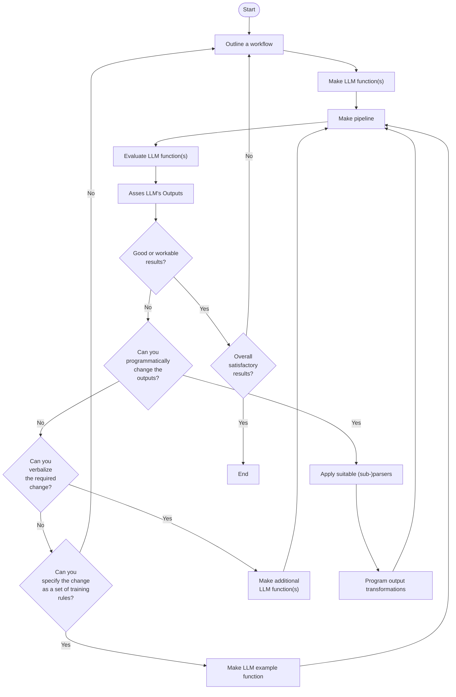

# Integrating Large Language Models with Raku

***[TRC-2023 talk link](https://conf.raku.org/talk/194)***

In this presentation we discuss different ways of using Large Language Models (LLMs) in Raku.

Three main ways are considered, using: 
- Literate programming
- LLM functions
- LLM chat objects

The presentation has multiple demos and examples of LLM utilization that include:
- Data retrieval, reshaping, and visualization
- Computation workflows in Physics and Chemistry
- Test generation and narration
- Iterative grammar development
- Number guessing games staging (man vs machine and machine vs machine)
- "In place" document generation
- Code writing assistance
- *Others*

------

### Generating documents via templates and LLMs

------

### LLM utilization flowchart 

------

## References 

### Articles

[AA1] Anton Antonov,
["Literate programming via CLI"](https://rakuforprediction.wordpress.com/2023/03/06/literate-programming-via-cli/),
(2023),
[RakuForPrediction at WordPress](https://rakuforprediction.wordpress.com).

[AA2] Anton Antonov,
["Generating documents via templates and LLMs"](https://rakuforprediction.wordpress.com/2023/07/11/generating-documents-via-templates-and-llms/),
(2023),
[RakuForPrediction at WordPress](https://rakuforprediction.wordpress.com).

[AA3] Anton Antonov,
["Workflows with LLM functions"](https://rakuforprediction.wordpress.com/2023/08/01/workflows-with-llm-functions/),
(2023),
[RakuForPrediction at WordPress](https://rakuforprediction.wordpress.com).

### Packages

[AAp1] Anton Antonov,
[LLM::Functions Raku package](https://github.com/antononcube/Raku-LLM-Functions),
(2023),
[GitHub/antononcube](https://github.com/antononcube).

[AAp2] Anton Antonov,
[WWW::OpenAI Raku package](https://github.com/antononcube/Raku-WWW-OpenAI),
(2023),
[GitHub/antononcube](https://github.com/antononcube).

[AAp3] Anton Antonov,
[WWW::PaLM Raku package](https://github.com/antononcube/Raku-WWW-PaLM),
(2023),
[GitHub/antononcube](https://github.com/antononcube).

[AAp4] Anton Antonov,
[Text::SubParsers Raku package](https://github.com/antononcube/Raku-Text-SubParsers),
(2023),
[GitHub/antononcube](https://github.com/antononcube).

[AAp5] Anton Antonov,
[Text::CodeProcessing Raku package](https://github.com/antononcube/Raku-Text-CodeProcessing),
(2021),
[GitHub/antononcube](https://github.com/antononcube).

### Videos

[AAv1] Anton Antonov,
["Racoons playing with pearls and onions"](https://www.youtube.com/watch?v=zlkoNZK8MpU)
(2023),
[YouTube/@AAA4Prediction](https://www.youtube.com/@AAA4prediction).

[AAv2] Anton Antonov,
["Streamlining ChatGPT code generation and narration workflows (Raku)"](https://www.youtube.com/watch?v=mI-oWLz5dYY)
(2023),
[YouTube/@AAA4Prediction](https://www.youtube.com/@AAA4prediction).
