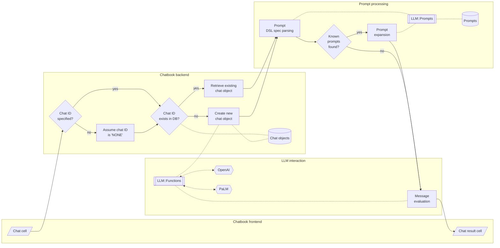
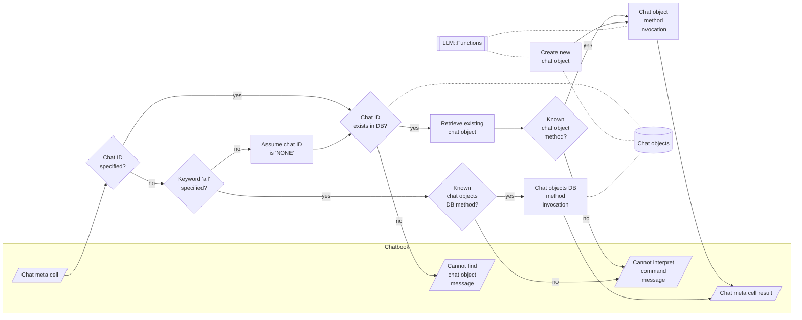

# Integrating Large Language Models with Raku

***[TRC-2023 talk link](https://conf.raku.org/talk/194)***

[*Video link*](https://youtu.be/-OxKqRrQvh0)

In this presentation we discuss different ways of using Large Language Models (LLMs) in Raku.

We consider using LLMs via:
- [Jupyter Chatbooks](https://raku.land/zef:antononcube/Jupyter::Chatbook)
- [Literate programming](https://raku.land/zef:antononcube/Text::CodeProcessing)
- [LLM functions](https://raku.land/zef:antononcube/LLM::Functions)
- [LLM chat objects](https://raku.land/zef:antononcube/LLM::Functions)
- [LLM prompts](https://raku.land/zef:antononcube/LLM::Prompts)

The presentation has multiple demos and examples of LLM utilization that include:
- [Data retrieval, reshaping, and visualization](https://rakuforprediction.wordpress.com/2023/08/01/workflows-with-llm-functions/)
- Computation workflows in Physics and Chemistry
- [Test generation and narration](https://github.com/antononcube/Raku-LLM-Functions/blob/main/docs/Expand-tests-into-doc-examples_woven.md)
- Iterative grammar development
- [Number guessing games staging (man vs machine and machine vs machine)](https://rakuforprediction.wordpress.com/2023/08/06/number-guessing-games-palm-vs-chatgpt/)
- ["In place" document generation](https://github.com/antononcube/RakuForPrediction-book/blob/main/Articles/LLM-generated/12-steps-guide-to-quit-Python-via-OpenAI-PaLM-2.md)
- Code writing assistance
- [Comparison with Python- and Mathematica LLM implementations](https://community.wolfram.com/groups/-/m/t/3053519)
- *Others*

------

## Jupyter Chatbooks

### Chat cells

### Chat meta cells

------

## Generating documents via templates and LLMs

------

## LLM utilization flowchart 

------

## References 

### Articles

[AA1] Anton Antonov,
["Literate programming via CLI"](https://rakuforprediction.wordpress.com/2023/03/06/literate-programming-via-cli/),
(2023),
[RakuForPrediction at WordPress](https://rakuforprediction.wordpress.com).

[AA2] Anton Antonov,
["Generating documents via templates and LLMs"](https://rakuforprediction.wordpress.com/2023/07/11/generating-documents-via-templates-and-llms/),
(2023),
[RakuForPrediction at WordPress](https://rakuforprediction.wordpress.com).

[AA3] Anton Antonov,
["Workflows with LLM functions"](https://rakuforprediction.wordpress.com/2023/08/01/workflows-with-llm-functions/),
(2023),
[RakuForPrediction at WordPress](https://rakuforprediction.wordpress.com).

[AA4] Anton Antonov,
["Number guessing games: PaLM vs ChatGPT"](https://rakuforprediction.wordpress.com/2023/08/06/number-guessing-games-palm-vs-chatgpt/),
(2023),
[RakuForPrediction at WordPress](https://rakuforprediction.wordpress.com).

### Packages

[AAp1] Anton Antonov,
[LLM::Functions Raku package](https://github.com/antononcube/Raku-LLM-Functions),
(2023),
[GitHub/antononcube](https://github.com/antononcube).

[AAp2] Anton Antonov,
[WWW::OpenAI Raku package](https://github.com/antononcube/Raku-WWW-OpenAI),
(2023),
[GitHub/antononcube](https://github.com/antononcube).

[AAp3] Anton Antonov,
[WWW::PaLM Raku package](https://github.com/antononcube/Raku-WWW-PaLM),
(2023),
[GitHub/antononcube](https://github.com/antononcube).

[AAp4] Anton Antonov,
[Text::SubParsers Raku package](https://github.com/antononcube/Raku-Text-SubParsers),
(2023),
[GitHub/antononcube](https://github.com/antononcube).

[AAp5] Anton Antonov,
[Text::CodeProcessing Raku package](https://github.com/antononcube/Raku-Text-CodeProcessing),
(2021),
[GitHub/antononcube](https://github.com/antononcube).

### Videos

[AAv1] Anton Antonov,
["Racoons playing with pearls and onions"](https://www.youtube.com/watch?v=zlkoNZK8MpU)
(2023),
[YouTube/@AAA4Prediction](https://www.youtube.com/@AAA4prediction).

[AAv2] Anton Antonov,
["Streamlining ChatGPT code generation and narration workflows (Raku)"](https://www.youtube.com/watch?v=mI-oWLz5dYY)
(2023),
[YouTube/@AAA4Prediction](https://www.youtube.com/@AAA4prediction).
