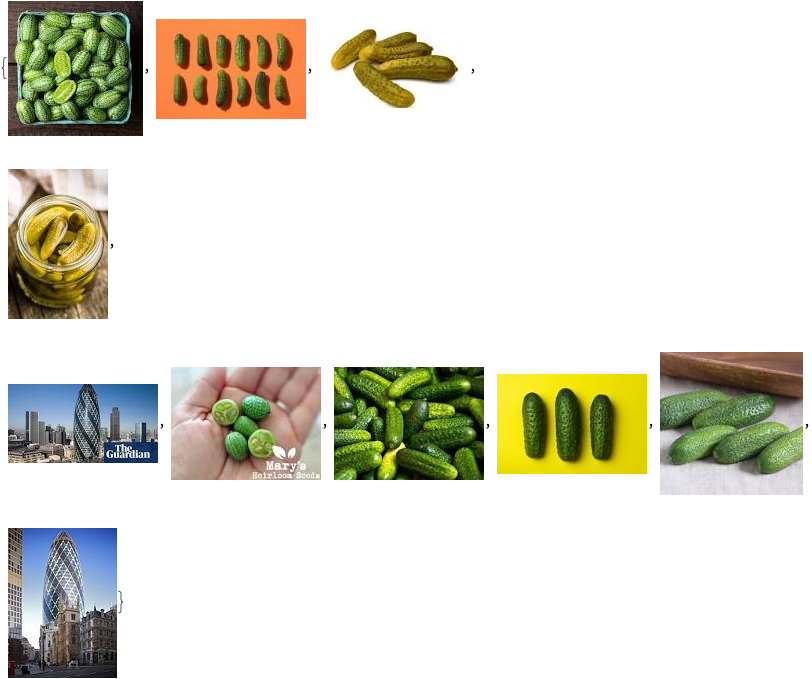
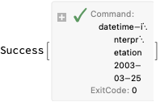
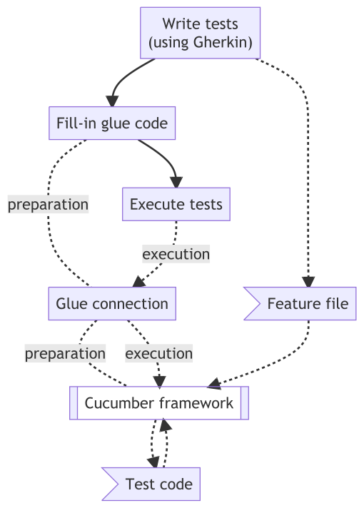
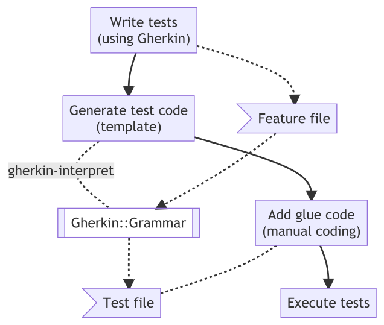

# Testing workflows with Gherkin specifications

**Anton Antonov   
[RakuForPrediction at WordPress](https://rakuforprediction.wordpress.com)   
[RakuForPrediction-book at GitHub](https://github.com/antononcube/RakuForPrediction-book)   
February 2023**

---

## Gherkin is ...

- The language of the [Cucumber framework](https://cucumber.io)

    - [Behavior-Driven Development](https://en.wikipedia.org/wiki/Behavior-driven_development) (BDD)

- Used for non-technical and human readable difinitions of test cases

- Also:

```mathematica
WebImageSearch["Gherkin", Method -> "Google"]
```



---

## [Cucumber framework](https://cucumber.io)


---

## [Gherkin language](https://cucumber.io/docs/gherkin/reference/)

Gherkin uses a set of special keywords to give structure and meaning to executable specifications. Each keyword is translated to many spoken languages; in this reference we'll use English.

```gherkin
Feature: DateTime interpretation test

  Scenario: ISO date
    When 2032-10-01
    Then the result is DateTime
    And the year is "2032", month is "10", and date "1"
      
```

It is assumed some familiriaty with Gherkin...

---

## DateTime::Grammar examples

We are going to make tests for ["DateTime::Grammar"](https://github.com/antononcube/Raku-DateTime-Grammar).

CLI example:

```shell
datetime-interpretation 2003-03-25

(*"2003-03-25T00:00:00Z"*)
```



---

## Gherkin::Grammar workflow

Here is workflow we will follow in this presentation:

```mathematica
mrmMain = "flowchart TDWT[\"Write tests<br/>(using Gherkin)\"] FG[\"Add glue code<br/>(manual coding)\"]GTC[\"Generate test code<br/>(template)\"]ET[Execute tests]FF>Feature file]GG[[Gherkin::Grammar]]TF>Test file]WT --> GTC --> FGWT -.-> FFGTC -.- |gherkin-interpret|GGFF -.-> GGGG -.->  TFFG -.- TFFG --> ET";
plMain = ResourceFunction["MermaidJS"][mrmMain, "PDF"]
```


---

## Typical Cucumber workflow

```mathematica
ResourceFunction["MermaidJS"]["flowchart TDWT[\"Write tests<br/>(using Gherkin)\"] FG[Fill-in glue code]GC[Glue connection]ET[Execute tests]FF>Feature file]CF[[Cucumber framework]]TF>Test code]WT --> FGFG -.- |preparation|GCWT -.-> FFGC -.- |preparation|CFFF -.-> CFCF -.-> TFTF -.-> CFFG --> ETET -.-> |execution|GCGC -.-> |execution|CF", "PDF", ImageSize -> 700]
```



---

## Simple example

- Using ["DateTime::Grammar"](https://github.com/antononcube/Raku-DateTime-Grammar)

- Comma (IntelliJ) plug-in

- Feature file

    - ...with one scenario

- Generate template testing code

-  Comparison

- Modifications

---

## Complex example

- Extending the previous example

    - Multiple scenarios

    - Scenario outline / template

---

## Summary

```mathematica
plMain
```

